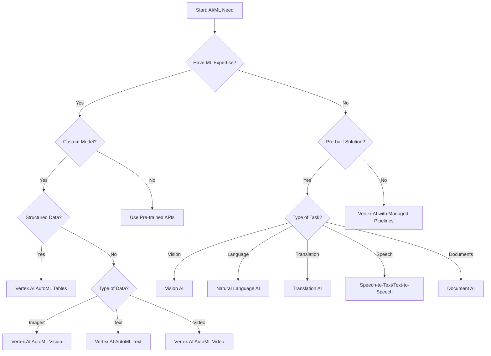

# GCP AI & Machine Learning Services

Google Cloud Platform offers a comprehensive suite of artificial intelligence and machine learning services that enable organizations to build, deploy, and scale AI solutions. From pre-trained APIs to custom model development platforms, GCP provides tools for every stage of the AI/ML lifecycle.

## Service Categories

GCP's AI and Machine Learning services can be categorized into several groups:

1. **AI Platform Services**
   - [[Vertex AI]]: Unified platform for ML development and deployment
   - [[AI Platform]]: Legacy ML platform (predecessor to Vertex AI)

2. **Pre-trained AI APIs**
   - [[Vision AI]]: Image analysis and recognition
   - [[Natural Language AI]]: Text analysis and understanding
   - [[Translation AI]]: Language translation
   - [[Speech-to-Text]]: Convert speech to text
   - [[Text-to-Speech]]: Convert text to speech
   - [[Document AI]]: Document processing and analysis
   - [[Video Intelligence API]]: Video content analysis

3. **AutoML Solutions**
   - [[AutoML Vision]]: Custom image recognition models
   - [[AutoML Natural Language]]: Custom text analysis models
   - [[AutoML Translation]]: Custom translation models
   - [[AutoML Tables]]: Custom structured data models

4. **AI Infrastructure**
   - [[Deep Learning VM Images]]: Pre-configured VMs for ML
   - [[Deep Learning Containers]]: Docker containers for ML
   - [[TPU]]: Tensor Processing Units for accelerated ML
   - [[GPU]]: Graphics Processing Units for ML workloads

5. **AI Solutions**
   - [[Contact Center AI]]: Intelligent contact center solution
   - [[Recommendations AI]]: Product recommendation system
   - [[Healthcare Natural Language API]]: Healthcare-specific NLP
   - [[Retail Product Discovery]]: Product search and recommendations

## Decision Tree: Choosing the Right AI/ML Service

## Comparison of AI/ML Services

| Service | Type | Expertise Required | Customization | Use Case |
|---------|------|-------------------|---------------|----------|
| Vertex AI | Platform | High | Full | End-to-end ML workflow |
| Pre-trained APIs | API | Low | None | Quick integration of AI capabilities |
| AutoML | Platform | Medium | Medium | Custom models without coding |
| Deep Learning VMs | Infrastructure | High | Full | Custom model development |
| TPU/GPU | Infrastructure | High | N/A | Accelerated training/inference |
| AI Solutions | Solution | Low | Limited | Industry-specific applications |

## AI/ML Development Lifecycle in GCP

1. **Data Preparation**
   - Cloud Storage: Store training data
   - BigQuery: Process and analyze data
   - Dataflow: Transform data
   - Dataprep: Clean and prepare data

2. **Model Development**
   - Vertex AI Workbench: Jupyter notebooks
   - Deep Learning VMs: Development environment
   - AutoML: No-code model development
   - Custom Training: Code-based model development

3. **Model Training**
   - Vertex AI Training: Managed training service
   - TPU/GPU: Accelerated training
   - Distributed Training: Scale across machines
   - Hyperparameter Tuning: Optimize model parameters

4. **Model Evaluation**
   - Vertex AI Model Evaluation: Assess model performance
   - Explainable AI: Understand model decisions
   - What-If Tool: Test model behavior

5. **Model Deployment**
   - Vertex AI Endpoints: Scalable serving
   - Vertex AI Batch Prediction: Batch inference
   - Model Monitoring: Track performance
   - Model Registry: Version control

6. **MLOps**
   - Vertex AI Pipelines: Automate ML workflows
   - Continuous Integration/Deployment: Automate updates
   - Feature Store: Manage ML features
   - Model Monitoring: Detect drift and anomalies

## Integration with Other GCP Services

- **BigQuery ML**: Build ML models directly in BigQuery
- **Dataflow**: Data processing for ML pipelines
- **Pub/Sub**: Event-driven ML workflows
- **Cloud Functions**: Serverless ML inference
- **Cloud Run**: Containerized ML serving
- **GKE**: Kubernetes-based ML infrastructure
- **Cloud Storage**: Store ML artifacts and data
- **Cloud Logging/Monitoring**: Track ML systems

## Best Practices

1. **Start Simple**: Begin with pre-trained APIs before custom models
2. **Data Quality**: Focus on data quality and preparation
3. **Experiment Tracking**: Track all experiments and parameters
4. **Continuous Evaluation**: Regularly evaluate model performance
5. **Scalable Architecture**: Design for production scale
6. **Cost Optimization**: Use the right hardware for the job
7. **MLOps Automation**: Automate the ML lifecycle
8. **Responsible AI**: Implement fairness, interpretability, and privacy
9. **Hybrid Approach**: Combine pre-trained and custom models
10. **Feedback Loops**: Incorporate user feedback into models

## Recent Developments

- **Generative AI Support**: Integration with foundation models
- **Vertex AI Agents**: Building conversational AI applications
- **Responsible AI Toolkit**: Tools for ethical AI development
- **Model Garden**: Access to foundation models
- **Gemini API**: Access to Google's multimodal AI model
- **Vector Search**: Semantic search capabilities
- **Grounding**: Techniques to improve AI accuracy and relevance

## Related Topics
- [[GCP Big Data Analytics]]
- [[GCP Compute Services]]
- [[GCP Storage Services]]
- [[GCP Database Services]]
- [[GCP Networking]]
