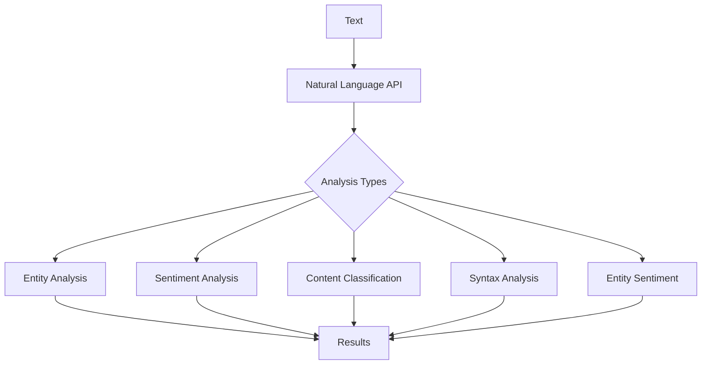

# Natural Language AI

Natural Language AI is Google Cloud's suite of natural language understanding (NLU) services that use machine learning to reveal the structure and meaning of text. It provides pre-trained models via API, allowing developers to analyze sentiment, extract entities, classify content, and understand the syntactic structure of text without having to build their own NLP models.

## Key Features

- **Entity Analysis**: Extract entities (people, places, things)
- **Sentiment Analysis**: Determine text sentiment (positive/negative)
- **Entity Sentiment Analysis**: Sentiment specific to entities
- **Content Classification**: Categorize text into topics
- **Syntax Analysis**: Parse grammatical structure of text
- **Text Moderation**: Identify offensive content
- **Document Analysis**: Analyze document structure and content
- **Custom Entity Extraction**: Define custom entity types
- **Multiple Languages**: Support for multiple languages
- **AutoML Natural Language**: Create custom NLP models
- **Batch Processing**: Analyze multiple documents
- **Integrated with Vertex AI**: Part of Google's AI platform

## How Natural Language AI Works

## Natural Language AI Features in Detail

### Entity Analysis

- Identifies named entities in text
- Categorizes entities into types:
  - Person
  - Location
  - Organization
  - Event
  - Work of art
  - Consumer good
  - Other
- Provides entity salience (importance in text)
- Links entities to Wikipedia/Knowledge Graph
- Supports multiple languages
- Handles ambiguous references

### Sentiment Analysis

- Determines overall emotional tone of text
- Provides sentiment score (-1 to +1):
  - Negative: -1.0 to -0.25
  - Neutral: -0.25 to 0.25
  - Positive: 0.25 to 1.0
- Includes magnitude (strength of emotion)
- Works at document and sentence level
- Handles nuanced expressions
- Supports multiple languages

### Entity Sentiment Analysis

- Combines entity and sentiment analysis
- Determines sentiment specific to each entity
- Provides sentiment score for each entity
- Includes magnitude for each entity sentiment
- Useful for targeted sentiment analysis
- Identifies mixed sentiments in a document

### Content Classification

- Categorizes text into content categories
- Uses a hierarchical taxonomy
- Provides confidence scores for categories
- Supports over 700 predefined categories
- Handles multiple categories per document
- Useful for content organization and filtering

### Syntax Analysis

- Analyzes grammatical structure of text
- Provides part-of-speech tagging
- Identifies tokens (words, punctuation)
- Creates dependency parse trees
- Analyzes sentence structure
- Supports morphological analysis
- Useful for advanced text processing

### Text Moderation

- Identifies potentially offensive content
- Categorizes content across multiple dimensions
- Provides confidence scores
- Helps enforce content policies
- Can be combined with other analyses

## Language Support

Natural Language AI supports varying features across languages:

| Language | Entity Analysis | Sentiment Analysis | Content Classification | Syntax Analysis |
|----------|----------------|-------------------|------------------------|----------------|
| English  | ✓              | ✓                 | ✓                      | ✓              |
| Chinese  | ✓              | ✓                 | ✓                      | ✓              |
| French   | ✓              | ✓                 | ✓                      | ✓              |
| German   | ✓              | ✓                 | ✓                      | ✓              |
| Italian  | ✓              | ✓                 | ✓                      | ✓              |
| Japanese | ✓              | ✓                 | ✓                      | ✓              |
| Korean   | ✓              | ✓                 | ✓                      | ✓              |
| Portuguese | ✓            | ✓                 | ✓                      | ✓              |
| Russian  | ✓              | ✓                 | ✓                      | ✓              |
| Spanish  | ✓              | ✓                 | ✓                      | ✓              |
| Others   | Limited        | Limited           | Limited                | Limited        |

## Natural Language AI Use Cases

- **Social Media Monitoring**: Track brand sentiment
- **Customer Feedback Analysis**: Understand customer opinions
- **Content Recommendation**: Categorize content for recommendations
- **Customer Service**: Route and prioritize customer inquiries
- **Content Moderation**: Filter inappropriate content
- **News Categorization**: Organize news articles by topic
- **Product Review Analysis**: Extract insights from reviews
- **Market Research**: Analyze trends and opinions
- **Competitive Intelligence**: Monitor competitor mentions
- **Chatbots**: Enhance natural language understanding
- **Search Enhancement**: Improve semantic search
- **Document Processing**: Extract key information from documents

## Integration Methods

### REST API

- HTTP-based API for direct integration
- Support for multiple programming languages
- Synchronous and asynchronous processing
- Batch processing capabilities
- Comprehensive documentation and client libraries

### Client Libraries

- Official libraries for popular languages:
  - Python
  - Java
  - Node.js
  - Go
  - PHP
  - Ruby
  - C#
- Simplified authentication and request handling
- Type-safe interfaces
- Error handling and retries

## Custom NLP Models with AutoML Natural Language

When pre-trained models aren't sufficient, AutoML Natural Language allows you to create custom NLP models:

- **No coding required**: Train models through UI
- **Custom classification**: Define your own categories
- **Custom entity extraction**: Define your own entity types
- **Sentiment analysis**: Train for your specific domain
- **Model evaluation**: Assess model performance
- **Deployment options**: Cloud API
- **Continuous improvement**: Retrain with new data

## Performance Considerations

- **Text Length**: Optimal performance for moderate-length texts
- **Language**: Best performance in fully supported languages
- **Domain Specificity**: General-purpose models may miss domain-specific nuances
- **Batch Processing**: Up to 1MB per request
- **Rate Limits**: Quotas apply based on service tier
- **Latency**: Varies by feature and text complexity
- **Accuracy**: Varies by feature and language

## Security and Compliance

- **Data Privacy**: Text processed according to Google Cloud terms
- **Encryption**: Data encrypted in transit and at rest
- **Access Control**: IAM integration for fine-grained access
- **Audit Logging**: Track API usage
- **Compliance**: Supports various compliance programs
- **Data Retention**: Options to control data retention
- **Private Endpoints**: VPC Service Controls support

## Pricing Model

- **Pay-per-use**: Based on features used and volume
- **Free Tier**: Monthly free quota for each feature
- **Volume Discounts**: Reduced rates for high volume
- **Feature-based Pricing**: Different rates for different features
- **AutoML Natural Language**: Separate pricing for custom models

## Comparison with Other NLP Services

| Feature | Google Natural Language AI | AWS Comprehend | Azure Text Analytics |
|---------|---------------------------|----------------|----------------------|
| Entity Analysis | Extensive | Extensive | Extensive |
| Sentiment Analysis | Document & Entity | Document & Entity | Document & Entity |
| Content Classification | 700+ categories | Custom | Limited |
| Syntax Analysis | Comprehensive | Basic | Basic |
| Custom Models | AutoML Natural Language | Custom Classification | Custom NER |
| Language Support | 10+ languages | 10+ languages | 10+ languages |
| Integration | GCP services | AWS services | Azure services |
| Pricing Model | Per feature | Per feature | Per feature |

## Best Practices

1. **Provide Sufficient Context**: Longer text often yields better results
2. **Use Appropriate Features**: Select only needed analyses
3. **Consider Language Support**: Check language compatibility
4. **Implement Error Handling**: Manage API failures gracefully
5. **Use Batch Processing**: For large volumes of text
6. **Cache Results**: Store results for frequently analyzed text
7. **Set Confidence Thresholds**: Filter low-confidence results
8. **Combine Features**: Use multiple features for richer analysis
9. **Monitor Usage**: Track API consumption
10. **Consider Privacy**: Handle user text appropriately

## Related Topics
- [[GCP AI & Machine Learning]]
- [[AutoML Natural Language]]
- [[Document AI]]
- [[Vertex AI]]
- [[Translation AI]]
