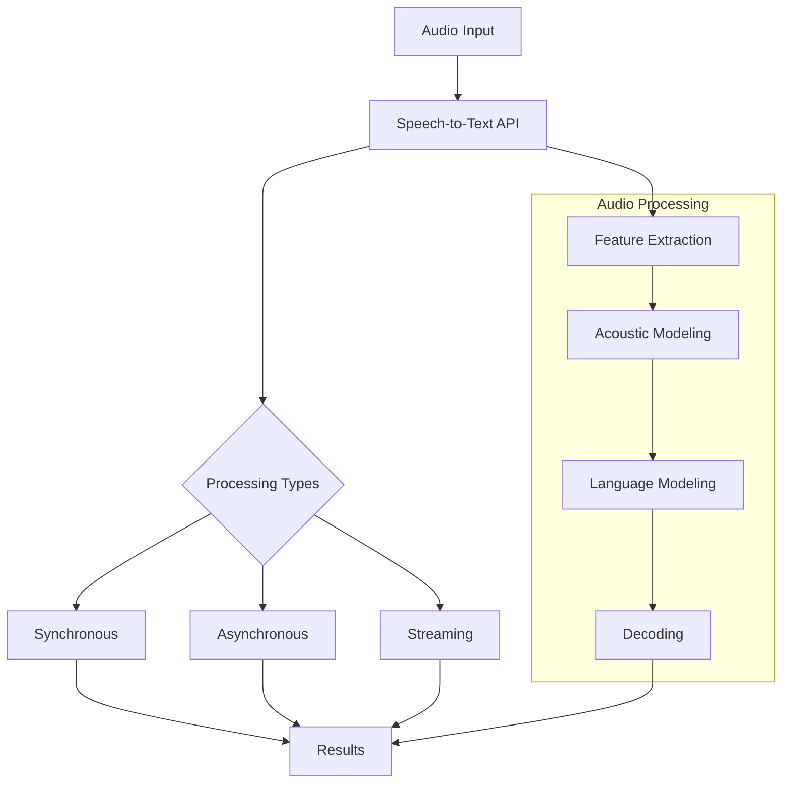

# Speech-to-Text

Speech-to-Text is Google Cloud's automatic speech recognition (ASR) service that enables developers to convert audio to text by applying powerful neural network models. It can process real-time streaming or pre-recorded audio, using machine learning to accurately transcribe speech in over 125 languages and variants.

## Key Features

- **Global Language Support**: 125+ languages and variants
- **Automatic Language Detection**: Identify spoken language
- **Noise Robustness**: Transcribe in noisy environments
- **Speaker Diarization**: Distinguish between speakers
- **Punctuation**: Automatic punctuation insertion
- **Profanity Filtering**: Option to filter explicit content
- **Custom Vocabulary**: Domain-specific terms recognition
- **Custom Models**: Train for specific use cases
- **Streaming Recognition**: Real-time transcription
- **Batch Recognition**: Process pre-recorded audio
- **Multi-Channel Recognition**: Process separate audio channels
- **Word-Level Timestamps**: Timing for each word
- **Word Confidence**: Confidence scores for each word
- **Automatic Content Moderation**: Identify sensitive content
- **Speech Adaptation**: Context-aware transcription
- **Audio Processing**: Handle various audio formats

## How Speech-to-Text Works

## Speech-to-Text Features in Detail

### Recognition Methods

- **Synchronous Recognition**: 
  - For short audio files (< 1 minute)
  - Blocks until processing completes
  - Simple implementation
  - Limited to 60 seconds of audio

- **Asynchronous Recognition**:
  - For longer audio files
  - Non-blocking operation
  - Supports audio up to 480 minutes
  - Results retrieved via polling or callback

- **Streaming Recognition**:
  - Real-time transcription
  - Results returned as audio is processed
  - Ideal for live applications
  - Supports WebSockets and gRPC

### Language Support

- **125+ Languages and Variants**:
  - Major languages with multiple dialects
  - Regional accents and variants
  - Specialized models for major languages
  - Continuous expansion of language support

- **Automatic Language Identification**:
  - Detect language from audio
  - Support for multiple languages in single audio
  - Confidence scores for detected languages
  - Optimize transcription quality

### Enhanced Speech Models

- **Standard Model**: General-purpose transcription
- **Enhanced Model**: Higher accuracy for specific use cases
- **Video Model**: Optimized for video content
- **Phone Call Model**: Optimized for telephony audio
- **Command and Search**: Short utterances and queries
- **Latest Long**: Most recent model for long-form content
- **Medical Dictation**: Specialized for healthcare terminology

### Advanced Features

- **Speaker Diarization**:
  - Identify and tag different speakers
  - Track speaker changes
  - Support for up to 10 speakers
  - Useful for meeting transcription

- **Multi-Channel Recognition**:
  - Process separate audio channels
  - Assign transcripts to specific channels
  - Ideal for interviews and multi-person recordings
  - Improves accuracy in multi-speaker scenarios

- **Automatic Punctuation**:
  - Insert periods, commas, question marks
  - Improve readability of transcripts
  - Context-aware punctuation
  - Available in most languages

- **Word-Level Timestamps**:
  - Start and end time for each word
  - Enable text-audio synchronization
  - Create searchable audio indexes
  - Support for caption generation

### Speech Adaptation

- **Custom Vocabularies**:
  - Improve recognition of domain-specific terms
  - Boost likelihood of specific phrases
  - Support for technical terminology
  - Acronyms and proper nouns handling

- **Phrase Sets**:
  - Groups of related phrases
  - Context-aware recognition
  - Improve accuracy for specific domains
  - Reusable across recognition requests

- **Custom Classes**:
  - Define categories of related terms
  - Dynamic substitution patterns
  - Flexible recognition of variants
  - Examples: product names, part numbers

- **Boost Parameter**:
  - Control adaptation strength
  - Balance between custom terms and general speech
  - Fine-tune recognition behavior
  - Optimize for specific use cases

### Content Features

- **Profanity Filtering**:
  - Option to mask explicit content
  - Replace profanity with asterisks
  - Maintain original meaning
  - Configurable filtering levels

- **Automatic Content Moderation**:
  - Identify potentially sensitive content
  - Flag inappropriate speech
  - Categories for different content types
  - Confidence scores for detected content

## Audio Requirements and Formats

- **Supported Formats**:
  - FLAC
  - WAV
  - MP3
  - OGG
  - AMR
  - GSM
  - MULAW

- **Audio Quality Recommendations**:
  - Sample Rate: 16 kHz or higher
  - Bit Depth: 16-bit
  - Channels: Mono preferred
  - Compression: Uncompressed or lossless preferred

- **Limitations**:
  - Maximum audio length: 480 minutes
  - Maximum file size: 10MB for synchronous
  - Maximum file size: 1GB for asynchronous
  - Maximum channels: 8

## Integration Methods

### REST API

- HTTP-based API for direct integration
- Support for multiple programming languages
- Synchronous and asynchronous processing
- Comprehensive documentation and client libraries

### Client Libraries

- Official libraries for popular languages:
  - Python
  - Java
  - Node.js
  - Go
  - PHP
  - Ruby
  - C#
- Simplified authentication and request handling
- Type-safe interfaces
- Error handling and retries

### Mobile SDK

- Firebase ML Kit integration
- On-device and cloud-based processing
- Android and iOS support
- Optimized for mobile environments

## Custom Speech Models

When pre-trained models aren't sufficient, custom models can be created:

- **AutoML Speech**: Train custom models through UI
- **Speech Adaptation**: Enhance existing models
- **Model Evaluation**: Assess model performance
- **Continuous Improvement**: Retrain with new data
- **Domain-Specific Optimization**: Tune for specific use cases

## Performance Considerations

- **Audio Quality**: Higher quality yields better results
- **Background Noise**: Clean audio improves accuracy
- **Speaker Clarity**: Clear speech improves results
- **Domain Specificity**: General models may miss domain-specific terms
- **Model Selection**: Choose appropriate model for use case
- **Speech Adaptation**: Use for domain-specific terminology
- **Rate Limits**: Quotas apply based on service tier
- **Latency**: Varies by processing method and audio length

## Security and Compliance

- **Data Privacy**: Audio processed according to Google Cloud terms
- **Encryption**: Data encrypted in transit and at rest
- **Access Control**: IAM integration for fine-grained access
- **Audit Logging**: Track API usage
- **Compliance**: Supports various compliance programs
- **Data Retention**: Options to control data retention
- **Private Endpoints**: VPC Service Controls support

## Pricing Model

- **Pay-per-use**: Based on audio duration processed
- **Free Tier**: Monthly free quota
- **Volume Discounts**: Reduced rates for high volume
- **Model-based Pricing**: Different rates for different models
- **Feature-based Pricing**: Additional cost for advanced features
- **Custom Models**: Separate pricing for custom models

## Speech-to-Text Use Cases

- **Call Center Analytics**: Transcribe and analyze customer calls
- **Meeting Transcription**: Create searchable meeting records
- **Content Creation**: Generate captions for videos
- **Voice Assistants**: Enable voice command processing
- **Accessibility**: Make audio content accessible
- **Medical Dictation**: Transcribe medical notes
- **Legal Documentation**: Create court and deposition transcripts
- **Media Monitoring**: Track mentions in broadcast media
- **Education**: Create transcripts for lectures
- **Customer Service**: Automate support interactions
- **Voice Search**: Enable audio-based search
- **IoT Voice Control**: Voice commands for devices

## Comparison with Other Speech Recognition Services

| Feature | Google Speech-to-Text | AWS Transcribe | Azure Speech Service |
|---------|----------------------|----------------|----------------------|
| Language Support | 125+ languages | 100+ languages | 100+ languages |
| Real-time | Yes | Yes | Yes |
| Speaker Diarization | Yes | Yes | Yes |
| Custom Vocabulary | Yes | Yes | Yes |
| Custom Models | AutoML Speech | Custom Language Models | Custom Speech |
| Punctuation | Automatic | Automatic | Automatic |
| Word Timestamps | Yes | Yes | Yes |
| Content Moderation | Yes | Yes | Limited |
| Integration | GCP services | AWS services | Azure services |
| Pricing Model | Per minute | Per minute | Per hour |
| On-device Options | Limited | No | Yes |

## Best Practices

1. **Optimize Audio Quality**: Provide clear, well-recorded audio
2. **Choose Appropriate Model**: Select model matching your use case
3. **Use Speech Adaptation**: For domain-specific terminology
4. **Implement Error Handling**: Manage API failures gracefully
5. **Consider Audio Format**: Use uncompressed when possible
6. **Test with Representative Audio**: Ensure performance with real-world samples
7. **Monitor Usage**: Track API consumption
8. **Consider Privacy**: Handle user audio appropriately
9. **Use Streaming for Real-time**: For interactive applications
10. **Post-process Results**: Clean and format transcripts as needed

## Related Topics
- [[GCP AI & Machine Learning]]
- [[Text-to-Speech]]
- [[Natural Language AI]]
- [[Dialogflow]]
- [[Contact Center AI]]
