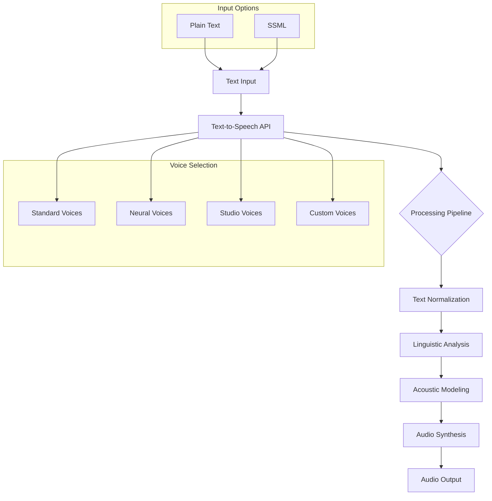

# Text-to-Speech

Text-to-Speech is Google Cloud's voice synthesis service that enables developers to convert text into natural-sounding human speech. It uses advanced neural network models to generate high-quality audio in multiple languages and voices, with customization options for specific use cases.

## Key Features

- **Global Language Support**: 220+ voices across 40+ languages and variants
- **Neural Voices**: High-quality, natural-sounding speech
- **Studio Voices**: Premium voices with enhanced naturalness
- **Voice Customization**: Create custom voices
- **SSML Support**: Fine-grained control over pronunciation
- **Audio Profiles**: Optimize for different playback devices
- **Speech Marks**: Synchronize speech with visual elements
- **Pitch Control**: Adjust voice pitch
- **Speaking Rate Control**: Adjust speech speed
- **Volume Gain Control**: Adjust audio volume
- **Multiple Audio Formats**: MP3, WAV, OGG, etc.
- **Batch Synthesis**: Process multiple texts
- **Long-form Synthesis**: Handle lengthy content
- **Pronunciation Customization**: Customize specific terms
- **Emphasis Marks**: Control word emphasis
- **Pauses and Breaks**: Natural speech timing

## How Text-to-Speech Works

## Text-to-Speech Features in Detail

### Voice Types

- **Standard Voices**: 
  - Traditional parametric voices
  - Wide language coverage
  - Lower latency
  - Consistent quality

- **Neural Voices (WaveNet)**:
  - Deep neural network-based
  - More natural intonation and emphasis
  - Human-like prosody
  - Available in select languages
  - Denoted with "Neural2" suffix

- **Studio Voices**:
  - Premium quality voices
  - Recorded by professional voice actors
  - Highest naturalness
  - Limited language availability
  - Ideal for premium applications

- **Custom Voices**:
  - Train with your own audio data
  - Brand-specific voices
  - Consistent with brand identity
  - Control over voice characteristics
  - Available through Custom Voice program

### Input Methods

- **Plain Text**:
  - Simple text input
  - Automatic text normalization
  - Easy to implement
  - Limited control over pronunciation

- **Speech Synthesis Markup Language (SSML)**:
  - XML-based markup language
  - Fine-grained control over:
    - Pronunciation
    - Emphasis
    - Pauses
    - Pitch
    - Rate
    - Volume
  - Support for special cases like numbers, dates, times
  - Language switching within text

### SSML Features

- **Pronunciation Control**:
  - Phonetic pronunciation (`<phoneme>`)
  - Substitute pronunciation (``)
  - Language switching (`<lang>`)
  - Expand abbreviations

- **Prosody Control**:
  - Rate adjustment (`<prosody rate>`)
  - Pitch adjustment (`<prosody pitch>`)
  - Volume adjustment (`<prosody volume>`)

- **Structural Elements**:
  - Sentences (`<s>`)
  - Paragraphs (`
`)
  - Breaks and pauses (`<break>`)

- **Special Cases**:
  - Say-as instructions (`<say-as>`)
    - Dates
    - Times
    - Addresses
    - Cardinal/ordinal numbers
    - Fractions
    - Telephone numbers
  - Emphasis (`<emphasis>`)
  - Audio marks (`<mark>`)

### Audio Profiles

- **Device Optimization**:
  - Headphones
  - Phone line
  - Smart home speakers
  - Smart watches
  - Car speakers
  - Large home entertainment systems

- **Effects**:
  - Equalization
  - Dynamic range compression
  - Pitch adjustment
  - Optimal for target playback device

### Audio Formats

- **Linear PCM**: Uncompressed audio
- **MP3**: Compressed format, widely supported
- **OGG Opus**: Efficient compression, good quality
- **MULAW**: Telephony applications
- **ALAW**: Telephony applications
- **Sample Rates**: 8kHz to 48kHz
- **Bit Depth**: 16-bit

### Speech Marks

- **Timing Information**:
  - Word timing
  - Sentence timing
  - SSML mark timing
- **Synchronization Use Cases**:
  - Lip syncing for avatars
  - Text highlighting
  - Animation timing
  - Subtitle synchronization

## Language and Voice Support

Text-to-Speech supports a wide range of languages and voices:

| Language | Standard Voices | Neural Voices | Studio Voices |
|----------|----------------|---------------|---------------|
| English (US) | Multiple | Multiple | Available |
| English (UK) | Multiple | Multiple | Available |
| English (Australia) | Multiple | Multiple | Limited |
| Spanish | Multiple | Multiple | Limited |
| French | Multiple | Multiple | Limited |
| German | Multiple | Multiple | Limited |
| Italian | Multiple | Multiple | Limited |
| Japanese | Multiple | Multiple | Limited |
| Korean | Multiple | Multiple | Limited |
| Portuguese | Multiple | Multiple | Limited |
| Hindi | Multiple | Limited | Limited |
| Other languages | Available | Limited | Very Limited |

## Integration Methods

### REST API

- HTTP-based API for direct integration
- Support for multiple programming languages
- Synchronous processing
- Comprehensive documentation and client libraries

### Client Libraries

- Official libraries for popular languages:
  - Python
  - Java
  - Node.js
  - Go
  - PHP
  - Ruby
  - C#
- Simplified authentication and request handling
- Type-safe interfaces
- Error handling and retries

### Mobile SDK

- Firebase ML Kit integration
- On-device and cloud-based processing
- Android and iOS support
- Optimized for mobile environments

## Custom Voice

When pre-built voices aren't sufficient, custom voices can be created:

- **Data Requirements**: High-quality voice recordings
- **Training Process**: Managed by Google
- **Voice Tuning**: Refine voice characteristics
- **Deployment**: Private voice model
- **Usage**: Exclusive to your organization
- **Licensing**: Specific terms for custom voices

## Performance Considerations

- **Text Length**: Optimal performance for moderate-length texts
- **SSML Complexity**: Complex SSML may increase latency
- **Voice Selection**: Neural voices have higher latency
- **Batch Processing**: More efficient for multiple texts
- **Caching**: Consider caching common phrases
- **Rate Limits**: Quotas apply based on service tier
- **Latency**: Varies by voice type and text complexity

## Security and Compliance

- **Data Privacy**: Text processed according to Google Cloud terms
- **Encryption**: Data encrypted in transit and at rest
- **Access Control**: IAM integration for fine-grained access
- **Audit Logging**: Track API usage
- **Compliance**: Supports various compliance programs
- **Data Retention**: Options to control data retention
- **Private Endpoints**: VPC Service Controls support

## Pricing Model

- **Pay-per-use**: Based on characters processed
- **Free Tier**: Monthly free quota
- **Voice Type Pricing**: Different rates for different voice types
  - Standard voices: Lower cost
  - Neural voices: Higher cost
  - Studio voices: Premium pricing
- **Volume Discounts**: Reduced rates for high volume
- **Custom Voice**: Custom pricing based on requirements

## Text-to-Speech Use Cases

- **Interactive Voice Response (IVR)**: Automated phone systems
- **Voice Assistants**: Natural-sounding responses
- **Accessibility**: Reading content for visually impaired
- **E-learning**: Audio narration for educational content
- **Navigation Systems**: Turn-by-turn directions
- **Public Announcements**: Transportation and public spaces
- **Audiobook Production**: Generate narration for books
- **Gaming**: Character voices and narration
- **IoT Devices**: Voice output for smart devices
- **Content Creation**: Automated voiceovers
- **Language Learning**: Pronunciation examples
- **Customer Service**: Automated responses

## Comparison with Other Text-to-Speech Services

| Feature | Google Text-to-Speech | AWS Polly | Azure Text-to-Speech |
|---------|----------------------|-----------|----------------------|
| Voice Quality | High (Neural/Studio) | High (Neural) | High (Neural) |
| Language Support | 40+ languages | 30+ languages | 110+ languages |
| Voice Types | Standard/Neural/Studio | Standard/Neural | Standard/Neural |
| Custom Voices | Yes | Yes | Yes |
| SSML Support | Comprehensive | Comprehensive | Comprehensive |
| Audio Formats | Multiple | Multiple | Multiple |
| Speech Marks | Yes | Yes | Yes |
| Integration | GCP services | AWS services | Azure services |
| Pricing Model | Per character | Per character | Per character |
| On-device Options | Limited | No | Yes |

## Best Practices

1. **Use SSML for Complex Text**: Control pronunciation and prosody
2. **Select Appropriate Voice**: Match voice to content and audience
3. **Optimize Text Input**: Format text for natural speech
4. **Use Caching**: Store frequently used phrases
5. **Handle Long Content**: Split into manageable chunks
6. **Test Across Devices**: Ensure quality on target devices
7. **Consider Audio Profiles**: Optimize for playback environment
8. **Implement Error Handling**: Manage API failures gracefully
9. **Monitor Usage**: Track API consumption
10. **Consider User Preferences**: Allow voice selection when possible

## Related Topics
- [[GCP AI & Machine Learning]]
- [[Speech-to-Text]]
- [[Natural Language AI]]
- [[Dialogflow]]
- [[Contact Center AI]]
