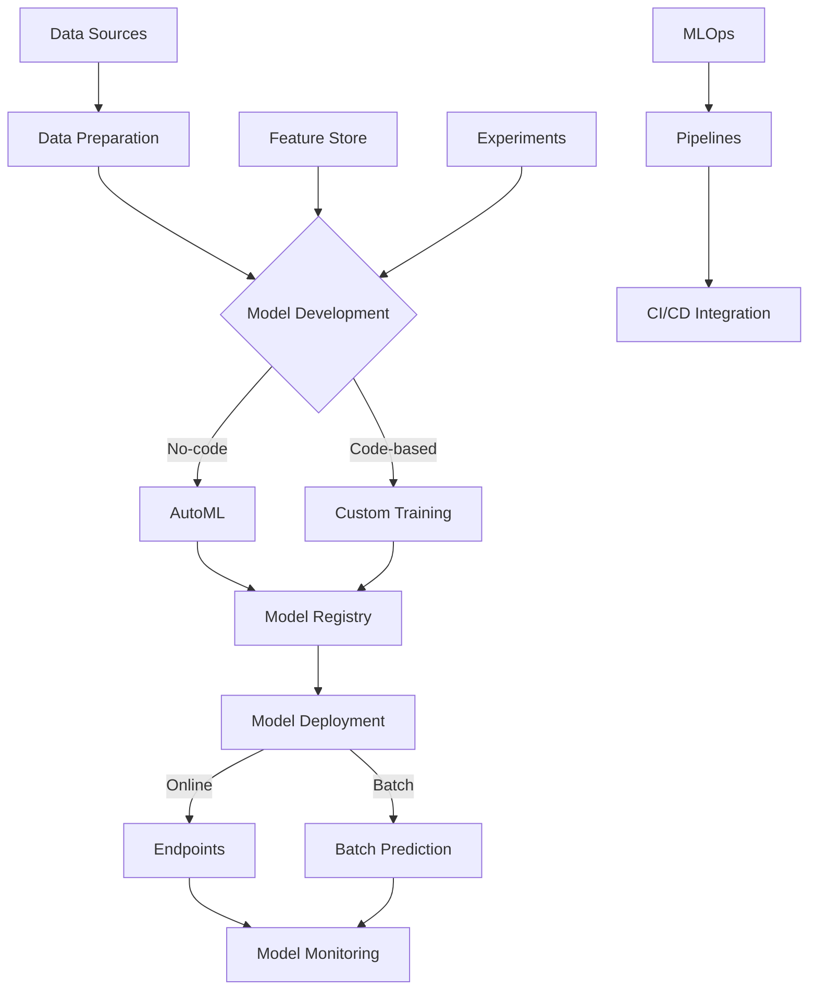

# Vertex AI

Vertex AI is Google Cloud's unified artificial intelligence platform that brings together all of Google Cloud's ML tools and capabilities under a single UI and API. It enables data scientists and ML engineers to accelerate the deployment and maintenance of ML models at scale.

## Key Features

- **Unified Platform**: Single interface for all ML workflows
- **AutoML**: No-code ML model development
- **Custom Training**: Code-based model development
- **Feature Store**: Centralized feature repository
- **Model Registry**: Version control for ML models
- **Pipelines**: Orchestration of ML workflows
- **Experiments**: Track and compare model experiments
- **Endpoints**: Scalable model serving
- **Model Monitoring**: Track model performance
- **Explainable AI**: Understand model decisions
- **Generative AI**: Access to foundation models
- **Vector Search**: Semantic search capabilities
- **Workbench**: Managed Jupyter notebooks

## Vertex AI Architecture

## Vertex AI Components

### AutoML

AutoML in Vertex AI enables you to build ML models without writing code:

- **AutoML Vision**: Image classification and object detection
- **AutoML Video**: Video classification and object tracking
- **AutoML Text**: Text classification, entity extraction
- **AutoML Translation**: Custom translation models
- **AutoML Tabular**: Regression, classification for structured data

### Custom Training

Custom Training allows you to use your own code to train models:

- **Pre-built Containers**: Ready-to-use training environments
- **Custom Containers**: Bring your own container
- **Distributed Training**: Scale across multiple machines
- **Hyperparameter Tuning**: Optimize model parameters
- **GPU/TPU Support**: Hardware acceleration

### Feature Store

Feature Store is a centralized repository for ML features:

- **Feature Management**: Create, store, and serve features
- **Feature Sharing**: Reuse features across models
- **Online Serving**: Low-latency feature retrieval
- **Batch Serving**: High-throughput feature retrieval
- **Feature Monitoring**: Track feature statistics

### Model Registry

Model Registry provides version control for ML models:

- **Model Versioning**: Track model versions
- **Model Lineage**: Track model origin and dependencies
- **Model Artifacts**: Store model artifacts
- **Deployment Management**: Track deployments
- **Approval Workflows**: Governance for model deployment

### Pipelines

Vertex AI Pipelines automates ML workflows:

- **Pipeline Definition**: Define workflows as code
- **Pipeline Components**: Reusable pipeline steps
- **Pipeline Execution**: Run pipelines on schedule or trigger
- **Pipeline Monitoring**: Track pipeline execution
- **Pipeline Templates**: Reusable workflow templates

### Endpoints

Vertex AI Endpoints provide scalable model serving:

- **Online Prediction**: Low-latency inference
- **Auto-scaling**: Scale based on traffic
- **Traffic Splitting**: Test multiple model versions
- **Model Monitoring**: Track performance
- **Explainable AI**: Understand predictions

### Workbench

Vertex AI Workbench provides managed Jupyter notebooks:

- **Managed Notebooks**: Fully managed JupyterLab
- **User-managed Notebooks**: Customizable environments
- **Integrated JupyterLab**: Familiar interface
- **Pre-installed Packages**: Ready-to-use ML libraries
- **GPU/TPU Support**: Hardware acceleration

### Generative AI

Vertex AI provides access to foundation models:

- **Text Generation**: Generate human-like text
- **Code Generation**: Generate code from descriptions
- **Image Generation**: Create images from text
- **Model Tuning**: Customize foundation models
- **Prompt Design**: Tools for effective prompting
- **Responsible AI**: Safety measures and controls

## MLOps with Vertex AI

Vertex AI provides comprehensive MLOps capabilities:

1. **Experiment Tracking**
   - Track model parameters
   - Compare model performance
   - Visualize results

2. **Pipeline Automation**
   - Define pipelines as code
   - Schedule pipeline execution
   - Monitor pipeline performance

3. **Continuous Integration/Deployment**
   - Automate model testing
   - Automate model deployment
   - Integration with CI/CD tools

4. **Model Monitoring**
   - Track prediction quality
   - Detect model drift
   - Set up alerts

5. **Feature Management**
   - Centralize feature definitions
   - Track feature lineage
   - Monitor feature statistics

## Integration with Google Cloud

Vertex AI integrates with several Google Cloud services:

- **BigQuery**: Data source and destination
- **Cloud Storage**: Store datasets and models
- **Dataflow**: Data processing for ML
- **Pub/Sub**: Event-driven ML workflows
- **Cloud Functions**: Serverless ML components
- **Cloud Run**: Containerized ML serving
- **GKE**: Kubernetes-based ML infrastructure
- **IAM**: Access control for ML resources

## Use Cases

- **Computer Vision**: Image and video analysis
- **Natural Language Processing**: Text understanding
- **Recommendation Systems**: Personalized recommendations
- **Forecasting**: Time series prediction
- **Anomaly Detection**: Identify unusual patterns
- **Classification**: Categorize data
- **Regression**: Predict numerical values
- **Generative AI Applications**: Create content
- **Conversational AI**: Build intelligent agents
- **Search and Discovery**: Semantic search

## Comparison with Other ML Platforms

| Feature | Vertex AI | AWS SageMaker | Azure ML |
|---------|-----------|---------------|----------|
| Unified Platform | Yes | Yes | Yes |
| AutoML | Comprehensive | Limited | Comprehensive |
| Custom Training | Flexible | Flexible | Flexible |
| MLOps | Comprehensive | Comprehensive | Comprehensive |
| Foundation Models | Extensive | Limited | Moderate |
| Integration | GCP services | AWS services | Azure services |
| Pricing Model | Pay-as-you-go | Pay-as-you-go | Pay-as-you-go |
| Ease of Use | High | Moderate | Moderate |

## Best Practices

1. **Start with AutoML**: Begin with no-code before custom
2. **Use Feature Store**: Centralize feature management
3. **Implement Pipelines**: Automate ML workflows
4. **Version Control Models**: Use Model Registry
5. **Monitor Models**: Track performance in production
6. **Implement CI/CD**: Automate testing and deployment
7. **Use Managed Endpoints**: Simplify serving infrastructure
8. **Apply Responsible AI**: Ensure fairness and transparency
9. **Optimize Costs**: Right-size resources
10. **Document Everything**: Maintain comprehensive documentation

## Limitations and Considerations

- **Learning Curve**: Complex platform with many components
- **Cost Management**: Monitor resource usage
- **Regional Availability**: Some features limited to specific regions
- **Integration Complexity**: Complex integrations with existing systems
- **Governance Requirements**: Compliance and regulatory considerations
- **Team Skills**: Required expertise for effective use

## Related Topics
- [[GCP AI & Machine Learning]]
- [[BigQuery ML]]
- [[Cloud Storage]]
- [[Dataflow]]
- [[Machine Learning Best Practices]]
