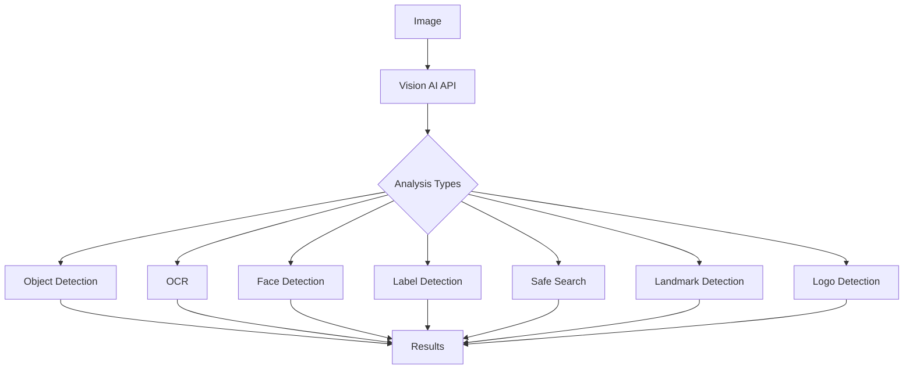

# Vision AI

Vision AI is Google Cloud's image analysis service that uses machine learning to help understand the content of images. It provides pre-trained models via API, allowing developers to detect objects, recognize text, identify explicit content, and extract other visual attributes without having to build their own machine learning models.

## Key Features

- **Object Detection**: Identify multiple objects within images
- **Label Detection**: Classify images into thousands of categories
- **Landmark Detection**: Recognize famous landmarks
- **Logo Detection**: Identify company logos
- **Face Detection**: Detect faces and facial attributes
- **Text Detection (OCR)**: Extract text from images
- **Document Text Detection**: Specialized OCR for documents
- **Image Properties**: Analyze color properties
- **Crop Hints**: Suggest optimal image cropping
- **Web Detection**: Find similar images on the web
- **Safe Search Detection**: Identify explicit content
- **Product Search**: Visual product search and recommendations
- **Batch Annotation**: Process multiple images
- **AutoML Vision**: Create custom vision models

## How Vision AI Works

## Vision AI API Features in Detail

### Object Detection

- Identifies multiple objects within an image
- Provides bounding boxes around detected objects
- Assigns confidence scores to detections
- Supports thousands of object categories
- Works with multiple objects in a single image

### Label Detection

- Classifies images into thousands of predefined categories
- Provides confidence scores for each label
- Supports general concepts and specific objects
- Detects multiple labels per image
- Organizes labels hierarchically

### Landmark Detection

- Recognizes famous natural and human-made structures
- Provides the name and geographic coordinates
- Includes confidence scores for detections
- Global coverage of landmarks
- Useful for travel and tourism applications

### Logo Detection

- Identifies company and brand logos
- Provides bounding boxes around logos
- Assigns confidence scores to detections
- Supports thousands of popular brands
- Useful for brand monitoring and analytics

### Face Detection

- Detects human faces in images
- Identifies facial landmarks (eyes, nose, mouth)
- Analyzes emotional attributes
- Detects multiple faces in a single image
- Provides face bounding boxes
- **Note**: Not a facial recognition service (does not identify individuals)

### Text Detection (OCR)

- Extracts text from images (Optical Character Recognition)
- Supports multiple languages
- Provides text bounding boxes
- Detects both printed and handwritten text
- Works with various fonts and styles

### Document Text Detection

- Specialized OCR for structured documents
- Preserves text layout and structure
- Identifies paragraphs, blocks, and lines
- Better for dense text documents
- Optimized for printed documents

### Image Properties

- Analyzes dominant colors in images
- Provides color information in various formats (RGB, hex)
- Calculates color percentages
- Useful for design and creative applications
- Helps with visual consistency

### Safe Search Detection

- Identifies potentially explicit or offensive content
- Categorizes content across multiple dimensions:
  - Adult
  - Spoof
  - Medical
  - Violence
  - Racy
- Provides confidence levels for each category
- Helps enforce content policies

### Web Detection

- Finds similar images on the web
- Identifies web entities related to the image
- Provides URLs of matching images
- Suggests image labels based on web data
- Useful for content research and verification

## Vision AI Use Cases

- **Content Moderation**: Filter inappropriate images
- **Product Cataloging**: Automatically tag product images
- **Document Digitization**: Convert paper documents to digital text
- **Visual Search**: Enable searching by image
- **Brand Monitoring**: Track logo appearances
- **Social Media Analysis**: Understand image content at scale
- **Accessibility**: Make image content accessible to visually impaired
- **Retail Analytics**: Analyze store shelf layouts and product placement
- **Security**: Detect suspicious objects or activities
- **Healthcare**: Analyze medical images (with appropriate compliance)
- **Manufacturing**: Quality control and defect detection
- **Real Estate**: Automatically categorize property images

## Integration Methods

### REST API

- HTTP-based API for direct integration
- Support for multiple programming languages
- Synchronous and asynchronous processing
- Batch processing capabilities
- Comprehensive documentation and client libraries

### Client Libraries

- Official libraries for popular languages:
  - Python
  - Java
  - Node.js
  - Go
  - PHP
  - Ruby
  - C#
- Simplified authentication and request handling
- Type-safe interfaces
- Error handling and retries

### Mobile SDK

- Firebase ML Kit integration
- On-device and cloud-based processing
- Android and iOS support
- Optimized for mobile environments
- Offline capabilities

## Custom Vision Models with AutoML Vision

When pre-trained models aren't sufficient, AutoML Vision allows you to create custom vision models:

- **No coding required**: Train models through UI
- **Custom labels**: Define your own categories
- **Specialized domains**: Train for specific use cases
- **Model evaluation**: Assess model performance
- **Deployment options**: Cloud API or edge devices
- **Continuous improvement**: Retrain with new data

## Performance Considerations

- **Image Quality**: Higher quality images yield better results
- **Image Size**: Optimal size between 640x480 and 1600x1200 pixels
- **File Size**: Maximum 20MB per image, 10MB for inline requests
- **Batch Processing**: Up to 16 images per request
- **Rate Limits**: Quotas apply based on service tier
- **Latency**: Varies by feature and image complexity
- **Accuracy**: Varies by feature and image quality

## Security and Compliance

- **Data Privacy**: Images processed according to Google Cloud terms
- **Encryption**: Data encrypted in transit and at rest
- **Access Control**: IAM integration for fine-grained access
- **Audit Logging**: Track API usage
- **Compliance**: Supports various compliance programs
- **Data Retention**: Options to control data retention
- **Private Endpoints**: VPC Service Controls support

## Pricing Model

- **Pay-per-use**: Based on features used and volume
- **Free Tier**: Monthly free quota for each feature
- **Volume Discounts**: Reduced rates for high volume
- **Feature-based Pricing**: Different rates for different features
- **AutoML Vision**: Separate pricing for custom models

## Comparison with Other Vision Services

| Feature | Google Vision AI | AWS Rekognition | Azure Computer Vision |
|---------|-----------------|-----------------|----------------------|
| Object Detection | Extensive | Extensive | Extensive |
| OCR | Strong | Basic | Strong |
| Face Analysis | Basic | Advanced | Advanced |
| Custom Models | AutoML Vision | Custom Labels | Custom Vision |
| Landmark Detection | Yes | No | Limited |
| Logo Detection | Yes | Yes | No |
| Integration | GCP services | AWS services | Azure services |
| Pricing Model | Per feature | Per feature | Per feature |
| On-device Options | Yes | Limited | Yes |

## Best Practices

1. **Optimize Image Quality**: Provide clear, well-lit images
2. **Use Appropriate Features**: Select only needed analyses
3. **Implement Error Handling**: Manage API failures gracefully
4. **Consider Batch Processing**: For large volumes of images
5. **Cache Results**: Store results for frequently analyzed images
6. **Set Confidence Thresholds**: Filter low-confidence detections
7. **Test with Diverse Images**: Ensure performance across image types
8. **Combine Features**: Use multiple features for richer analysis
9. **Monitor Usage**: Track API consumption
10. **Consider Privacy**: Handle user images appropriately

## Related Topics
- [[GCP AI & Machine Learning]]
- [[AutoML Vision]]
- [[Document AI]]
- [[Vertex AI]]
- [[Product Search]]
