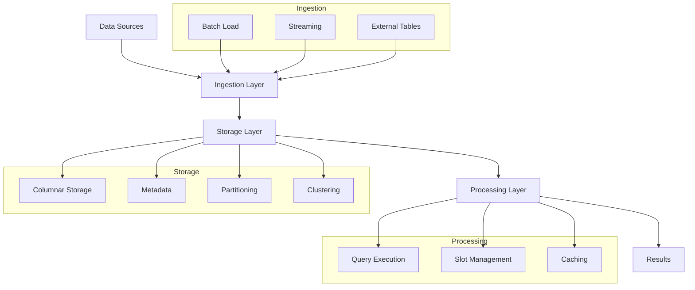

---
tags:
  - gcp
  - big_data
  - analytics
  - data_warehouse
  - sql
  - bigquery
---

# BigQuery

BigQuery is Google Cloud's fully managed, serverless, highly scalable, and cost-effective multi-cloud data warehouse designed for business agility. It enables analyzing petabytes of data using ANSI SQL and supports streaming analytics, machine learning, and geospatial analysis.

## Key Features

- **Serverless Architecture**: No infrastructure to manage
- **Separation of Storage and Compute**: Independent scaling
- **Petabyte-scale**: Handle massive datasets
- **Real-time Analytics**: Stream data for immediate analysis
- **Standard SQL Support**: ANSI SQL 2011 compliant
- **Built-in Machine Learning**: ML models in SQL
- **Geospatial Analysis**: Location-based analytics
- **Multi-cloud**: Query data across clouds
- **High Availability**: 99.99% SLA
- **Automatic Backup and Restore**: Point-in-time recovery
- **Data Sharing**: Share datasets across organizations
- **Integrated Security**: IAM, VPC Service Controls, encryption
- **BI Engine**: In-memory analysis service
- **Materialized Views**: Precomputed views for performance
- **Query Optimization**: Automatic query optimization
- **Capacity Planning**: Flexible reservation model

## BigQuery Architecture

## Data Organization

BigQuery organizes data in a hierarchical structure:

- **Organization**: Top-level container
- **Project**: Container for resources
- **Dataset**: Container for tables and views
- **Table**: Structured data storage
- **View**: Virtual table defined by a SQL query
- **Materialized View**: Precomputed view

## Data Types

BigQuery supports various data types:

- **Numeric**: INT64, NUMERIC, FLOAT64, BIGNUMERIC
- **String**: STRING
- **Boolean**: BOOL
- **Bytes**: BYTES
- **Date/Time**: DATE, DATETIME, TIME, TIMESTAMP
- **Structured**: STRUCT, ARRAY
- **Geography**: GEOGRAPHY

## Storage Optimization

BigQuery offers several storage optimization techniques:

### Partitioning

- **Time-based Partitioning**: By ingestion time, date column
- **Integer Range Partitioning**: By integer column
- **Benefits**: Reduced cost, improved performance
- **Limitations**: 4,000 partitions per table

### Clustering

- **Column-based Clustering**: Up to 4 columns
- **Automatic Re-clustering**: Maintains order
- **Benefits**: Improved filter and aggregate performance
- **Works with**: Partitioning for combined optimization

## Data Loading

BigQuery provides multiple data loading methods:

- **Batch Loading**: Load from Cloud Storage, local files
- **Streaming**: Real-time data insertion
- **Data Transfer Service**: Automated data loading
- **External Tables**: Query data in place
- **Dataflow**: ETL pipelines
- **Partners**: Third-party ETL tools

## Query Execution

BigQuery's query execution is:

- **Distributed**: Across thousands of workers
- **Columnar**: Reads only required columns
- **Slot-based**: Compute units for processing
- **Cached**: Automatic query result caching
- **Optimized**: Automatic query optimization
- **Scalable**: Handles complex queries on large datasets

## Performance Optimization

Techniques to optimize BigQuery performance:

1. **Partitioning and Clustering**: Reduce data scanned
2. **Column Selection**: Query only needed columns
3. **Filter Early**: Apply filters early in queries
4. **Materialized Views**: Precompute common queries
5. **BI Engine**: In-memory analysis for small datasets
6. **Denormalization**: Reduce JOINs
7. **Query Caching**: Reuse results
8. **Approximate Aggregations**: Use approximate functions
9. **Script Optimization**: Efficient SQL scripting
10. **Reservation Model**: Dedicated resources

## Cost Management

BigQuery offers several pricing models and cost controls:

- **On-demand Pricing**: Pay per TB processed
- **Flat-rate Pricing**: Reserved slots
- **Storage Pricing**: Active vs. long-term storage
- **Free Tier**: Monthly free quota
- **Cost Controls**: Custom quotas, budgets, alerts
- **Query Optimization**: Reduce data processed
- **Data Lifecycle**: Archive cold data

## Security Features

BigQuery includes comprehensive security features:

- **IAM**: Fine-grained access control
- **Column-level Security**: Restrict access to columns
- **Row-level Security**: Dynamic data filtering
- **Dynamic Data Masking**: Hide sensitive data
- **VPC Service Controls**: Network security perimeter
- **Customer-managed Encryption Keys**: Control encryption
- **Data Lineage**: Track data origin and transformations
- **Audit Logging**: Track user activity

## BigQuery ML

BigQuery ML enables building ML models using SQL:

- **Supported Models**:
  - Linear/Logistic Regression
  - K-means Clustering
  - Time Series
  - Boosted Trees
  - Deep Neural Networks
  - AutoML Tables
  - Matrix Factorization
  - TensorFlow models
  - XGBoost models
- **End-to-end Workflow**: Train, evaluate, predict
- **Feature Engineering**: SQL-based transformations
- **Hyperparameter Tuning**: Optimize model parameters
- **Model Explainability**: Understand model decisions

## BigQuery BI Engine

BI Engine accelerates analytics:

- **In-memory Analysis**: Fast query processing
- **Low Latency**: Sub-second query response
- **Seamless Integration**: Works with existing tools
- **Automatic Optimization**: Smart memory management
- **Reserved Capacity**: Dedicated resources

## Integration with Google Cloud

BigQuery integrates with several Google Cloud services:

- **Cloud Storage**: Data source and export
- **Dataflow**: ETL pipelines
- **Pub/Sub**: Real-time data ingestion
- **Data Studio**: Visualization
- **Looker**: Enterprise BI
- **Vertex AI**: Advanced ML
- **Data Catalog**: Metadata management
- **Dataproc**: Spark/Hadoop integration
- **Cloud Functions**: Event-driven processing

## Use Cases

- **Data Warehousing**: Centralized analytics repository
- **Business Intelligence**: Reporting and dashboards
- **Customer Analytics**: Understand customer behavior
- **IoT Analytics**: Process and analyze device data
- **Log Analysis**: Analyze application and system logs
- **Real-time Analytics**: Streaming data analysis
- **Predictive Analytics**: Forecast business outcomes
- **Data Science**: Advanced analytics and ML
- **Marketing Analytics**: Campaign performance
- **Financial Analysis**: Transaction and risk analysis

## Comparison with Other Data Warehouses

| Feature | BigQuery | Snowflake | Amazon Redshift |
|---------|----------|-----------|-----------------|
| Architecture | Serverless | Multi-cluster | Cluster-based |
| Scaling | Automatic | Separate compute | Manual/Elastic |
| Pricing Model | On-demand/Flat-rate | Credits-based | Instance-based |
| Setup Complexity | Low | Medium | High |
| Query Language | Standard SQL | Standard SQL | PostgreSQL-based |
| ML Capabilities | Built-in | Limited | Redshift ML |
| Geospatial | Built-in | Limited | Limited |
| Multi-cloud | Yes | Yes | AWS only |
| Real-time | Built-in | Limited | Limited |

## Best Practices

1. **Schema Design**: Optimize for query patterns
2. **Partitioning Strategy**: Choose appropriate partitioning
3. **Cost Monitoring**: Track and optimize costs
4. **Query Optimization**: Write efficient queries
5. **Data Loading**: Choose appropriate loading method
6. **Resource Management**: Use reservations for predictable workloads
7. **Security Implementation**: Apply principle of least privilege
8. **Monitoring**: Set up alerts and monitoring
9. **Disaster Recovery**: Plan for data resilience
10. **Data Governance**: Implement metadata management

## Related Topics
- [[GCP Big Data Analytics]]
- [[BigQuery ML]]
- [[Data Studio]]
- [[Looker]]
- [[Dataflow]]
