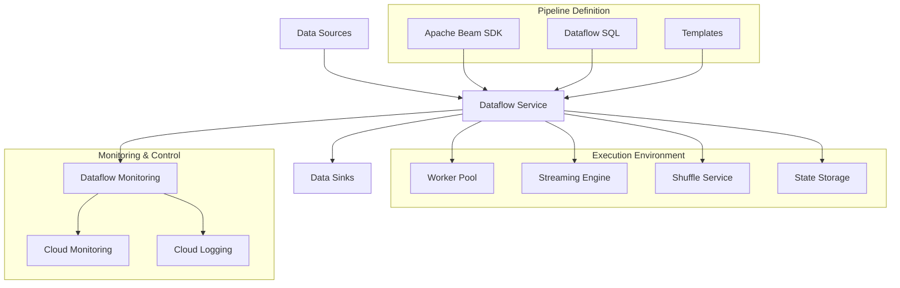

Dataflow is Google Cloud's fully managed service for executing Apache Beam pipelines for stream and batch data processing. It provides a serverless, auto-scaling execution environment that eliminates operational overhead and enables developers to focus on programming logic rather than managing infrastructure.

## Key Features

- **Unified Programming Model**: Same code for batch and streaming
- **Serverless Execution**: No infrastructure management
- **Auto-scaling**: Dynamic resource allocation
- **Horizontal Autoscaling**: Scale workers based on workload
- **Vertical Autoscaling**: Optimize memory usage
- **Streaming Engine**: Separate compute from state management
- **Flexible Resource Scheduling**: Optimize for cost or speed
- **Dataflow Shuffle**: Optimized data redistribution
- **Streaming Analytics**: Real-time data processing
- **Exactly-once Processing**: Guaranteed data consistency
- **Dynamic Work Rebalancing**: Optimize worker utilization
- **Fusion Optimization**: Combine processing steps
- **Monitoring and Metrics**: Built-in observability
- **Templates**: Reusable pipeline patterns
- **SQL Support**: Query-based pipeline definition
- **ML Integration**: Built-in ML transforms
- **Dataflow Prime**: Next-generation execution engine

## Dataflow Architecture

## Apache Beam Basics

Dataflow uses Apache Beam as its programming model:

- **PCollection**: Distributed data collection
- **PTransform**: Data processing operation
- **Pipeline**: Complete data processing workflow
- **Runner**: Execution environment (Dataflow is a runner)
- **I/O Connectors**: Data source and sink adapters
- **Window**: Time-based data grouping
- **Watermark**: Progress tracking for streaming
- **Trigger**: When to emit results

## Batch vs. Streaming Processing

Dataflow supports both batch and streaming with the same programming model:

| Aspect | Batch Processing | Streaming Processing |
|--------|------------------|---------------------|
| Data Scope | Finite datasets | Unbounded datasets |
| Latency | Minutes to hours | Seconds to minutes |
| Processing | Process complete datasets | Process data as it arrives |
| Windows | Global windows | Time-based windows |
| Use Cases | Historical analysis, ETL | Real-time analytics, monitoring |
| Execution | Optimized for throughput | Optimized for latency |
| State | Limited state requirements | Stateful processing |

## Windowing and Triggers

For streaming data, Dataflow provides:

### Window Types
- **Fixed Time Windows**: Regular time intervals
- **Sliding Time Windows**: Overlapping intervals
- **Session Windows**: Activity-based grouping
- **Global Windows**: All data in one window

### Trigger Types
- **Event Time Triggers**: Based on data timestamps
- **Processing Time Triggers**: Based on system time
- **Composite Triggers**: Combinations of triggers
- **Repeated Triggers**: Fire multiple times

## Dataflow Execution Model

Dataflow's execution environment provides:

- **Worker VMs**: Compute resources for pipeline execution
- **Dynamic Scaling**: Add/remove workers as needed
- **Work Partitioning**: Distribute processing across workers
- **Streaming Engine**: Separate compute from processing state
- **Shuffle Service**: Optimize data redistribution
- **Fusion Optimization**: Combine steps for efficiency
- **Dataflow Prime**: Next-generation execution engine with:
  - Enhanced performance
  - Reduced resource usage
  - Lower latency
  - Improved cost efficiency

## Pipeline Development

Dataflow pipelines can be developed using:

### Apache Beam SDKs
- **Java**: Most mature SDK
- **Python**: Growing feature parity
- **Go**: Newer SDK with core features
- **TypeScript**: Preview SDK

### Dataflow SQL
- SQL-based pipeline definition
- Interactive development in BigQuery UI
- Integration with BigQuery and Pub/Sub

### Dataflow Templates
- Pre-built pipelines for common patterns
- Customizable parameters
- No coding required for execution
- Supports both batch and streaming

## Common Transforms

Dataflow/Beam provides several built-in transforms:

- **ParDo**: Element-wise processing
- **GroupByKey**: Group elements by key
- **CoGroupByKey**: Join collections by key
- **Combine**: Aggregate values
- **Flatten**: Merge collections
- **Partition**: Split collection
- **Filter**: Remove elements
- **Map**: Transform elements
- **FlatMap**: One-to-many transformation
- **Count**: Count elements
- **Top**: Select largest elements
- **Sample**: Select random elements

## I/O Connectors

Dataflow supports numerous data sources and sinks:

### Google Cloud
- **BigQuery**: Data warehouse
- **Pub/Sub**: Messaging service
- **Cloud Storage**: Object storage
- **Bigtable**: NoSQL database
- **Spanner**: Relational database
- **Datastore/Firestore**: Document database

### Third-party
- **Kafka**: Messaging platform
- **JDBC**: Relational databases
- **MongoDB**: Document database
- **Cassandra**: Wide-column store
- **Redis**: In-memory data store
- **Elasticsearch**: Search engine
- **File formats**: CSV, JSON, Avro, Parquet, etc.

## Dataflow SQL

Dataflow SQL allows creating pipelines using SQL:

- **Standard SQL Syntax**: Familiar query language
- **Streaming Extensions**: Windowing, watermarks
- **Interactive Development**: In BigQuery UI
- **Table Definitions**: Connect to data sources
- **UDF Support**: Custom functions
- **Integration**: BigQuery, Pub/Sub, other sources

## Dataflow Templates

Templates provide pre-built solutions for common use cases:

- **Batch Templates**: Data migration, transformation
- **Streaming Templates**: Real-time processing
- **Custom Templates**: Build your own reusable pipelines
- **Template Parameters**: Customization without coding
- **Flex Templates**: Enhanced customization options
- **Template Catalog**: Growing library of solutions

## Performance Optimization

Techniques to optimize Dataflow performance:

1. **Pipeline Design**: Efficient transform sequence
2. **Fusion Optimization**: Automatic step combining
3. **Combiner Lifting**: Local pre-aggregation
4. **Worker Configuration**: Right-size resources
5. **Autoscaling**: Enable dynamic scaling
6. **Streaming Engine**: Enable for complex streaming
7. **Dataflow Shuffle**: Enable for large shuffles
8. **Dataflow Prime**: Use next-gen execution engine
9. **Windowing Strategy**: Appropriate window sizing
10. **Coder Optimization**: Efficient data serialization

## Cost Management

Dataflow offers several pricing models and cost controls:

- **On-demand Pricing**: Pay for resources used
- **Committed Use Discounts**: Reduced rates for commitments
- **Flex Resource Scheduling**: Optimize for cost
- **Dataflow Prime**: More efficient resource usage
- **Worker Optimization**: Right-size worker resources
- **Autoscaling**: Scale down when not needed
- **Job Scheduling**: Run batch jobs during off-peak
- **Monitoring**: Track resource usage

## Security Features

Dataflow includes comprehensive security features:

- **IAM**: Fine-grained access control
- **VPC Service Controls**: Network security perimeter
- **Private IP**: Internal network execution
- **CMEK**: Customer-managed encryption keys
- **Secure Boot**: Verified worker images
- **Confidential VMs**: Encrypted memory
- **Dataflow Shuffle**: Secure data redistribution
- **Audit Logging**: Track user activity

## Monitoring and Operations

Dataflow provides extensive monitoring capabilities:

- **Dataflow Monitoring UI**: Pipeline visualization
- **Execution Details**: Step-by-step metrics
- **Worker Logs**: Detailed execution logs
- **Cloud Monitoring**: Metrics and alerts
- **Cloud Logging**: Centralized logging
- **Job Validation**: Pre-execution checks
- **Pipeline Options**: Runtime configuration
- **Update**: Modify running pipelines
- **Drain**: Graceful shutdown

## Use Cases

- **ETL/ELT**: Data transformation and loading
- **Data Migration**: Move data between systems
- **Stream Analytics**: Real-time data processing
- **IoT Data Processing**: Device data analysis
- **Event Processing**: React to business events
- **Fraud Detection**: Real-time pattern matching
- **Clickstream Analysis**: User behavior tracking
- **Log Processing**: System and application logs
- **Sentiment Analysis**: Social media monitoring
- **Recommendation Systems**: Real-time personalization

## Comparison with Other Data Processing Services

| Feature | Dataflow | Apache Spark | Apache Flink |
|---------|----------|--------------|--------------|
| Programming Model | Apache Beam | RDD/DataFrame | DataStream/DataSet |
| Execution Model | Fully managed | Self/managed | Self/managed |
| Scaling | Automatic | Manual/Auto | Manual/Auto |
| Streaming | Native unified | Micro-batch | Native streaming |
| Exactly-once | Yes | Yes (structured) | Yes |
| Late Data | Native support | Limited | Native support |
| Setup Complexity | Low | Medium | High |
| Language Support | Java, Python, Go | Many | Java, Scala, Python |
| SQL Support | Yes | Yes | Yes |
| ML Integration | Yes | MLlib | FlinkML |

## Best Practices

1. **Pipeline Design**: Design for parallelism
2. **Data Structure**: Use appropriate coders
3. **Resource Sizing**: Right-size worker resources
4. **Error Handling**: Implement robust error handling
5. **Testing**: Use DirectRunner for local testing
6. **Monitoring**: Set up alerts for failures
7. **Cost Optimization**: Enable autoscaling
8. **Windowing**: Choose appropriate windows for streaming
9. **State Management**: Minimize state size
10. **CI/CD Integration**: Automate pipeline deployment

## Related Topics
- [[GCP Big Data Analytics]]
- [[Apache Beam]]
- [[Pub/Sub]]
- [[BigQuery]]
- [[Dataproc]]
