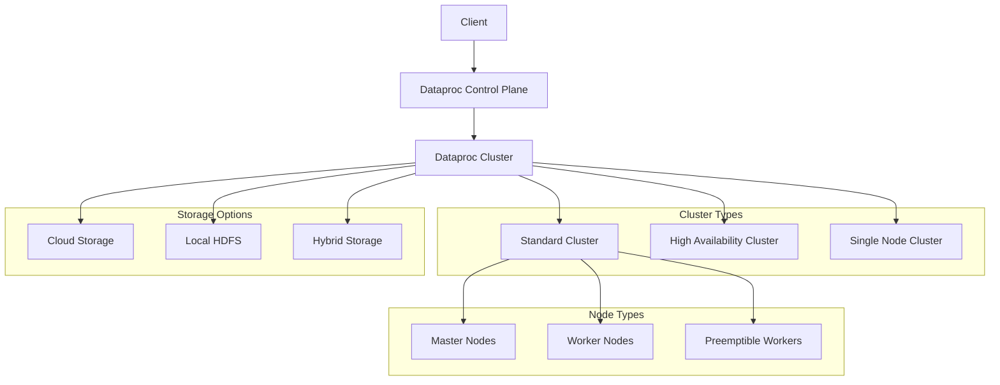

# Dataproc

Dataproc is Google Cloud's fully managed and highly scalable service for running Apache Hadoop, Apache Spark, Apache Flink, Presto, and 30+ open source tools and frameworks. It simplifies big data processing by providing a fast, easy-to-use, and cost-effective way to run data processing workloads on managed infrastructure.

## Key Features

- **Fast Cluster Creation**: Clusters in 90 seconds or less
- **Flexible Scaling**: Scale up/down as needed
- **Separation of Compute and Storage**: Use Cloud Storage as HDFS
- **Integration with GCP Services**: BigQuery, Bigtable, Pub/Sub
- **Multiple Cluster Modes**: Standard, High Availability, Single Node
- **Autoscaling**: Automatic worker adjustment
- **Preemptible VMs**: Cost-effective worker nodes
- **Custom Images**: Customize cluster environment
- **Component Gateway**: Secure web interfaces
- **Workflow Templates**: Reusable job workflows
- **Notebooks**: Interactive data exploration
- **Jobs API**: Programmatic job submission
- **Metastore Service**: Managed Hive Metastore
- **Optional Components**: 30+ ecosystem components
- **Secure Boot**: Verified VM images
- **Serverless Spark**: Spark without cluster management

## Dataproc Architecture

## Cluster Types and Configurations

Dataproc offers several cluster configurations:

### Standard Cluster
- 1 master node
- N worker nodes
- Simple setup for most workloads
- Cost-effective for medium workloads

### High Availability (HA) Cluster
- 3 master nodes
- N worker nodes
- Fault tolerance for master services
- Suitable for production workloads
- YARN and HDFS high availability

### Single Node Cluster
- 1 combined master/worker node
- No separate workers
- Ideal for development and testing
- Cost-effective for small workloads

### Serverless Spark (Spark on Dataproc)
- No cluster management
- Pay only for resources used
- Automatic scaling
- Simplified operations
- Ideal for batch processing

## Node Types

Dataproc clusters consist of different node types:

### Master Nodes
- Run HDFS NameNode
- Run YARN ResourceManager
- Host job drivers
- Manage cluster coordination
- Typically need more memory

### Worker Nodes
- Run HDFS DataNode
- Run YARN NodeManager
- Execute processing tasks
- Store data (if using HDFS)
- Can be scaled up/down

### Preemptible Worker Nodes
- Same software as regular workers
- Lower cost (60-80% discount)
- Can be reclaimed by GCP
- No HDFS storage
- Ideal for fault-tolerant workloads

## Storage Options

Dataproc supports multiple storage options:

### Cloud Storage
- Recommended primary storage
- Persistent beyond cluster lifecycle
- Globally accessible
- No replication overhead
- Cost-effective
- Scales independently

### Local HDFS
- Traditional Hadoop storage
- Faster for some workloads
- Tied to cluster lifecycle
- Requires careful sizing
- Needs replication management

### Hybrid Storage
- Combine Cloud Storage and HDFS
- Use HDFS for temporary data
- Use Cloud Storage for persistent data
- Optimize for performance and cost

## Supported Processing Frameworks

Dataproc supports numerous data processing frameworks:

### Core Components
- **Apache Hadoop**: Distributed computing framework
- **Apache Spark**: Fast data processing engine
- **Apache Hive**: SQL-like data warehouse
- **Apache Pig**: Dataflow scripting
- **Apache Tez**: DAG-based execution

### Optional Components
- **Apache Flink**: Stream processing
- **Presto**: Distributed SQL query engine
- **Trino (PrestoSQL)**: SQL query engine
- **Jupyter**: Interactive notebooks
- **Zeppelin**: Web-based notebooks
- **Apache Zookeeper**: Coordination service
- **Apache Kafka**: Messaging system
- **Apache HBase**: NoSQL database
- **Apache Solr**: Search platform
- **Apache Druid**: OLAP database
- **Delta Lake**: Data lake storage
- **Hudi**: Data lake storage
- **Iceberg**: Data lake table format

## Job Types and Submission

Dataproc supports various job types:

### Supported Job Types
- **Spark**: Scala, Java, Python (PySpark)
- **SparkR**: R on Spark
- **SparkSQL**: SQL on Spark
- **Hadoop MapReduce**: Java MapReduce
- **Hive**: SQL-like queries
- **Pig**: Dataflow language
- **Presto/Trino**: SQL queries
- **Custom JAR**: Custom Java applications
- **Custom Python**: Python scripts

### Job Submission Methods
- **Console**: Google Cloud Console UI
- **gcloud**: Command-line interface
- **REST API**: Programmatic submission
- **Client Libraries**: Language-specific SDKs
- **Workflow Templates**: Reusable job sequences

## Workflow Templates

Workflow Templates provide reusable job workflows:

- **Parameterized Workflows**: Customizable execution
- **DAG Support**: Define job dependencies
- **Managed Execution**: Automatic cluster management
- **Reusability**: Save and reuse workflows
- **Scheduling**: Trigger on schedule
- **Event-driven**: Trigger on events
- **Cluster Reuse**: Share cluster across jobs
- **Ephemeral Clusters**: Create/delete as needed

## Autoscaling

Dataproc Autoscaling automatically adjusts worker count:

- **Policy-based**: Define scaling rules
- **Metric-based**: Scale based on YARN metrics
- **Cooldown Periods**: Prevent oscillation
- **Graceful Decommissioning**: Safe node removal
- **Minimum/Maximum Bounds**: Control scaling limits
- **Support for Preemptibles**: Include in scaling
- **Custom Metrics**: Define your own scaling metrics

## Integration with Google Cloud

Dataproc integrates with several Google Cloud services:

- **Cloud Storage**: Primary data storage
- **BigQuery**: Data warehouse integration
- **Pub/Sub**: Messaging and streaming
- **Bigtable**: NoSQL database
- **Cloud SQL**: Managed relational database
- **Data Catalog**: Metadata management
- **Cloud Logging**: Centralized logging
- **Cloud Monitoring**: Performance monitoring
- **VPC Network**: Network configuration
- **IAM**: Access control
- **Secret Manager**: Secure credentials

## Dataproc Hub and Notebooks

Dataproc provides interactive notebook environments:

- **Jupyter Notebooks**: Interactive Python, R, Scala
- **JupyterLab**: Enhanced Jupyter experience
- **Zeppelin Notebooks**: Web-based notebooks
- **Persistent Storage**: Save notebooks to GCS
- **Collaborative Features**: Share notebooks
- **Pre-installed Libraries**: Common data science packages
- **Kernel Selection**: Multiple language support
- **Custom Containers**: Customize environment
- **Component Gateway**: Secure web access

## Dataproc Metastore Service

Managed Hive Metastore service:

- **Fully Managed**: No infrastructure management
- **Highly Available**: Automatic replication
- **Scalable**: Handles large metadata volumes
- **Shared**: Use across multiple clusters
- **Persistent**: Independent of clusters
- **Compatible**: Works with Hive, Spark, Presto
- **Secure**: IAM integration
- **Backup/Restore**: Data protection

## Security Features

Dataproc includes comprehensive security features:

- **IAM**: Fine-grained access control
- **Kerberos**: Authentication for Hadoop services
- **Secure Boot**: Verified VM images
- **Shielded VMs**: Enhanced security
- **VPC Service Controls**: Network security perimeter
- **Private Google Access**: Private API access
- **CMEK**: Customer-managed encryption keys
- **Component Gateway**: Secure web interfaces
- **OAuth**: Secure authentication
- **Audit Logging**: Track user activity

## Monitoring and Operations

Dataproc provides extensive monitoring capabilities:

- **Cloud Monitoring**: Metrics and dashboards
- **Cloud Logging**: Centralized logging
- **Component Gateway**: Web UIs for Hadoop services
- **Job History**: View past job details
- **Stackdriver Integration**: Alerts and notifications
- **Custom Metrics**: Define your own metrics
- **Log Export**: Export logs for analysis
- **Cluster Diagnostics**: Troubleshooting tools
- **Health Checks**: Automatic health monitoring

## Cost Management

Dataproc offers several pricing models and cost controls:

- **Per-second Billing**: Pay only for what you use
- **Preemptible VMs**: Low-cost worker nodes
- **Autoscaling**: Scale down when not needed
- **Ephemeral Clusters**: Create/delete as needed
- **Custom Machine Types**: Right-size instances
- **Idle Shutdown**: Automatic termination
- **Workflow Templates**: Optimize cluster usage
- **Serverless Spark**: No cluster management costs
- **Storage Separation**: Optimize storage costs

## Use Cases

- **ETL/ELT**: Data transformation and loading
- **Data Processing**: Batch processing workflows
- **Machine Learning**: Distributed ML with Spark MLlib
- **SQL Analytics**: Interactive queries with Hive/Presto
- **Log Processing**: Analyze system and application logs
- **Data Preparation**: Prepare data for analytics
- **Streaming Analytics**: Process real-time data
- **Graph Processing**: Analyze relationships
- **Genomics**: Process genomic data
- **Financial Analysis**: Process financial datasets
- **Recommendation Systems**: Build recommendation engines
- **Scientific Computing**: Large-scale computations

## Comparison with Other Hadoop Services

| Feature | Dataproc | EMR (AWS) | HDInsight (Azure) |
|---------|----------|-----------|-------------------|
| Startup Time | 90 seconds | 5-10 minutes | 10-20 minutes |
| Scaling | Quick, flexible | Moderate | Moderate |
| Storage | GCS, HDFS | S3, HDFS | ADLS, HDFS |
| Pricing | Per-second | Per-second | Per-minute |
| Serverless | Yes (Spark) | Limited | Limited |
| Integration | GCP services | AWS services | Azure services |
| Autoscaling | Yes | Yes | Yes |
| HA | Yes | Yes | Yes |
| Metastore | Managed service | Manual setup | Managed service |
| Components | 30+ | 30+ | 30+ |

## Best Practices

1. **Use Cloud Storage**: Separate storage from compute
2. **Right-size Clusters**: Match resources to workload
3. **Use Preemptible VMs**: Reduce costs for fault-tolerant jobs
4. **Enable Autoscaling**: Adapt to changing workloads
5. **Use Workflow Templates**: Automate job sequences
6. **Optimize Job Configurations**: Tune for performance
7. **Consider Ephemeral Clusters**: Create for specific jobs
8. **Monitor Resource Usage**: Track and optimize
9. **Use Initialization Actions**: Customize clusters
10. **Implement Error Handling**: Manage job failures

## Related Topics
- [[GCP Big Data Analytics]]
- [[Apache Spark]]
- [[Apache Hadoop]]
- [[BigQuery]]
- [[Dataflow]]
