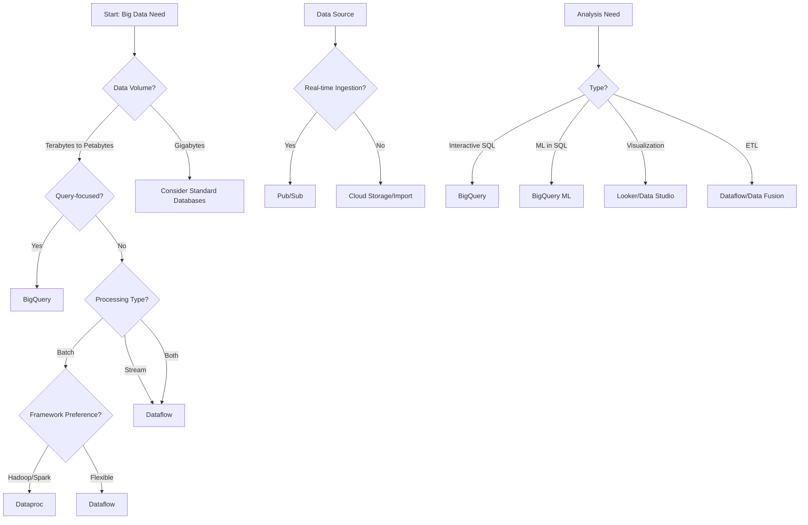
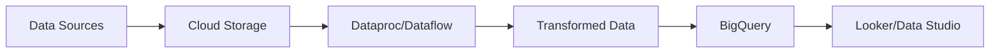
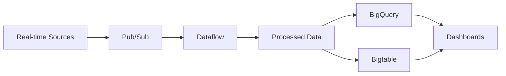
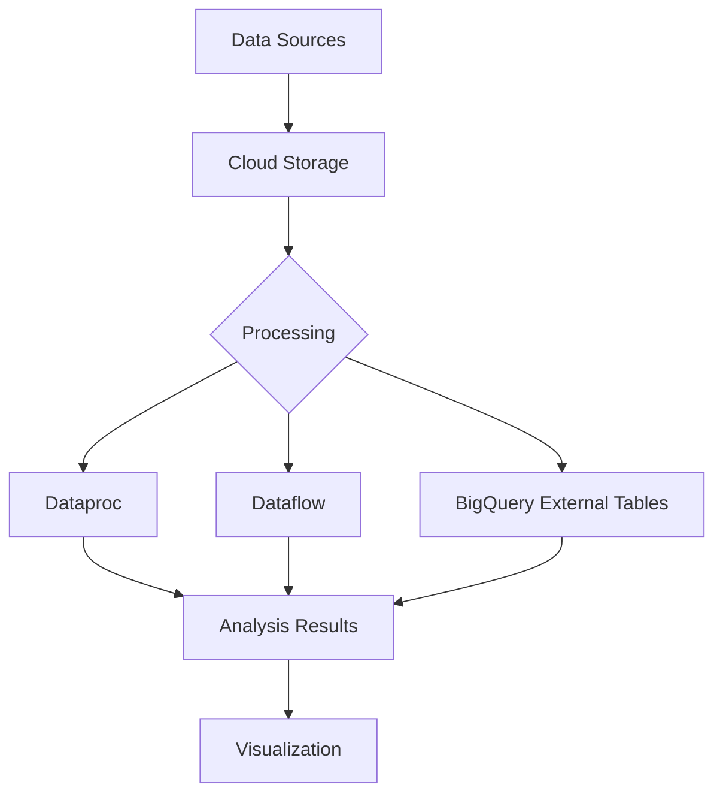

# GCP Big Data Analytics Services

Google Cloud Platform offers a comprehensive suite of big data analytics services that enable organizations to ingest, process, analyze, and visualize massive datasets. From data warehousing to stream processing, GCP provides scalable solutions for every stage of the data analytics lifecycle.

## Service Categories

GCP's Big Data Analytics services can be categorized into several groups:

1. **Data Warehousing**
   - [[BigQuery]]: Serverless, highly scalable data warehouse
   - [[BigQuery ML]]: Machine learning in BigQuery
   - [[BigQuery BI Engine]]: In-memory analysis service

2. **Data Processing**
   - [[Dataflow]]: Unified stream and batch data processing
   - [[Dataproc]]: Managed Hadoop and Spark service
   - [[Dataprep]]: Visual data preparation tool
   - [[Data Fusion]]: Managed data integration service

3. **Streaming Analytics**
   - [[Pub/Sub]]: Messaging and ingestion for streaming analytics
   - [[Dataflow Streaming]]: Real-time data processing
   - [[BigQuery Streaming]]: Real-time data ingestion to BigQuery

4. **Data Orchestration**
   - [[Cloud Composer]]: Managed Apache Airflow service
   - [[Workflows]]: Serverless workflow orchestration

5. **Data Exploration and Visualization**
   - [[Looker]]: Enterprise business intelligence platform
   - [[Data Studio]]: Free data visualization tool
   - [[Connected Sheets]]: BigQuery analysis in Google Sheets

6. **Data Governance and Management**
   - [[Data Catalog]]: Metadata management service
   - [[Dataplex]]: Unified data management platform
   - [[Data Lineage]]: Track data movement and transformations

## Decision Tree: Choosing the Right Big Data Service

## Comparison of Big Data Services

| Service | Type | Scalability | Management | Use Case |
|---------|------|-------------|------------|----------|
| BigQuery | Data Warehouse | Petabyte-scale | Serverless | Ad-hoc analysis, reporting |
| Dataflow | Processing | Auto-scaling | Managed | ETL, stream processing |
| Dataproc | Processing | Manual scaling | Managed | Hadoop/Spark workloads |
| Pub/Sub | Messaging | Auto-scaling | Serverless | Event ingestion, streaming |
| Cloud Composer | Orchestration | Cluster-based | Managed | Complex workflows |
| Looker | Visualization | Enterprise-scale | Managed | Business intelligence |
| Data Catalog | Governance | Organization-wide | Managed | Metadata management |

## Big Data Analytics Architectures

### Batch Processing Architecture

### Streaming Analytics Architecture

### Data Lake Architecture

## Integration with Other GCP Services

- **Cloud Storage**: Data lake storage
- **Cloud Functions**: Serverless data processing
- **Cloud Run**: Containerized data applications
- **Vertex AI**: Machine learning on big data
- **Cloud Monitoring**: Track analytics systems
- **Cloud Logging**: Log analytics activities
- **IAM**: Access control for data
- **VPC Service Controls**: Data security perimeters

## Best Practices

1. **Data Architecture**: Design for scale and flexibility
2. **Cost Optimization**: Choose the right service for the workload
3. **Data Partitioning**: Partition large datasets for performance
4. **Query Optimization**: Write efficient queries
5. **Streaming Design**: Consider windowing and state management
6. **Pipeline Design**: Build modular, reusable pipelines
7. **Data Governance**: Implement metadata management
8. **Security**: Apply appropriate access controls
9. **Monitoring**: Track performance and costs
10. **Disaster Recovery**: Plan for data resilience

## Common Use Cases

- **Data Warehousing**: Centralized analytics repository
- **Customer 360**: Unified customer view
- **IoT Analytics**: Process and analyze device data
- **Log Analysis**: Analyze application and system logs
- **Real-time Dashboards**: Live business metrics
- **Predictive Analytics**: Forecast business outcomes
- **Data Science**: Advanced analytics and ML
- **ETL/ELT**: Data transformation and loading
- **Event-driven Analytics**: Trigger analysis based on events
- **Operational Analytics**: Improve business operations

## Recent Developments

- **BigQuery Omni**: Multi-cloud analytics
- **Dataplex**: Unified data management
- **Analytics Hub**: Data exchange platform
- **BigQuery Studio**: Integrated SQL workspace
- **Dataflow Prime**: Next-generation Dataflow
- **Looker Studio Pro**: Enhanced visualization
- **Vertex AI Integration**: ML on analytics data
- **BigQuery ML Improvements**: More ML capabilities in SQL

## Related Topics
- [[GCP AI & Machine Learning]]
- [[GCP Compute Services]]
- [[GCP Storage Services]]
- [[GCP Database Services]]
- [[GCP Networking]]
