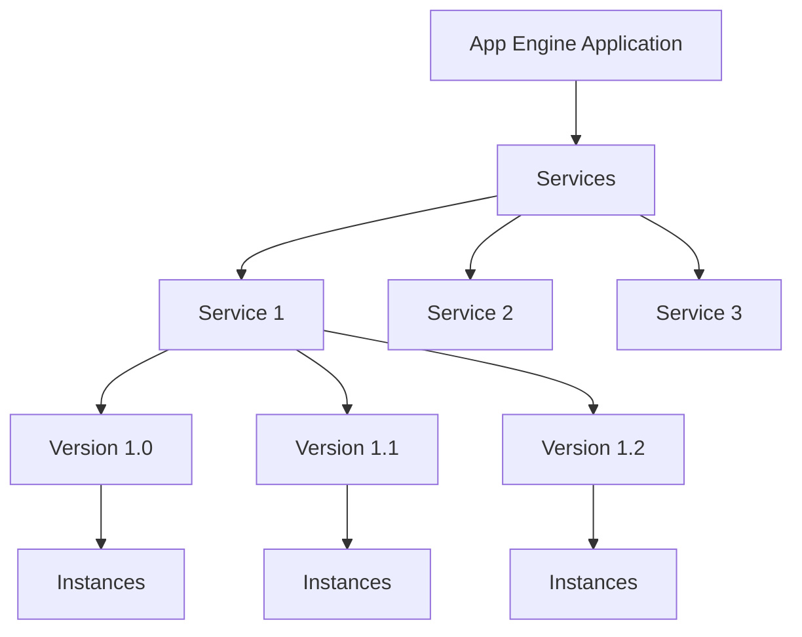

# App Engine

App Engine is a fully managed, serverless platform for developing and hosting web applications at scale. It allows developers to focus on writing code without worrying about infrastructure management.

## Environments

App Engine offers two environments:

1. **Standard Environment**
   - Run applications in a sandbox using specific versions of supported languages
   - Faster startup times
   - Free daily quota
   - Supported languages: Java, Python, Node.js, PHP, Ruby, Go

2. **Flexible Environment**
   - Run applications in Docker containers
   - Support for custom runtimes
   - Access to background processes
   - Native access to network and filesystem
   - No free tier

## Key Features

- **Automatic Scaling**: Automatically scale your application based on traffic
- **Versioning**: Deploy multiple versions of your application
- **Traffic Splitting**: Split traffic between different versions of your application
- **Managed Services**: Integrate with other Google Cloud services
- **Custom Domains**: Map your own domain names to your applications
- **SSL Certificates**: Automatic SSL certificate management
- **Application Security**: Built-in security features
- **Cron Jobs**: Schedule tasks to run at specified times

## Application Structure

## Scaling Options

App Engine provides several scaling options:

- **Automatic Scaling**: Automatically create instances based on load
- **Basic Scaling**: Create instances when your application receives requests
- **Manual Scaling**: Specify the number of instances that continuously run

## Deployment Options

- **gcloud CLI**: Deploy using the Google Cloud CLI
- **Cloud Build**: Integrate with CI/CD pipelines
- **IDE Plugins**: Deploy directly from your IDE
- **App Engine Admin API**: Programmatically deploy applications

## Use Cases

- **Web Applications**: Host websites and web applications
- **Mobile Backends**: Build backends for mobile applications
- **RESTful APIs**: Create and host APIs
- **IoT Applications**: Build applications for Internet of Things devices

## Standard vs. Flexible Environment Comparison

| Feature | Standard Environment | Flexible Environment |
|---------|---------------------|----------------------|
| Instance Startup | Seconds | Minutes |
| SSH Access | No | Yes |
| Write to Local Disk | No | Yes |
| Background Processes | No | Yes |
| Network Access | Via App Engine services | Yes |
| Pricing | Free tier available | No free tier |
| Scaling | Faster | Slower |
| Language Support | Specific versions | Any via Docker |

## Best Practices

1. **Use Services**: Organize your application into services
2. **Implement Versioning**: Use versioning for safe deployments
3. **Configure Scaling**: Choose the right scaling option for your workload
4. **Use Traffic Splitting**: Test new versions with a subset of users
5. **Implement Monitoring**: Monitor application performance
6. **Optimize for Cold Starts**: Minimize initialization time
7. **Use Caching**: Implement caching for better performance

## Related Topics
- [[GCP Compute Services]]
- [[Cloud Run]]
- [[Cloud Functions]]
- [[App Engine vs Cloud Run]]
