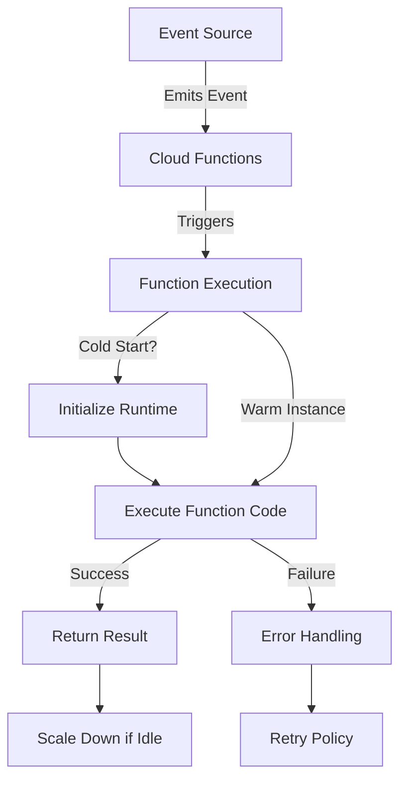

# Cloud Functions

Cloud Functions is a serverless execution environment for building and connecting cloud services. It allows you to write simple, single-purpose functions that are attached to events emitted from your cloud infrastructure and services.

## Cloud Functions Generations

Google Cloud offers two generations of Cloud Functions:

1. **Cloud Functions (1st gen)**
   - Original serverless function offering
   - Simpler deployment model
   - Limited configuration options

2. **Cloud Functions (2nd gen)**
   - Built on Cloud Run
   - More configuration options
   - Better performance
   - Longer maximum execution time
   - Improved concurrency

## Key Features

- **Event-driven**: Triggered by cloud events
- **Serverless**: No infrastructure management
- **Pay per Use**: Only pay for execution time
- **Automatic Scaling**: Scale from zero to thousands of instances
- **Connected**: Easily connect to other Google Cloud services
- **Multiple Language Support**: Node.js, Python, Go, Java, Ruby, PHP, .NET
- **Local Development**: Test functions locally before deployment
- **Monitoring and Logging**: Integrated with Cloud Monitoring and Cloud Logging

## Trigger Types

Cloud Functions can be triggered by various event types:

- **HTTP Triggers**: Invoke functions via HTTP requests
- **Cloud Storage**: Respond to changes in Cloud Storage buckets
- **Pub/Sub**: Process messages from Pub/Sub topics
- **Firestore**: React to changes in Firestore documents
- **Firebase**: Respond to Firebase events
- **Cloud Audit Logs**: React to admin activities and data access
- **Eventarc**: Respond to events from 90+ Google Cloud sources

## Function Execution Flow

## Concurrency Models

- **1st Gen**: One request per instance
- **2nd Gen**: Multiple concurrent requests per instance (configurable)

## Deployment Options

- **gcloud CLI**: Deploy using the Google Cloud CLI
- **Cloud Console**: Deploy through the web interface
- **Terraform**: Infrastructure as code deployment
- **Cloud Build**: CI/CD integration

## Use Cases

- **Data Processing**: Process data from Cloud Storage, Firestore, or Pub/Sub
- **Webhooks**: Respond to webhooks from third-party services
- **API Backend**: Create lightweight API backends
- **IoT**: Process and respond to IoT device data
- **Mobile Backend**: Create backends for mobile applications
- **Real-time Processing**: Process events in real-time

## Comparison with Other Serverless Options

| Feature | Cloud Functions | Cloud Run | App Engine |
|---------|----------------|-----------|------------|
| Execution Model | Function | Container | Application |
| Complexity | Low | Medium | High |
| Startup Time | Very Fast | Fast | Medium |
| Max Execution Time | 9 min (1st gen), 60 min (2nd gen) | 60 min | No limit |
| Stateful | No | No | Yes (with limitations) |
| Event-driven | Yes | Yes (with Eventarc) | No (needs custom code) |

## Best Practices

1. **Keep Functions Focused**: Write single-purpose functions
2. **Optimize Cold Starts**: Minimize dependencies and initialization code
3. **Use Dependency Injection**: For better testability
4. **Implement Error Handling**: Handle errors gracefully
5. **Set Appropriate Timeouts**: Configure timeouts based on function needs
6. **Use Environment Variables**: For configuration
7. **Implement Retry Logic**: For transient failures
8. **Use Cloud Functions (2nd gen)**: For better performance and features

## Related Topics
- [[GCP Compute Services]]
- [[Cloud Run]]
- [[App Engine]]
- [[Serverless Architecture]]
