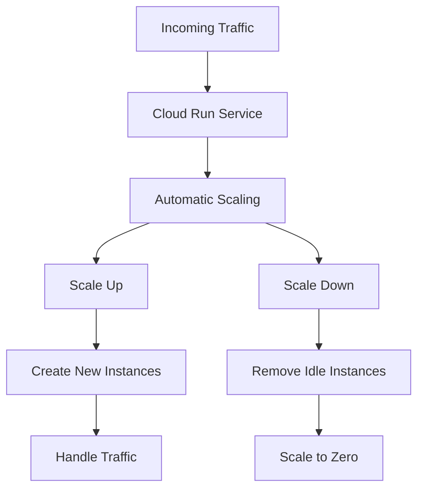

# Cloud Run

Cloud Run is a fully managed compute platform that automatically scales stateless containers. It allows you to run containers directly on top of Google's scalable infrastructure without having to manage servers, clusters, or infrastructure.

## Key Features

- **Serverless**: No infrastructure management required
- **Built on Knative**: Open API and runtime environment
- **Any Language, Any Library**: Run containers built with your preferred languages and tools
- **Pay per Use**: Only pay for the resources you use
- **Automatic Scaling**: Scale from zero to thousands of container instances
- **Custom Domains**: Map your own domain names to your services
- **HTTPS Endpoints**: Automatic HTTPS provisioning
- **Concurrency**: Configure the number of requests per container
- **VPC Connectivity**: Connect to your VPC network
- **Secrets Management**: Securely manage sensitive information
- **Cloud SQL Integration**: Connect to Cloud SQL databases

## Deployment Options

Cloud Run offers two deployment models:

1. **Cloud Run Services**
   - HTTP-based services that respond to requests
   - Automatically scale based on incoming traffic
   - Can scale to zero when not in use

2. **Cloud Run Jobs**
   - Execute containers as jobs (not HTTP services)
   - Run to completion and exit
   - Good for batch processing and scheduled tasks

## Container Requirements

For containers to run on Cloud Run, they must:

- Listen for HTTP requests on the port defined by the PORT environment variable
- Start quickly (within a few seconds)
- Not store state in the local filesystem (it's ephemeral)
- Handle multiple concurrent requests (for better efficiency)
- Exit cleanly when receiving SIGTERM

## Scaling Behavior

## Networking Options

Cloud Run provides several networking options:

- **Public Services**: Accessible from the internet
- **Internal Services**: Only accessible from within your VPC
- **Serverless VPC Access**: Connect to resources in your VPC
- **VPC Service Controls**: Implement security perimeters
- **Cloud Armor Integration**: Protect against DDoS attacks

## Use Cases

- **Web Services**: Host web services and APIs
- **Event Processing**: Process events from Pub/Sub and other event sources
- **Data Processing**: Process data in response to events
- **Microservices**: Deploy and run microservices
- **CI/CD Tasks**: Run CI/CD tasks in response to events

## Cloud Run vs. Other GCP Services

| Feature | Cloud Run | App Engine Flexible | GKE |
|---------|-----------|---------------------|-----|
| Container Support | Yes | Yes | Yes |
| Scaling to Zero | Yes | No | No* |
| Cold Start | Yes | No | No |
| Infrastructure Management | None | Minimal | More |
| Pricing Model | Per Request | Per Instance Hour | Per Node Hour |
| Startup Time | Seconds | Minutes | Minutes |

*GKE can scale to zero with Knative serving

## Best Practices

1. **Optimize Container Size**: Smaller containers start faster
2. **Handle Concurrency**: Configure and handle multiple concurrent requests
3. **Implement Health Checks**: Ensure your service is healthy
4. **Use Memory Limits**: Set appropriate memory limits
5. **Implement Graceful Shutdown**: Handle SIGTERM signals properly
6. **Use Cloud Run Jobs**: For non-HTTP workloads
7. **Implement Retry Logic**: Handle transient failures

## Related Topics
- [[GCP Compute Services]]
- [[App Engine]]
- [[Cloud Functions]]
- [[Containerization Basics]]
