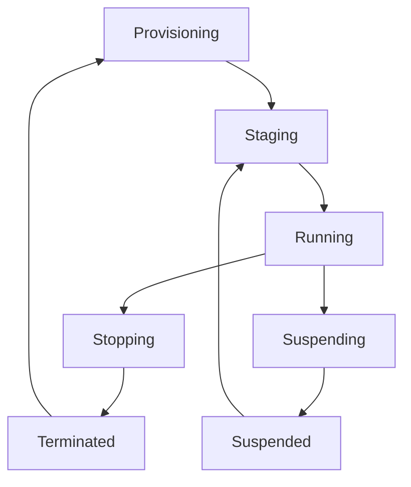

# Compute Engine

Compute Engine is Google Cloud's Infrastructure as a Service (IaaS) offering that provides virtual machines running in Google's data centers.

## Key Features

- **Custom Machine Types**: Create VMs with custom CPU and memory configurations
- **Persistent Disks**: Durable network storage devices that can be attached to your VMs
- **Global Load Balancing**: Distribute incoming traffic across multiple VM instances
- **Automatic Discounts**: Automatic discounts for sustained use of VM instances
- **Preemptible VMs**: Low-cost, short-duration VM instances for batch jobs and fault-tolerant workloads
- **Confidential VMs**: Encrypt data in use with Confidential Computing

## Machine Types

Compute Engine offers several predefined machine types:

1. **General-purpose (E2, N2, N2D, N1)**
   - Balanced CPU-to-memory ratio
   - Best for web servers, small-medium databases, dev environments

2. **Compute-optimized (C2, C2D)**
   - Higher CPU-to-memory ratio
   - Best for compute-intensive workloads

3. **Memory-optimized (M1, M2)**
   - Higher memory-to-CPU ratio
   - Best for memory-intensive workloads like large databases

4. **Accelerator-optimized (A2)**
   - With GPUs for machine learning and high-performance computing
   - Best for AI training, scientific computing

## Disk Options

Compute Engine provides several disk options:

- **Standard Persistent Disk**: Cost-effective and reliable storage
- **SSD Persistent Disk**: High-performance SSD storage
- **Balanced Persistent Disk**: Balance of performance and cost
- **Local SSD**: Physically attached to the server
- **Hyperdisk**: High-performance block storage for demanding workloads

## Networking Features

- **VPC Network**: Connect your VMs in a virtual private cloud
- **Cloud Load Balancing**: Distribute traffic across instances
- **Cloud NAT**: Provide outbound connectivity to instances without external IPs
- **VPC Peering**: Connect VPC networks across projects
- **Cloud VPN**: Connect to your on-premises network securely

## Use Cases

- **Web Applications**: Host websites and web applications
- **Development and Testing**: Create development and test environments
- **High-Performance Computing**: Run compute-intensive workloads
- **Disaster Recovery**: Set up disaster recovery solutions

## VM Instance Lifecycle

## Best Practices

1. **Right-sizing**: Choose the appropriate machine type for your workload
2. **Use Managed Instance Groups**: For high availability and auto-scaling
3. **Implement Startup Scripts**: Automate VM configuration
4. **Use Custom Images**: Create custom images for faster deployment
5. **Enable Monitoring**: Monitor VM performance with Cloud Monitoring
6. **Implement IAM**: Control access to VM instances
7. **Use Labels**: Organize and track resources

## Related Topics
- [[GCP Compute Services]]
- [[Google Kubernetes Engine]]
- [[Compute Engine Pricing]]
- [[VM Migration Strategies]]
