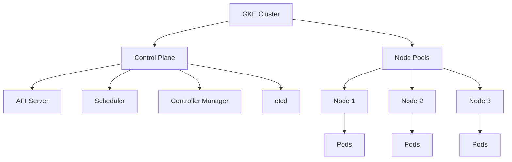

# Google Kubernetes Engine (GKE)

Google Kubernetes Engine is a managed Kubernetes service that allows you to deploy, manage, and scale containerized applications using Google's infrastructure.

## Key Features

- **Fully Managed Kubernetes**: Google manages the Kubernetes control plane
- **Auto-scaling**: Automatically scale your cluster based on demand
- **Auto-upgrade**: Automatically upgrade your cluster to the latest Kubernetes version
- **Auto-repair**: Automatically repair unhealthy nodes
- **Multi-cluster Support**: Deploy applications across multiple clusters
- **Integrated Logging and Monitoring**: Monitor your clusters with Cloud Monitoring and Cloud Logging

## GKE Modes

GKE offers two operational modes:

1. **Standard Mode**
   - More control over cluster configuration
   - You manage node pools and configurations
   - You pay for the nodes you provision

2. **Autopilot Mode**
   - Fully managed Kubernetes experience
   - Google manages node provisioning and optimization
   - You pay only for the pods you run
   - Reduced operational burden

## Cluster Architecture

## Networking Options

GKE provides several networking options:

- **VPC-native Clusters**: Use alias IP ranges for pod networking
- **Routes-based Clusters**: Use routes for pod networking
- **Private Clusters**: Restrict access to the control plane and nodes
- **Network Policies**: Control traffic between pods
- **Service Mesh**: Implement Istio for advanced traffic management

## Storage Options

GKE supports various storage options:

- **Persistent Disks**: Durable block storage for stateful applications
- **Filestore**: Managed file storage for applications that need file system interface
- **Cloud Storage**: Object storage for unstructured data
- **CSI Drivers**: Support for Container Storage Interface drivers

## Use Cases

- **Microservices Architecture**: Deploy and manage microservices
- **Hybrid and Multi-cloud Deployments**: Run applications across multiple clouds
- **CI/CD Pipelines**: Implement continuous integration and continuous deployment
- **Stateful Applications**: Run stateful applications with persistent storage

## Best Practices

1. **Use Node Auto-provisioning**: Let GKE automatically provision node pools
2. **Implement Workload Identity**: Securely access Google Cloud services
3. **Use Binary Authorization**: Ensure only trusted containers are deployed
4. **Configure Resource Requests and Limits**: Properly size your workloads
5. **Implement Pod Disruption Budgets**: Ensure availability during maintenance
6. **Use Namespaces**: Organize and isolate resources
7. **Implement Network Policies**: Control traffic between pods

## GKE Enterprise Features

GKE Enterprise (formerly Anthos) provides additional features:

- **Multi-cluster Management**: Manage multiple clusters from a single console
- **Config Management**: Implement GitOps for configuration management
- **Service Mesh**: Advanced traffic management with Istio
- **Multi-cloud**: Run GKE on AWS and Azure
- **On-premises**: Run GKE on your own infrastructure

## Related Topics
- [[GCP Compute Services]]
- [[Compute Engine]]
- [[Kubernetes Basics]]
- [[GKE vs Self-Managed Kubernetes]]
