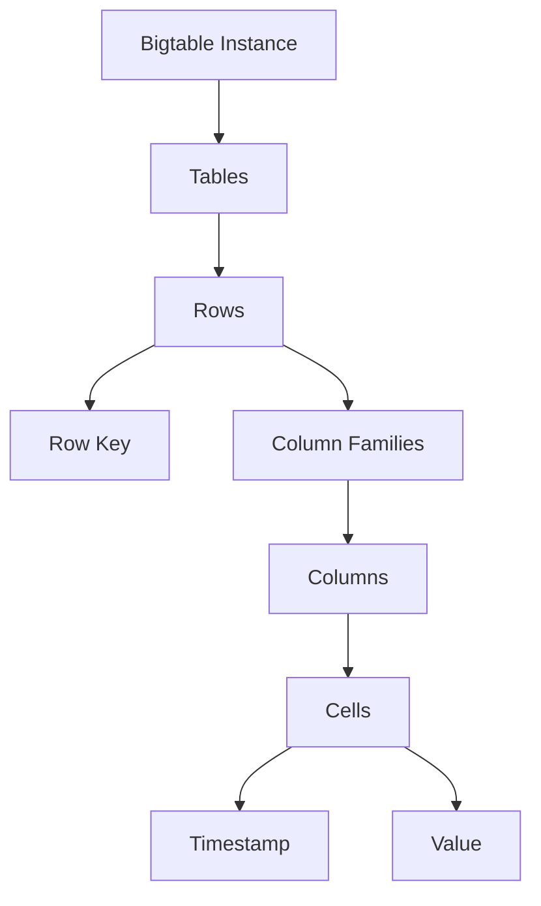

# Bigtable

Cloud Bigtable is Google's fully managed, scalable NoSQL database service for large analytical and operational workloads. It's the same database that powers many Google core services, including Search, Analytics, Maps, and Gmail.

## Key Features

- **Massive Scalability**: Scale to petabytes of data and billions of rows
- **High Throughput**: Millions of operations per second
- **Low Latency**: Single-digit millisecond latency
- **Seamless Scaling**: Add nodes without downtime
- **Automatic Sharding**: Google manages data distribution
- **HBase API Compatibility**: Compatible with HBase 1.x and 2.x APIs
- **Replication**: Replicate data across zones and regions
- **SSD and HDD Storage**: Choose storage type based on workload
- **Encryption**: Automatic encryption at rest and in transit
- **IAM Integration**: Role-based access control
- **Monitoring**: Integrated with Cloud Monitoring
- **Garbage Collection**: Automatic cleanup of expired data

## Data Model

Bigtable uses a wide-column data model:

- **Tables**: Container for rows
- **Rows**: Identified by a unique row key
- **Column Families**: Groups of related columns
- **Columns**: Named data within a column family
- **Cells**: Intersection of row and column, containing timestamped values

## Instance Types

Bigtable offers two types of instances:

1. **Production Instances**
   - Minimum of 3 nodes
   - High availability
   - Suitable for production workloads

2. **Development Instances**
   - Single node
   - Lower cost
   - Not for production use

## Storage Options

Bigtable provides two storage options:

1. **SSD (Solid State Drive)**
   - Higher performance
   - Higher cost
   - Best for low-latency workloads

2. **HDD (Hard Disk Drive)**
   - Lower cost
   - Lower performance
   - Best for batch processing and high-throughput workloads

## Replication Configurations

Bigtable supports several replication configurations:

- **Single-cluster Routing**: All reads and writes go to a single cluster
- **Multi-cluster Routing**: Reads and writes can go to any cluster
- **Replication Profiles**: Predefined replication configurations
- **Custom Replication**: Custom replication across regions

## Performance Scaling

Bigtable performance scales linearly with the number of nodes:

- **CPU**: Each node provides a certain amount of CPU capacity
- **Storage**: Up to 16 TB per node (SSD) or 64 TB per node (HDD)
- **QPS**: Approximately 10,000 QPS per node for reads/writes

## Use Cases

- **Time-series Data**: IoT data, financial market data, monitoring data
- **Marketing Data**: User behavior, ad performance
- **Financial Data**: Transactions, risk analysis
- **IoT Data**: Device telemetry, sensor readings
- **Graph Data**: Social connections, network topology
- **Personalization**: User preferences, recommendations
- **AdTech**: Ad targeting, campaign analysis
- **Fraud Detection**: Pattern analysis, anomaly detection

## Integration with Google Cloud

Bigtable integrates with several Google Cloud services:

- **Dataflow**: Process and analyze Bigtable data
- **Dataproc**: Run Hadoop and Spark jobs on Bigtable
- **BigQuery**: Export data to BigQuery for analysis
- **Cloud Functions**: Trigger functions based on Bigtable changes
- **Cloud Run**: Run containerized applications with Bigtable
- **GKE**: Run applications on Kubernetes with Bigtable

## Comparison with Other GCP Database Services

| Feature | Bigtable | Firestore | Cloud Spanner |
|---------|----------|-----------|---------------|
| Data Model | Wide-column | Document | Relational |
| Scale | Petabytes | Terabytes | Petabytes |
| Query Capabilities | Key-based | Rich | SQL |
| Latency | Very low | Low | Low |
| Transactions | Row-level | Document-level | Global |
| Best For | High-throughput, time-series | Mobile/web apps | Global, relational |

## Best Practices

1. **Design Row Keys Carefully**: Distribute load evenly
2. **Use Column Families Effectively**: Group related columns
3. **Limit Column Families**: Keep under 100 per table
4. **Size Instances Appropriately**: Match nodes to workload
5. **Use Replication**: For high availability
6. **Monitor Performance**: Track CPU, disk usage, and latency
7. **Use Time-to-Live (TTL)**: Automatically expire old data
8. **Batch Operations**: Use batching for better performance
9. **Implement IAM for Access Control**: Implement least privilege access
10. **Choose the Right Storage Type**: SSD or HDD based on workload

## Limitations and Considerations

- **No SQL Support**: Limited query capabilities
- **No Secondary Indexes**: All access via row key
- **No Joins**: No native support for joins
- **No Transactions Across Rows**: Only single-row transactions
- **Minimum Size**: 3 nodes for production (significant cost)

## Related Topics
- [[GCP Database Services]]
- [[Firestore]]
- [[BigQuery]]
- [[Time-Series Database Concepts]]
