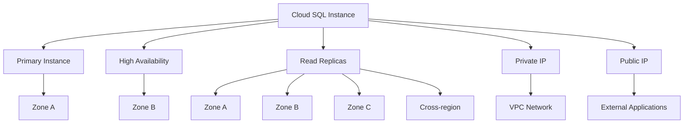

# Cloud SQL

Cloud SQL is a fully managed relational database service that makes it easy to set up, maintain, manage, and administer your relational databases on Google Cloud Platform. It offers MySQL, PostgreSQL, and SQL Server database engines.

## Supported Database Engines

Cloud SQL supports three major database engines:

1. **MySQL**
   - Versions: 5.6, 5.7, 8.0
   - Compatible with standard MySQL
   - Supports MySQL Workbench and other standard tools

2. **PostgreSQL**
   - Versions: 9.6, 10, 11, 12, 13, 14, 15
   - Compatible with standard PostgreSQL
   - Supports extensions like PostGIS, pgVector

3. **SQL Server**
   - Versions: 2017, 2019
   - Enterprise, Standard, Express, and Web editions
   - Compatible with standard SQL Server tools

## Key Features

- **Fully Managed**: Google handles backups, replication, patches, and updates
- **High Availability**: Automatic failover between zones
- **Read Replicas**: Scale read operations across multiple replicas
- **Automatic Storage Increase**: Storage automatically grows as needed
- **Point-in-time Recovery**: Restore to any point within the retention period
- **Automated Backups**: Daily backups with configurable retention
- **Encryption**: Automatic encryption at rest and in transit
- **IAM Integration**: Role-based access control
- **VPC Integration**: Private IP connectivity
- **Maintenance Controls**: Control when maintenance occurs
- **Database Flags**: Configure database engine parameters
- **Query Insights**: Analyze and optimize query performance

## Deployment Architecture

## Instance Types and Scaling

Cloud SQL offers several machine types to match your workload requirements:

- **Shared-core Machines**: 1 shared vCPU (db-f1-micro, db-g1-small)
- **Standard Machines**: 1-96 vCPUs, 3.75-624 GB memory
- **High-memory Machines**: Higher memory-to-CPU ratio
- **High-CPU Machines**: Higher CPU-to-memory ratio

Scaling options include:
- **Vertical Scaling**: Increase CPU and memory
- **Storage Scaling**: Automatic or manual storage increases
- **Read Scaling**: Add read replicas

## Connectivity Options

Cloud SQL provides several connectivity options:

- **Private IP**: Connect via VPC network
- **Public IP**: Connect from external networks with authorized networks
- **Cloud SQL Auth Proxy**: Secure connection with IAM authentication
- **Cloud SQL Language Connectors**: Language-specific connection libraries
- **Cloud SQL for JDBC/ODBC**: Standard database connection drivers
- **VPC Service Controls**: Create security perimeters

## High Availability and Disaster Recovery

- **High Availability Configuration**: Synchronous replication to standby
- **Automatic Failover**: Automatic promotion of standby instance
- **Cross-region Read Replicas**: Replicate data across regions
- **Automated Backups**: Daily backups with point-in-time recovery
- **Manual Backups**: On-demand backups
- **Export/Import**: Export to Cloud Storage and import as needed

## Use Cases

- **Web Applications**: Backend database for web applications
- **E-commerce**: Store product catalogs and order information
- **CMS Systems**: Content management system databases
- **SaaS Applications**: Multi-tenant application databases
- **Enterprise Applications**: Databases for enterprise workloads
- **Development and Testing**: Development and test environments

## Comparison with Other GCP Database Services

| Feature | Cloud SQL | Cloud Spanner | AlloyDB |
|---------|-----------|---------------|---------|
| Database Type | Relational | Relational | Relational |
| Engines | MySQL, PostgreSQL, SQL Server | Google proprietary | PostgreSQL-compatible |
| Scale | Regional | Global | Regional |
| Transactions | ACID | ACID | ACID |
| Horizontal Scaling | Read replicas only | Automatic | Read replicas |
| Global Distribution | No | Yes | No |
| Price | $$ | $$$$ | $$$ |
| Best For | Traditional applications | Global, high-scale applications | High-performance PostgreSQL |

## Best Practices

1. **Choose the Right Instance Size**: Match instance size to workload
2. **Implement High Availability**: For production workloads
3. **Use Private IP**: For better security and performance
4. **Set Up Read Replicas**: For read-heavy workloads
5. **Configure Maintenance Windows**: Schedule maintenance during low-traffic periods
6. **Monitor Performance**: Track CPU, memory, and disk usage
7. **Optimize Queries**: Use Query Insights to identify slow queries
8. **Implement Backup Strategy**: Configure appropriate backup retention
9. **Use IAM for Access Control**: Implement least privilege access
10. **Enable Binary Logging**: For point-in-time recovery

## Related Topics
- [[GCP Database Services]]
- [[Cloud Spanner]]
- [[AlloyDB for PostgreSQL]]
- [[Database Migration Service]]
