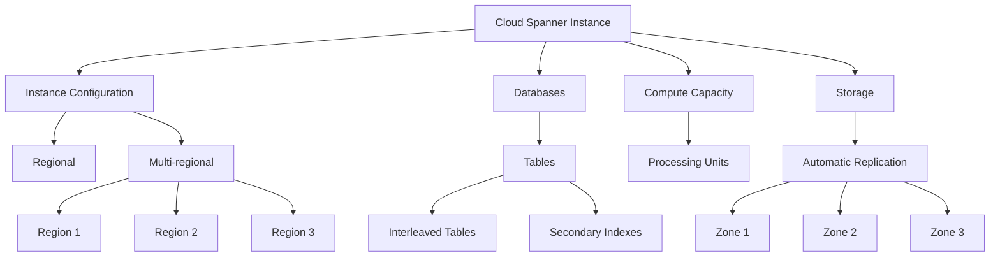

# Cloud Spanner

Cloud Spanner is Google's globally distributed, horizontally scalable, and strongly consistent relational database service. It combines the benefits of relational database structure with non-relational horizontal scale, delivering high-performance transactions and strong consistency across rows, regions, and continents.

## Key Features

- **Global Distribution**: Distribute data across regions and continents
- **Horizontal Scalability**: Scale from 1 to thousands of nodes
- **Strong Consistency**: External consistency (stronger than ACID)
- **Automatic Sharding**: Google manages data distribution
- **High Availability**: 99.999% availability SLA
- **Automatic Replication**: Synchronous replication across zones and regions
- **Schema and SQL Support**: Familiar relational database concepts
- **Automatic Synchronization**: No need for manual replication
- **No Downtime for Schema Changes**: Online schema changes
- **Integrated Backup and Recovery**: Point-in-time recovery
- **Automatic Maintenance**: No downtime for maintenance
- **Integrated Monitoring**: Monitor performance with Cloud Monitoring

## Architecture

## Data Model

Cloud Spanner supports a relational data model with some unique features:

- **Tables and Schemas**: Standard relational tables and schemas
- **Interleaved Tables**: Parent-child relationships for locality
- **Secondary Indexes**: Improve query performance
- **Foreign Keys**: Enforce referential integrity
- **Check Constraints**: Enforce data validation rules
- **Computed Columns**: Columns derived from other columns
- **JSON Data Type**: Store and query JSON data
- **Array Data Type**: Store arrays of values
- **Commit Timestamps**: Automatic tracking of write times

## Query Language

Cloud Spanner supports two query languages:

1. **GoogleSQL**
   - Similar to standard SQL
   - Full ANSI SQL support
   - Support for joins, subqueries, and aggregations

2. **PostgreSQL Interface**
   - PostgreSQL-compatible dialect
   - Familiar syntax for PostgreSQL users
   - Support for PostgreSQL tools and drivers

## Scaling and Performance

- **Linear Scaling**: Performance scales linearly with nodes
- **Processing Units**: Measure of compute capacity
- **Automatic Sharding**: Google manages data distribution
- **Query Optimization**: Automatic query optimization
- **Partitioned DML**: Parallel execution of DML statements
- **Distributed Transactions**: Transactions across the entire database
- **Query Statistics**: Analyze query performance

## Use Cases

- **Global Applications**: Applications with global user base
- **Financial Systems**: High-consistency financial transactions
- **Inventory Management**: Real-time inventory tracking
- **Global Gaming**: Global leaderboards and player data
- **Multi-region Applications**: Applications deployed across regions
- **High-scale OLTP**: Online transaction processing at scale
- **Hybrid Transactional/Analytical**: Combined OLTP and OLAP workloads

## Comparison with Other GCP Database Services

| Feature | Cloud Spanner | Cloud SQL | AlloyDB |
|---------|---------------|-----------|---------|
| Scale | Global | Regional | Regional |
| Horizontal Scaling | Automatic | Read replicas only | Read pools |
| Global Distribution | Yes | No | No |
| Consistency | External consistency | Strong consistency | Strong consistency |
| SQL Compatibility | GoogleSQL, PostgreSQL | MySQL, PostgreSQL, SQL Server | PostgreSQL |
| Price | $$$$ | $$ | $$$ |
| Best For | Global, high-scale applications | Traditional applications | High-performance PostgreSQL |

## Best Practices

1. **Design for Scale**: Design schema for horizontal scaling
2. **Use Interleaved Tables**: For parent-child relationships
3. **Choose Primary Keys Carefully**: Avoid hotspots
4. **Implement Secondary Indexes**: For query performance
5. **Use Stale Reads**: For read-heavy workloads
6. **Batch Operations**: Use batching for better performance
7. **Monitor Performance**: Track CPU, storage, and latency
8. **Use Partitioned DML**: For large-scale updates
9. **Implement IAM for Access Control**: Implement least privilege access
10. **Choose the Right Instance Configuration**: Regional or multi-regional

## Limitations and Considerations

- **Cost**: More expensive than traditional databases
- **Learning Curve**: Different approach to schema design
- **Transaction Size**: Limited to 100,000 mutations
- **Query Complexity**: Some complex queries may require optimization
- **Minimum Commitment**: 1 node minimum (significant cost)

## Related Topics
- [[GCP Database Services]]
- [[Cloud SQL]]
- [[AlloyDB for PostgreSQL]]
- [[Database Migration Service]]
