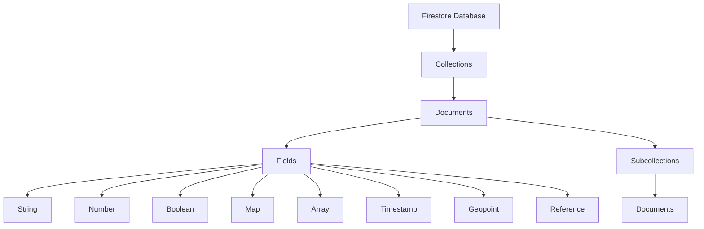

# Firestore

Firestore is a flexible, scalable, cloud-native NoSQL document database that simplifies storing, syncing, and querying data for mobile, web, and server applications. It's the next generation of the Firebase Realtime Database, offering richer, faster queries and automatic multi-region data replication.

## Key Features

- **Document-based NoSQL Database**: Store data in flexible, hierarchical documents
- **Real-time Updates**: Subscribe to data changes in real-time
- **Offline Support**: Cache data for offline access
- **Automatic Scaling**: Scales automatically with your application
- **Strong Consistency**: Strongly consistent reads and queries
- **ACID Transactions**: Support for atomic operations
- **Expressive Querying**: Rich query capabilities
- **Security Rules**: Declarative security model
- **Multi-region Replication**: Automatic replication across regions
- **Mobile and Web SDKs**: Native SDKs for various platforms
- **Server Client Libraries**: Libraries for server-side development
- **Seamless Firebase Integration**: Works with Firebase Authentication and other Firebase services

## Data Model

Firestore organizes data in a hierarchical structure:

- **Collections**: Containers for documents
- **Documents**: Individual data records with fields
- **Fields**: Data values of various types
- **Subcollections**: Collections attached to documents

## Modes

Firestore offers two modes:

1. **Native Mode**
   - Newer, recommended mode
   - Enhanced query capabilities
   - Better performance
   - More flexible security rules

2. **Datastore Mode**
   - Compatible with App Engine Datastore API
   - Designed for server applications
   - No real-time updates
   - No mobile/web SDKs

## Querying Capabilities

Firestore provides rich querying capabilities:

- **Simple Queries**: Query by field values
- **Compound Queries**: Combine multiple conditions
- **Collection Group Queries**: Query across subcollections
- **Array Queries**: Query for values in arrays
- **Range Queries**: Query for ranges of values
- **Ordering**: Order results by fields
- **Limiting**: Limit number of results
- **Pagination**: Paginate through results
- **Aggregation Queries**: Count, sum, average, etc.

## Security

Firestore provides multiple security mechanisms:

- **Security Rules**: Declarative rules for authentication and authorization
- **IAM**: Role-based access control for server applications
- **VPC Service Controls**: Create security perimeters
- **Encryption**: Automatic encryption at rest and in transit
- **Audit Logging**: Track access and changes

## Use Cases

- **Mobile Applications**: Backend for mobile apps
- **Web Applications**: Real-time data for web apps
- **IoT Applications**: Store and sync IoT device data
- **User Profiles**: Store user data and preferences
- **Game State**: Store game state and player data
- **Chat Applications**: Real-time messaging
- **Collaborative Applications**: Multi-user editing

## Comparison with Other GCP Database Services

| Feature | Firestore | Bigtable | Cloud SQL |
|---------|-----------|----------|-----------|
| Data Model | Document | Wide-column | Relational |
| Query Capabilities | Rich | Limited | Full SQL |
| Real-time Updates | Yes | No | No |
| Transactions | Document-level | Row-level | Full ACID |
| Scaling | Automatic | Manual | Vertical |
| Best For | Mobile/web apps | High-throughput | Traditional apps |

## Best Practices

1. **Design for Scale**: Structure data for query performance
2. **Denormalize Data**: Store related data together
3. **Use References**: Link related documents
4. **Avoid Deep Nesting**: Limit subcollection depth
5. **Batch Operations**: Use batching for better performance
6. **Implement Security Rules**: Secure access to data
7. **Monitor Usage**: Track reads, writes, and storage
8. **Use Transactions**: For data consistency
9. **Implement Indexing Strategy**: Create composite indexes for complex queries
10. **Consider Costs**: Understand pricing model

## Limitations and Considerations

- **Document Size**: Limited to 1 MB per document
- **Indexing**: All queries require indexes
- **Write Rate**: Limited to 500 writes per second per collection
- **Transactions**: Limited to 500 operations per transaction
- **Security Rules**: Can impact performance

## Related Topics
- [[GCP Database Services]]
- [[Bigtable]]
- [[Firebase]]
- [[NoSQL Database Concepts]]
