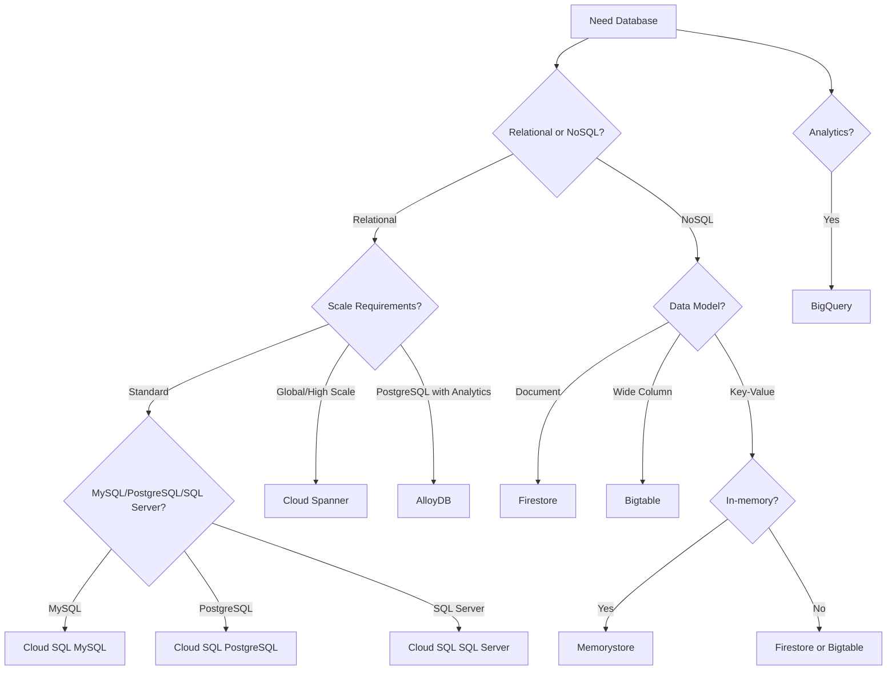

# GCP Database Services

Google Cloud Platform offers a comprehensive suite of database services designed to meet various data storage, processing, and analysis needs. These services range from relational databases to NoSQL databases, in-memory databases, and specialized database solutions.

## Database Service Categories

GCP database services can be categorized into several types:

1. **Relational Databases**
   - Cloud SQL
   - Cloud Spanner
   - AlloyDB for PostgreSQL

2. **NoSQL Databases**
   - Firestore
   - Bigtable
   - Memorystore

3. **Analytical Databases**
   - BigQuery
   - Dataflow

4. **Migration Services**
   - Database Migration Service
   - Data Transfer Service

## Choosing the Right Database Service

Selecting the appropriate database service depends on your specific requirements:

| Database Service | Type | Best For | Scalability | Global Distribution |
|------------------|------|----------|-------------|---------------------|
| Cloud SQL | Relational | Traditional applications, OLTP | Regional | No |
| Cloud Spanner | Relational | Global applications, high scale OLTP | Global | Yes |
| AlloyDB | Relational | PostgreSQL workloads, OLTP/OLAP | Regional | No |
| Firestore | Document | Mobile/web apps, real-time data | Global | Yes |
| Bigtable | Wide-column | High-throughput, low-latency | Regional/Multi-regional | No |
| Memorystore | In-memory | Caching, session storage | Regional | No |
| BigQuery | Analytical | Data warehousing, analytics | Global | Yes |

## Database Decision Tree

## Database Migration Options

GCP provides several options for migrating databases:

- **Database Migration Service**: Managed migration service for MySQL, PostgreSQL, and SQL Server
- **Data Transfer Service**: Transfer data to BigQuery
- **Lift and Shift**: Migrate VMs running databases
- **Replication**: Set up replication between source and destination
- **Backup and Restore**: Use backup and restore for one-time migrations

## Database Security Features

GCP database services include robust security features:

- **Encryption at Rest**: All data automatically encrypted
- **Encryption in Transit**: Data encrypted during transfer
- **Customer-Managed Encryption Keys (CMEK)**: Control your own keys
- **IAM**: Fine-grained access control
- **VPC Service Controls**: Create security perimeters
- **Audit Logging**: Track access and changes
- **Private Connectivity**: Connect via private IP

## High Availability and Disaster Recovery

GCP databases offer various high availability and disaster recovery options:

- **Multi-zone Deployments**: Replicate across zones in a region
- **Read Replicas**: Create read replicas for read scaling
- **Cross-region Replication**: Replicate data across regions
- **Point-in-time Recovery**: Restore to a specific point in time
- **Automated Backups**: Regular automated backups
- **Manual Backups**: Create on-demand backups

## Database Management Features

GCP provides several features to simplify database management:

- **Automatic Scaling**: Scale resources automatically
- **Automated Maintenance**: Managed updates and patches
- **Monitoring and Alerting**: Track performance and health
- **Query Insights**: Analyze query performance
- **Database Advisors**: Get recommendations for optimization
- **Automated Backup**: Schedule regular backups
- **Self-healing**: Automatic recovery from failures

## Related Topics
- [[Cloud SQL]]
- [[Cloud Spanner]]
- [[Firestore]]
- [[Bigtable]]
- [[BigQuery]]
- [[Memorystore]]
- [[AlloyDB for PostgreSQL]]
- [[Database Migration Service]]
