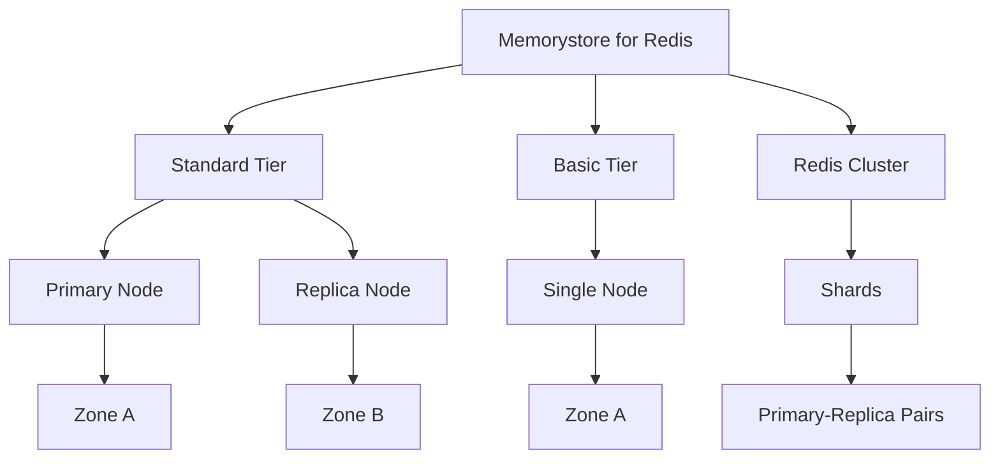
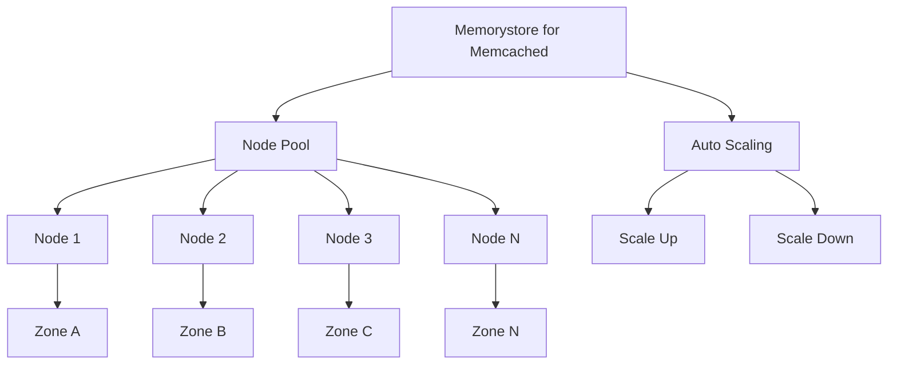

# Memorystore

Memorystore is Google Cloud's fully managed in-memory datastore service that provides low-latency access to data. It offers Redis and Memcached compatible services, making it easy to migrate existing applications to Google Cloud.

## Service Types

Memorystore offers two service types:

1. **Memorystore for Redis**
   - Fully managed Redis service
   - Compatible with Redis protocol
   - Supports Redis 4.0, 5.0, 6.x, and 7.0
   - Offers high availability configuration
   - Supports data persistence

2. **Memorystore for Memcached**
   - Fully managed Memcached service
   - Compatible with Memcached protocol
   - Auto-scaling capability
   - No high availability option
   - No data persistence

## Key Features

### Memorystore for Redis

- **High Availability**: Automatic failover with 99.9% availability SLA
- **Scalability**: Scale from 1 GB to 300 GB per instance
- **Redis AUTH**: Authentication support
- **Redis OSS Compatibility**: Compatible with Redis open-source software
- **Import/Export**: Import and export data from/to Cloud Storage
- **Maintenance Controls**: Control when maintenance occurs
- **Read Replicas**: Scale read operations with read replicas
- **Redis Cluster**: Support for Redis Cluster (sharded) mode
- **VPC Integration**: Private connectivity within your VPC
- **Monitoring**: Integrated with Cloud Monitoring
- **Data Persistence**: RDB snapshots for data persistence

### Memorystore for Memcached

- **Auto Scaling**: Automatically scale node count based on memory utilization
- **Memcached OSS Compatibility**: Compatible with Memcached open-source software
- **Flexible Node Size**: Choose from 1-32 vCPU configurations
- **VPC Integration**: Private connectivity within your VPC
- **Monitoring**: Integrated with Cloud Monitoring
- **Multi-zone Distribution**: Distribute nodes across zones

## Architecture

### Memorystore for Redis

### Memorystore for Memcached

## Use Cases

### Memorystore for Redis

- **Caching**: Application and database caching
- **Session Storage**: Web application session storage
- **Real-time Analytics**: Real-time data analysis
- **Leaderboards**: Gaming leaderboards
- **Queuing**: Message queuing
- **Pub/Sub**: Publish/subscribe messaging
- **Geospatial Applications**: Location-based applications

### Memorystore for Memcached

- **Caching**: Application and database caching
- **Session Storage**: Web application session storage
- **API Rate Limiting**: Limit API requests
- **Database Query Results**: Cache query results
- **Page Rendering Data**: Cache data for page rendering

## Comparison: Redis vs. Memcached

| Feature | Memorystore for Redis | Memorystore for Memcached |
|---------|------------------------|---------------------------|
| Data Structures | Rich (strings, lists, sets, sorted sets, hashes) | Simple (strings only) |
| Persistence | Yes | No |
| High Availability | Yes | No |
| Auto Scaling | No | Yes |
| Max Instance Size | 300 GB | Based on node count |
| Replication | Yes | No |
| Transactions | Yes | No |
| Lua Scripting | Yes | No |
| Pub/Sub | Yes | No |
| Geospatial | Yes | No |
| Use Case | Feature-rich in-memory database | Simple high-performance cache |

## Performance Considerations

- **Network Latency**: Place clients in the same region
- **Instance Size**: Choose appropriate size for workload
- **Connection Pooling**: Implement connection pooling
- **Eviction Policies**: Configure appropriate eviction policies
- **Memory Usage**: Monitor memory usage
- **Command Usage**: Monitor command usage and latency

## Security Features

- **Private Services Access**: Connect via VPC
- **IAM**: Role-based access control
- **Redis AUTH**: Authentication for Redis
- **Encryption in Transit**: TLS encryption
- **Encryption at Rest**: Automatic encryption

## Best Practices

### Memorystore for Redis

1. **Choose the Right Tier**: Standard tier for high availability
2. **Set Appropriate Memory Limits**: Size instance appropriately
3. **Configure Eviction Policies**: Set appropriate policies
4. **Use Connection Pooling**: Implement connection pooling
5. **Monitor Performance**: Track memory usage and latency
6. **Schedule Maintenance Windows**: During low-traffic periods
7. **Implement Proper Backup Strategy**: Regular exports
8. **Use Redis Cluster for Large Datasets**: Shard data across nodes

### Memorystore for Memcached

1. **Enable Auto Scaling**: For variable workloads
2. **Configure Node Count**: Set min/max node count
3. **Use Connection Pooling**: Implement connection pooling
4. **Distribute Keys Evenly**: Use consistent hashing
5. **Monitor Performance**: Track memory usage and hit rate
6. **Set Appropriate Item Size Limits**: Configure item size limits

## Related Topics
- [[GCP Database Services]]
- [[Caching Strategies]]
- [[Redis vs Memcached]]
- [[Application Performance Optimization]]
