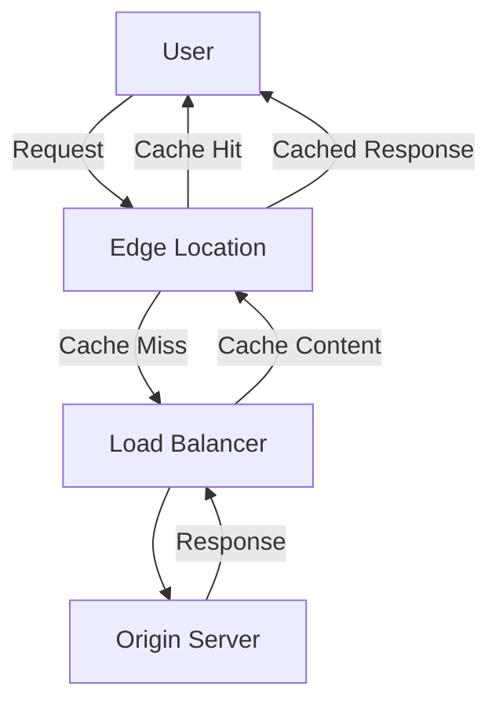

# Cloud CDN

Cloud CDN (Content Delivery Network) is Google's globally distributed edge caching service that accelerates content delivery by caching content close to users. It leverages Google's global edge network to reduce latency, save bandwidth, and improve user experience.

## Key Features

- **Global Edge Network**: Content cached at 100+ locations worldwide
- **Integrated with Load Balancing**: Works with Google Cloud Load Balancing
- **Origin Support**: Google Cloud and external origins
- **Cache Invalidation**: Programmatically invalidate cached content
- **Cache Control**: Fine-grained control over caching behavior
- **HTTPS Support**: Secure content delivery
- **HTTP/2 and QUIC Support**: Modern protocol support
- **Signed URLs**: Time-limited access to content
- **Signed Cookies**: Authenticate users for cached content
- **Custom Domains**: Use your own domain names
- **SSL Certificates**: Managed or custom certificates
- **Compression**: Automatic content compression
- **Metrics and Logging**: Detailed performance monitoring

## How Cloud CDN Works

1. User requests content from your website
2. Request goes to the nearest Google edge location
3. If content is cached (cache hit), it's served directly from the edge
4. If content is not cached (cache miss), request goes to the origin
5. Origin response is cached at the edge for future requests

## Integration with Google Cloud

Cloud CDN integrates with several Google Cloud services:

- **External Application Load Balancer**: Required for Cloud CDN
- **Cloud Storage**: Serve content from Cloud Storage buckets
- **Compute Engine**: Serve content from VM instances
- **GKE**: Serve content from Kubernetes applications
- **Cloud Armor**: Security protection for cached content
- **Cloud Logging**: Log CDN activity
- **Cloud Monitoring**: Monitor CDN performance

## Cache Control

Cloud CDN provides several ways to control caching behavior:

- **Cache-Control Headers**: Set from origin server
- **TTL Settings**: Default and maximum TTL
- **Cache Modes**: Use origin headers, override, or bypass cache
- **Custom Cache Keys**: Include/exclude query strings, headers, cookies
- **Negative Caching**: Cache error responses
- **Cache Invalidation**: Programmatically invalidate cached content
- **Cache Bypass**: Bypass cache for specific requests

## Content Types

Cloud CDN can cache various types of content:

- **Static Assets**: Images, CSS, JavaScript
- **Media Files**: Video, audio
- **Documents**: PDFs, documents
- **API Responses**: JSON, XML
- **Dynamic Content**: With appropriate cache headers

## Security Features

Cloud CDN includes several security features:

- **HTTPS**: Secure content delivery
- **Signed URLs**: Time-limited access to content
- **Signed Cookies**: Authenticate users for cached content
- **Cloud Armor Integration**: DDoS protection and WAF
- **SSL Certificates**: Managed or custom certificates
- **Private Content**: Restrict access to content

## Performance Optimization

Cloud CDN offers several features for optimizing performance:

- **Global Edge Network**: Reduce latency with edge caching
- **HTTP/2 and QUIC**: Modern protocol support
- **Compression**: Automatic content compression
- **Preconnect Hints**: Improve connection establishment
- **Cache Optimization**: Fine-tune caching behavior
- **Content Prefetching**: Preload content for faster access

## Use Cases

- **Website Acceleration**: Speed up website delivery
- **Mobile App APIs**: Accelerate API responses
- **Media Streaming**: Deliver video and audio content
- **Software Distribution**: Distribute software updates
- **Game Assets**: Deliver game content
- **E-commerce**: Accelerate product images and static content
- **SaaS Applications**: Improve application performance

## Best Practices

1. **Set Appropriate Cache TTLs**: Balance freshness and cache efficiency
2. **Use Cache-Control Headers**: Control caching behavior
3. **Implement Cache Invalidation**: Update cached content when needed
4. **Enable Compression**: Reduce content size
5. **Use Custom Cache Keys**: Control what constitutes a cache hit
6. **Monitor Cache Performance**: Track cache hit ratio
7. **Implement Signed URLs/Cookies**: For restricted content
8. **Use HTTPS**: Secure content delivery
9. **Optimize Origin Performance**: Fast origin for cache misses
10. **Implement Content Versioning**: For cache busting

## Comparison with Other CDN Providers

| Feature | Cloud CDN | Cloudflare | Akamai |
|---------|-----------|------------|--------|
| Edge Locations | 100+ | 275+ | 4,000+ |
| Integration with GCP | Native | Limited | Limited |
| Pricing Model | Pay-as-you-go | Tiered | Contract |
| DDoS Protection | Via Cloud Armor | Included | Additional |
| Origin Support | GCP and external | Any origin | Any origin |
| Edge Computing | Limited | Workers | EdgeWorkers |

## Related Topics
- [[GCP Networking]]
- [[Cloud Load Balancing]]
- [[Cloud Armor]]
- [[Network Service Tiers]]
- [[Performance Optimization]]
