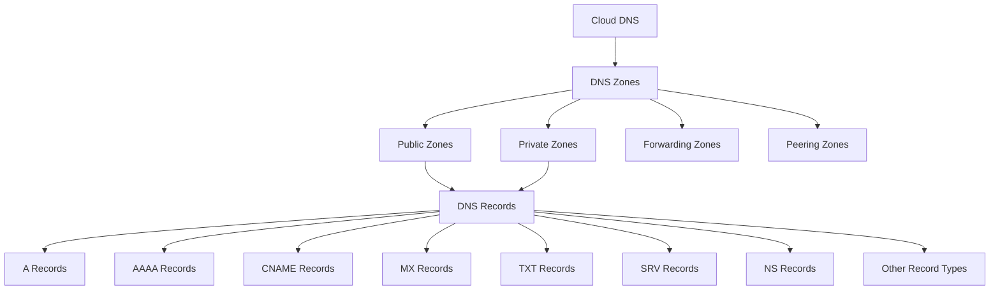

# Cloud DNS

Cloud DNS is Google's scalable, reliable, and managed authoritative Domain Name System (DNS) service that publishes your domain names to the global DNS in a cost-effective way. It translates domain names like `example.com` into IP addresses like `198.51.100.1`.

## Key Features

- **High Availability**: 100% uptime SLA
- **Global Anycast Network**: Low-latency DNS resolution worldwide
- **Managed Service**: No DNS servers to maintain
- **DNSSEC Support**: Cryptographically signed DNS records
- **Public and Private Zones**: Serve public internet or private VPC
- **DNS Forwarding**: Forward DNS queries to other resolvers
- **DNS Peering**: Share DNS information across VPC networks
- **Cloud IAM Integration**: Fine-grained access control
- **API and CLI Support**: Programmatic management
- **Logging**: DNS query logging
- **Geo-based Routing**: Route based on user location
- **High Query Volume**: Support for high query volumes
- **Integrated with Google Domains**: Easy domain management

## Zone Types

Cloud DNS supports several types of DNS zones:

1. **Public Zones**
   - Visible on the public internet
   - Resolve domain names for internet users
   - Authoritative for your domains

2. **Private Zones**
   - Only visible within your VPC networks
   - Resolve internal domain names
   - Not visible on the public internet

3. **Forwarding Zones**
   - Forward DNS queries to specified DNS servers
   - Useful for hybrid cloud scenarios

4. **Peering Zones**
   - Share DNS information across VPC networks
   - Enable cross-project DNS resolution

## DNS Architecture

## DNS Record Types

Cloud DNS supports all standard DNS record types:

- **A**: Maps a domain to an IPv4 address
- **AAAA**: Maps a domain to an IPv6 address
- **CNAME**: Creates an alias for another domain
- **MX**: Specifies mail servers
- **TXT**: Stores text information
- **SRV**: Specifies services
- **NS**: Specifies name servers
- **SOA**: Start of Authority record
- **PTR**: Reverse DNS lookup
- **CAA**: Certificate Authority Authorization
- **DNSKEY**: DNSSEC public key
- **DS**: Delegation Signer
- **NAPTR**: Name Authority Pointer
- **SPF**: Sender Policy Framework (deprecated, use TXT)

## DNSSEC

Domain Name System Security Extensions (DNSSEC) adds security to DNS:

- **Authentication**: Verify DNS responses are authentic
- **Integrity**: Ensure DNS data hasn't been modified
- **Key Signing Keys (KSK)**: Sign the DNSKEY records
- **Zone Signing Keys (ZSK)**: Sign the zone records
- **Chain of Trust**: Establish trust from root to your domain

## Private DNS

Private DNS allows you to use DNS within your VPC networks:

- **Internal DNS Names**: Use custom domain names internally
- **VPC Network Binding**: Associate zones with VPC networks
- **DNS Peering**: Share DNS information across VPC networks
- **DNS Forwarding**: Forward queries to on-premises DNS
- **Split-horizon DNS**: Different views for internal and external users

## DNS Forwarding

DNS forwarding allows you to forward DNS queries to other resolvers:

- **On-premises Integration**: Forward to on-premises DNS servers
- **Hybrid Cloud**: Resolve names across environments
- **Conditional Forwarding**: Forward specific domains
- **Inbound Forwarding**: Forward from on-premises to Cloud DNS

## Use Cases

- **Website Hosting**: Direct users to your website
- **Email Routing**: Configure email delivery
- **Service Discovery**: Locate services
- **Load Balancing**: Distribute traffic
- **Hybrid Cloud**: Resolve names across environments
- **Microservices**: Service discovery for microservices
- **Private Networking**: Internal DNS resolution
- **Multi-tenant Applications**: Separate DNS for each tenant

## Best Practices

1. **Use DNSSEC**: Enhance security with DNSSEC
2. **Implement TTL Strategy**: Set appropriate TTL values
3. **Use IAM for Access Control**: Restrict who can modify DNS
4. **Monitor DNS Health**: Track query performance
5. **Implement Redundancy**: Secondary DNS for critical domains
6. **Document DNS Configuration**: Maintain documentation
7. **Automate DNS Management**: Use Infrastructure as Code
8. **Use Meaningful Names**: Consistent naming conventions
9. **Implement DNS Logging**: Track DNS queries
10. **Regular Audits**: Review DNS configuration periodically

## Comparison with Other DNS Providers

| Feature | Cloud DNS | Amazon Route 53 | Azure DNS |
|---------|-----------|-----------------|-----------|
| Global Anycast | Yes | Yes | Yes |
| DNSSEC | Yes | Yes | Yes |
| Private DNS | Yes | Yes | Yes |
| Geo Routing | Yes | Yes | No |
| Health Checks | No | Yes | No |
| Traffic Flow | No | Yes | No |
| API Support | Yes | Yes | Yes |
| Pricing Model | Per zone + queries | Per zone + queries | Per zone + queries |

## Related Topics
- [[GCP Networking]]
- [[Virtual Private Cloud]]
- [[Cloud Load Balancing]]
- [[Hybrid Connectivity]]
- [[Domain Management]]
