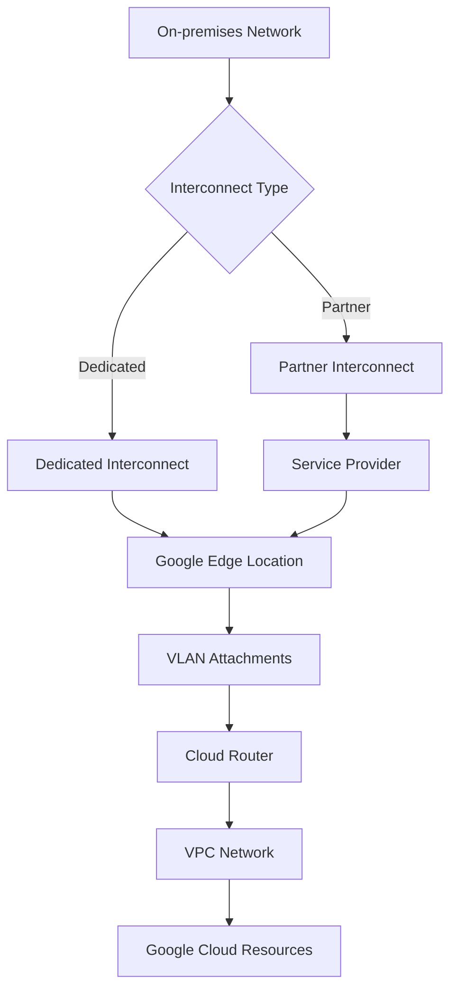

# Cloud Interconnect

Cloud Interconnect provides high-availability, low-latency connections between your on-premises network and Google Cloud. It offers dedicated physical connections and connections through supported service providers, allowing you to extend your local network to Google's network.

## Types of Cloud Interconnect

Google Cloud offers two main types of Cloud Interconnect:

1. **Dedicated Interconnect**
   - Direct physical connection to Google's network
   - 10 Gbps or 100 Gbps connections
   - Available at Google's colocation facilities
   - Requires network equipment at colocation facility
   - Higher bandwidth and lower cost per Gbps

2. **Partner Interconnect**
   - Connection through a supported service provider
   - Flexible bandwidth options (50 Mbps to 50 Gbps)
   - Available from many locations
   - No need for equipment at a colocation facility
   - Faster to provision

## Interconnect Architecture

## Key Components

Cloud Interconnect consists of several key components:

- **Physical Connections**: The actual fiber connections
- **VLAN Attachments**: Virtual interfaces on the connections
- **Cloud Router**: BGP routing between networks
- **BGP Sessions**: Exchange routes between networks
- **Edge Availability Domains**: Redundant edge locations
- **MACsec Encryption**: Layer 2 encryption (Dedicated Interconnect)

## Redundancy Options

Cloud Interconnect offers several redundancy options:

- **99.9% Availability**: Single connection, single region
- **99.99% Availability**: Redundant connections, single region
- **99.999% Availability**: Redundant connections, multiple regions

## Connectivity Models

Cloud Interconnect supports several connectivity models:

- **Site-to-Cloud**: Connect on-premises to Google Cloud
- **Multicloud**: Connect to multiple cloud providers
- **Hybrid Cloud**: Integrate on-premises and cloud resources
- **Global Routing**: Route traffic to any Google Cloud region

## Cloud Router and BGP

Cloud Router establishes BGP sessions over Cloud Interconnect:

- **Dynamic Routing**: Automatically exchange routes
- **BGP Sessions**: Establish routing relationships
- **Route Advertisements**: Advertise routes between networks
- **Custom Route Advertisements**: Control which routes are advertised
- **BGP Communities**: Tag routes for specific handling
- **Route Priorities**: Control route preference
- **BGP MD5 Authentication**: Secure BGP sessions

## Performance Considerations

Cloud Interconnect offers several performance advantages:

- **Low Latency**: Direct connection to Google's network
- **High Bandwidth**: Up to 100 Gbps per connection
- **Predictable Performance**: Dedicated capacity
- **Traffic Engineering**: Control traffic flow
- **Quality of Service**: Prioritize critical traffic
- **Reduced Egress Costs**: Lower costs for data transfer

## Security Features

Cloud Interconnect includes several security features:

- **Private Connectivity**: Traffic doesn't traverse the internet
- **MACsec Encryption**: Layer 2 encryption (Dedicated Interconnect)
- **IAM Integration**: Role-based access control
- **VPC Service Controls**: Create security perimeters
- **Private Google Access**: Access Google services privately
- **Firewall Rules**: Control traffic flow

## Use Cases

- **Hybrid Cloud**: Integrate on-premises and cloud resources
- **Data Migration**: Transfer large datasets to Google Cloud
- **Disaster Recovery**: Replicate data between environments
- **Multicloud Strategy**: Connect to multiple cloud providers
- **High-Performance Computing**: Low-latency access to cloud resources
- **Media and Entertainment**: Transfer large media files
- **Healthcare and Life Sciences**: Secure data transfer
- **Financial Services**: Low-latency trading platforms

## Comparison: Interconnect vs. VPN

| Feature | Cloud Interconnect | Cloud VPN |
|---------|-------------------|-----------|
| Connection Type | Dedicated physical | Encrypted tunnel over internet |
| Bandwidth | Up to 100 Gbps | Up to 3 Gbps |
| Latency | Lower | Higher |
| Cost | Higher | Lower |
| Setup Time | Days to weeks | Minutes to hours |
| SLA | Up to 99.999% | Up to 99.99% |
| Security | Private connection | Encrypted over public internet |
| Use Case | High bandwidth, low latency | Lower bandwidth, cost-sensitive |

## Best Practices

1. **Implement Redundancy**: Use multiple connections
2. **Distribute Across Availability Domains**: Enhance reliability
3. **Monitor Bandwidth Usage**: Track capacity needs
4. **Implement BGP Best Practices**: Proper route advertisement
5. **Document Network Design**: Maintain documentation
6. **Test Failover**: Ensure high availability
7. **Implement QoS**: Prioritize critical traffic
8. **Use MACsec Encryption**: For sensitive data
9. **Plan for Growth**: Design for future capacity needs
10. **Regular Audits**: Review configuration periodically

## Related Topics
- [[GCP Networking]]
- [[Virtual Private Cloud]]
- [[Cloud Router]]
- [[Cloud VPN]]
- [[Hybrid Connectivity]]
