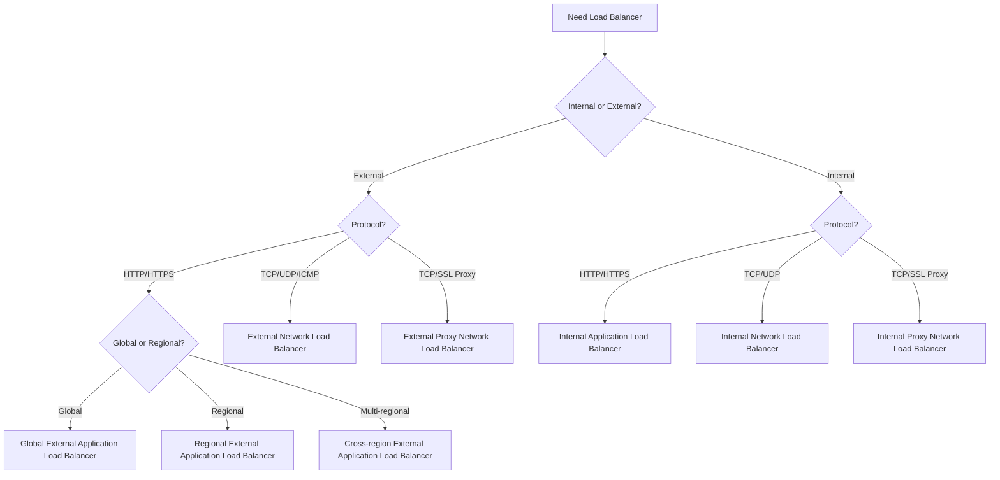

# Cloud Load Balancing

Cloud Load Balancing is a fully distributed, software-defined managed service for distributing traffic across applications and regions. It offers global and regional load balancing, automatic scaling, and integrated health checking.

## Types of Load Balancers

Google Cloud offers several types of load balancers:

### External Load Balancers
- **Global External Application Load Balancer**: HTTP/HTTPS, global
- **Regional External Application Load Balancer**: HTTP/HTTPS, regional
- **Cross-region External Application Load Balancer**: HTTP/HTTPS, multi-regional
- **External Network Load Balancer**: TCP/UDP/ICMP, regional
- **External Proxy Network Load Balancer**: TCP/SSL, global or regional

### Internal Load Balancers
- **Internal Application Load Balancer**: HTTP/HTTPS, regional
- **Internal Network Load Balancer**: TCP/UDP, regional
- **Internal Proxy Network Load Balancer**: TCP/SSL, regional

## Load Balancer Selection Guide

## Key Components

Cloud Load Balancing consists of several components:

- **Forwarding Rules**: Define the frontend (IP, port, protocol)
- **Target Proxies**: Terminate connections and route requests
- **URL Maps**: Route requests based on URL patterns (for HTTP/HTTPS)
- **Backend Services**: Define backends and health checks
- **Backends**: Instance groups, NEGs, or buckets
- **Health Checks**: Verify backend health

## Global External Application Load Balancer

The Global External Application Load Balancer is a globally distributed HTTP/HTTPS load balancer:

- **Global Anycast IP**: Single IP address for global services
- **HTTP/HTTPS**: Layer 7 load balancing
- **URL-based Routing**: Route based on URL patterns
- **SSL Termination**: Terminate SSL at the load balancer
- **WebSocket Support**: Support for WebSocket connections
- **Google Cloud Armor Integration**: DDoS protection and WAF
- **Cloud CDN Integration**: Content delivery network
- **IAP Integration**: Identity-Aware Proxy for authentication

## Network Load Balancers

Network Load Balancers provide Layer 4 load balancing:

- **External Network Load Balancer**: Regional TCP/UDP/ICMP load balancing
- **Internal Network Load Balancer**: Regional TCP/UDP load balancing
- **Passthrough Load Balancing**: Traffic passes through without termination
- **Preserve Client IP**: Client IP is preserved
- **High Performance**: Low latency, high throughput
- **Support for Any Port**: Any TCP/UDP port

## Proxy Network Load Balancers

Proxy Network Load Balancers provide Layer 4 proxy-based load balancing:

- **External Proxy Network Load Balancer**: Global or regional TCP/SSL proxy
- **Internal Proxy Network Load Balancer**: Regional TCP/SSL proxy
- **SSL Termination**: Terminate SSL at the load balancer
- **Connection Draining**: Graceful removal of backends
- **Session Affinity**: Keep client requests on the same backend

## Load Balancing Features

Cloud Load Balancing offers several advanced features:

- **Autoscaling**: Automatically scale backends based on load
- **Health Checking**: Verify backend health
- **Session Affinity**: Keep client requests on the same backend
- **Connection Draining**: Graceful removal of backends
- **SSL Policies**: Control SSL/TLS versions and ciphers
- **WebSocket Support**: Support for WebSocket connections
- **HTTP/2 and gRPC Support**: Modern protocol support
- **Traffic Splitting**: Split traffic between backends
- **Weighted Load Balancing**: Distribute traffic based on weights
- **Cross-region Load Balancing**: Distribute traffic across regions

## Use Cases

- **Global Applications**: Serve users worldwide with low latency
- **High Availability**: Distribute traffic across zones and regions
- **Microservices**: Route traffic to microservices
- **Content Delivery**: Deliver content with Cloud CDN
- **API Gateway**: Route API requests
- **Blue/Green Deployments**: Implement zero-downtime deployments
- **A/B Testing**: Test new features with traffic splitting
- **Security**: Implement DDoS protection and WAF

## Best Practices

1. **Choose the Right Load Balancer**: Match to your requirements
2. **Implement Health Checks**: Verify backend health
3. **Configure Firewall Rules**: Allow health check traffic
4. **Use Instance Groups**: For automatic scaling
5. **Implement SSL Termination**: Offload SSL processing
6. **Configure Session Affinity**: When needed for stateful applications
7. **Monitor Load Balancer Metrics**: Track performance
8. **Implement Cloud CDN**: For static content
9. **Use Google Cloud Armor**: For security
10. **Test Failover**: Ensure high availability

## Related Topics
- [[GCP Networking]]
- [[Virtual Private Cloud]]
- [[Cloud CDN]]
- [[Cloud Armor]]
- [[Network Service Tiers]]
