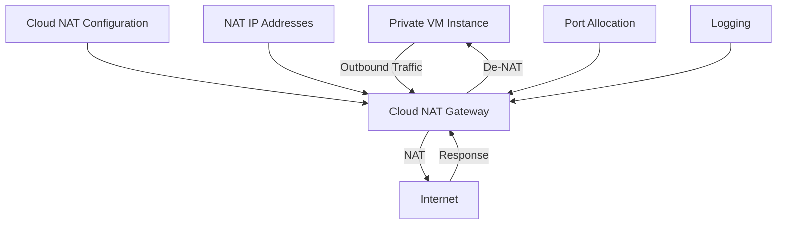

# Cloud NAT

Cloud NAT (Network Address Translation) is a distributed, software-defined managed service that lets instances without external IP addresses access the internet. It provides outbound connectivity for private instances while keeping them protected from inbound connections.

## Key Features

- **Managed Service**: No NAT instances to maintain
- **Distributed NAT**: Scales automatically
- **Regional Service**: Deployed per region
- **High Availability**: No single point of failure
- **Private Instances**: Secure internet access
- **Logging**: Optional connection logging
- **Port Allocation**: Configurable port allocation
- **IP Address Management**: Automatic or manual
- **Endpoint-Independent Mapping**: Consistent NAT mapping
- **TCP/UDP/ICMP Support**: Multiple protocol support
- **IPv4 Support**: NAT for IPv4 traffic
- **VPC Integration**: Works with VPC networks

## How Cloud NAT Works

1. Private instances initiate outbound connections
2. Cloud NAT translates private IP to public IP
3. Internet services respond to the public IP
4. Cloud NAT forwards responses back to private instances
5. No inbound connections can be initiated from the internet

## Cloud NAT Components

Cloud NAT consists of several components:

- **NAT Gateway**: Regional resource that provides NAT
- **NAT Configuration**: Defines NAT behavior
- **NAT IP Addresses**: Public IPs used for translation
- **NAT Rules**: Define how traffic is translated
- **NAT Logging**: Optional connection logging

## NAT IP Address Management

Cloud NAT offers two ways to manage NAT IP addresses:

1. **Auto-allocated**: Google Cloud automatically allocates IPs
   - Simplest option
   - Google manages the IP addresses
   - Number of IPs based on VM instances

2. **Manual**: You specify the IP addresses
   - More control
   - Use specific IP addresses
   - Static IPs for allowlisting

## Port Allocation

Cloud NAT provides configurable port allocation:

- **Port Allocation**: Number of ports per VM instance
   - Default: 64 ports per VM per IP
   - Maximum: 65,536 ports per VM (across all IPs)
   - Minimum: 64 ports per VM per IP

- **Port Allocation Types**:
   - **Auto**: Automatic port allocation
   - **Minimum Ports**: Guarantee minimum ports per VM
   - **Maximum Ports**: Limit maximum ports per VM

## NAT Logging

Cloud NAT offers optional logging:

- **Connection Logging**: Log NAT connections
- **Translation Logging**: Log NAT translations
- **Error Logging**: Log NAT errors
- **Log Destinations**: Cloud Logging
- **Log Sampling**: Configure sampling rate
- **Log Filtering**: Filter logs by criteria

## Use Cases

- **Private Instances**: Internet access for private VMs
- **Security**: Prevent inbound connections
- **Compliance**: Meet regulatory requirements
- **Cost Optimization**: Reduce external IP costs
- **Outbound-Only Services**: Services that only need outbound access
- **Batch Processing**: Jobs that need to download data
- **Package Updates**: Update software packages
- **API Access**: Access external APIs
- **Database Replication**: Outbound database connections

## Limitations

- **Inbound Connections**: No inbound NAT (ingress)
- **Protocol Support**: TCP, UDP, ICMP only
- **ICMP Error Mapping**: Limited ICMP error support
- **Endpoint-Dependent Filtering**: Consistent mapping only
- **IPv6**: No IPv6 NAT support
- **Maximum VMs**: 1,024 VMs per NAT gateway
- **Regional Scope**: NAT gateway is regional

## Comparison with Other NAT Solutions

| Feature | Cloud NAT | NAT Instance | Cloud VPN/Interconnect |
|---------|-----------|-------------|-----------------------|
| Deployment | Managed service | Self-managed VM | Network connection |
| Scaling | Automatic | Manual | Fixed |
| High Availability | Built-in | Manual setup | Depends on setup |
| Maintenance | Google-managed | Self-maintained | Minimal |
| Cost | Pay-as-you-go | VM + egress | Connection + egress |
| Performance | High | Limited by VM | Limited by connection |
| Management | Minimal | High | Moderate |

## Best Practices

1. **Size Appropriately**: Allocate enough IPs and ports
2. **Monitor Usage**: Track port utilization
3. **Enable Logging**: For troubleshooting
4. **Use Private Google Access**: For Google API access
5. **Consider Regional Distribution**: Distribute workloads
6. **Plan IP Allocation**: Manual IPs for specific needs
7. **Document NAT Configuration**: Maintain documentation
8. **Review Periodically**: Adjust as needs change
9. **Consider Alternatives**: Private Google Access, VPC Service Controls
10. **Test Connectivity**: Verify outbound access

## Troubleshooting

Common issues and solutions:

- **Connection Failures**: Check port allocation
- **Intermittent Connectivity**: Check for port exhaustion
- **Slow Connections**: Check for overloaded NAT gateway
- **Specific Service Issues**: Check for service-specific ports
- **Logging Issues**: Verify logging configuration
- **IP Exhaustion**: Add more NAT IPs

## Related Topics
- [[GCP Networking]]
- [[Virtual Private Cloud]]
- [[Private Google Access]]
- [[VPC Service Controls]]
- [[Security Best Practices]]
