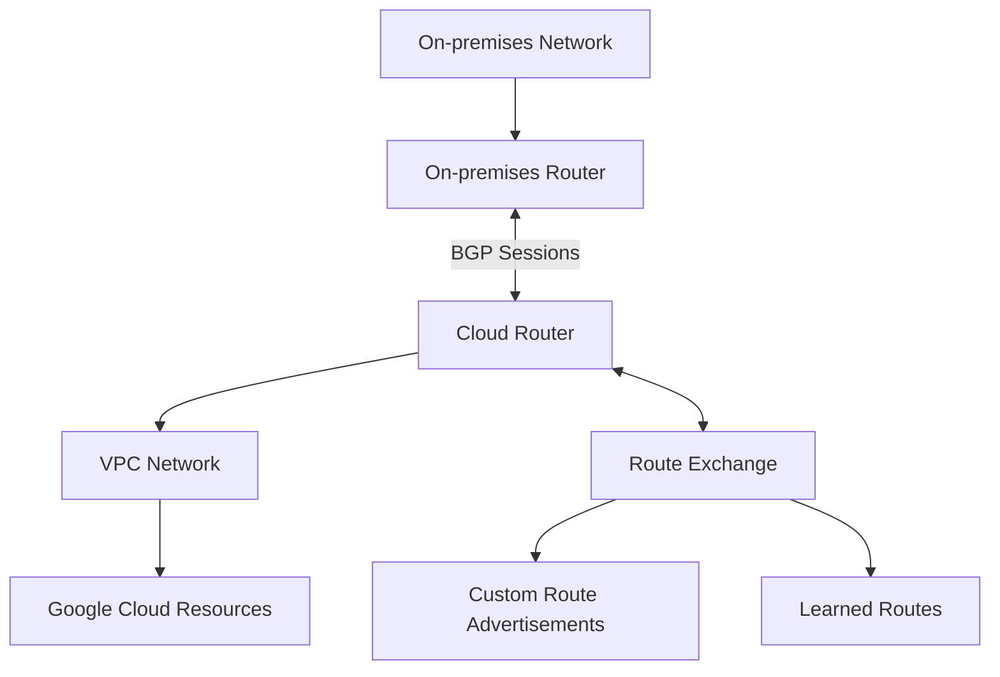

# Cloud Router

Cloud Router is a fully distributed and managed Google Cloud service that uses the Border Gateway Protocol (BGP) to dynamically exchange routes between your Google Cloud Virtual Private Cloud (VPC) network and on-premises or other cloud networks. It enables dynamic routing for Cloud VPN and Cloud Interconnect connections.

## Key Features

- **Dynamic Route Exchange**: Automatically exchange routes using BGP
- **Fully Managed Service**: No router infrastructure to maintain
- **High Availability**: Regional redundancy
- **Global Routing**: Advertise routes to any Google Cloud region
- **BGP Support**: Industry-standard routing protocol
- **Custom Route Advertisements**: Control which routes are advertised
- **Route Priorities**: Control route preference
- **Graceful Restart**: Maintain routing during maintenance
- **Multiple BGP Sessions**: Connect to multiple peers
- **BGP Communities**: Tag routes for specific handling
- **BGP MD5 Authentication**: Secure BGP sessions
- **IPv4 and IPv6 Support**: Dual-stack routing

## How Cloud Router Works

Cloud Router establishes BGP sessions with your on-premises router or another cloud provider's router. It then:

1. Learns routes from your on-premises network
2. Advertises routes from your VPC network
3. Updates routes automatically when network changes occur
4. Provides fast failover when connectivity issues arise

## Integration with Google Cloud Services

Cloud Router integrates with several Google Cloud services:

- **Cloud VPN**: Dynamic routing for VPN connections
- **Cloud Interconnect**: Dynamic routing for Interconnect connections
- **VPC Network Peering**: Route exchange between VPC networks
- **Network Connectivity Center**: Central hub for connectivity
- **Private Service Connect**: Access to Google services
- **Cloud NAT**: Outbound NAT for private instances

## BGP Configuration

Cloud Router uses BGP for dynamic routing:

- **ASN (Autonomous System Number)**: Identifies your network
- **BGP Sessions**: Establish routing relationships
- **Peer ASN**: Identifies your peer's network
- **BGP Timers**: Control session behavior
- **Route Priorities**: Determine preferred routes
- **MED (Multi-Exit Discriminator)**: Influence inbound traffic
- **Communities**: Tag routes for specific handling
- **Prefix Filtering**: Control which routes are accepted
- **MD5 Authentication**: Secure BGP sessions

## Custom Route Advertisements

Cloud Router allows you to control which routes are advertised:

- **Custom Mode**: Advertise specific subnets
- **Default Mode**: Advertise all subnets
- **Subnet Groups**: Group subnets for advertisement
- **Custom Routes**: Advertise static and dynamic routes
- **Regional Control**: Advertise routes to specific regions

## High Availability

Cloud Router provides high availability through:

- **Regional Redundancy**: Multiple router instances per region
- **Multiple BGP Sessions**: Connect to multiple peers
- **Graceful Restart**: Maintain routing during maintenance
- **Fast Failover**: Quickly detect and recover from failures
- **99.99% SLA**: When configured properly

## Use Cases

- **Hybrid Cloud**: Connect on-premises and cloud networks
- **Multi-Cloud**: Connect to multiple cloud providers
- **Global Routing**: Route traffic to any Google Cloud region
- **Dynamic Networking**: Automatically adapt to network changes
- **High Availability**: Ensure continuous connectivity
- **Traffic Engineering**: Control traffic flow
- **Network Migration**: Gradually migrate workloads to cloud
- **Disaster Recovery**: Route traffic to backup sites

## Best Practices

1. **Use Multiple BGP Sessions**: For redundancy
2. **Configure Proper ASNs**: Use private ASNs when possible
3. **Implement Route Filtering**: Control route advertisements
4. **Document BGP Design**: Maintain documentation
5. **Monitor BGP Status**: Track session health
6. **Use MD5 Authentication**: Secure BGP sessions
7. **Configure Graceful Restart**: Minimize disruption
8. **Plan IP Addressing**: Avoid overlapping subnets
9. **Test Failover**: Ensure high availability
10. **Regular Audits**: Review configuration periodically

## Troubleshooting

Common issues and solutions:

- **BGP Session Establishment**: Check network connectivity
- **Route Exchange**: Verify BGP configuration
- **Missing Routes**: Check route advertisements
- **Asymmetric Routing**: Ensure consistent route priorities
- **MTU Issues**: Check for fragmentation
- **Performance Problems**: Check for congestion

## Comparison with On-premises Routers

| Feature | Cloud Router | Traditional Router |
|---------|-------------|-------------------|
| Deployment | Fully managed | Self-managed |
| Scaling | Automatic | Manual |
| Redundancy | Built-in | Manual configuration |
| Maintenance | Google-managed | Self-maintained |
| Configuration | API, Console, CLI | Vendor-specific |
| Cost | Pay-as-you-go | Capital expense |
| Features | Focused on BGP | Comprehensive |

## Related Topics
- [[GCP Networking]]
- [[Virtual Private Cloud]]
- [[Cloud VPN]]
- [[Cloud Interconnect]]
- [[Network Connectivity Center]]
