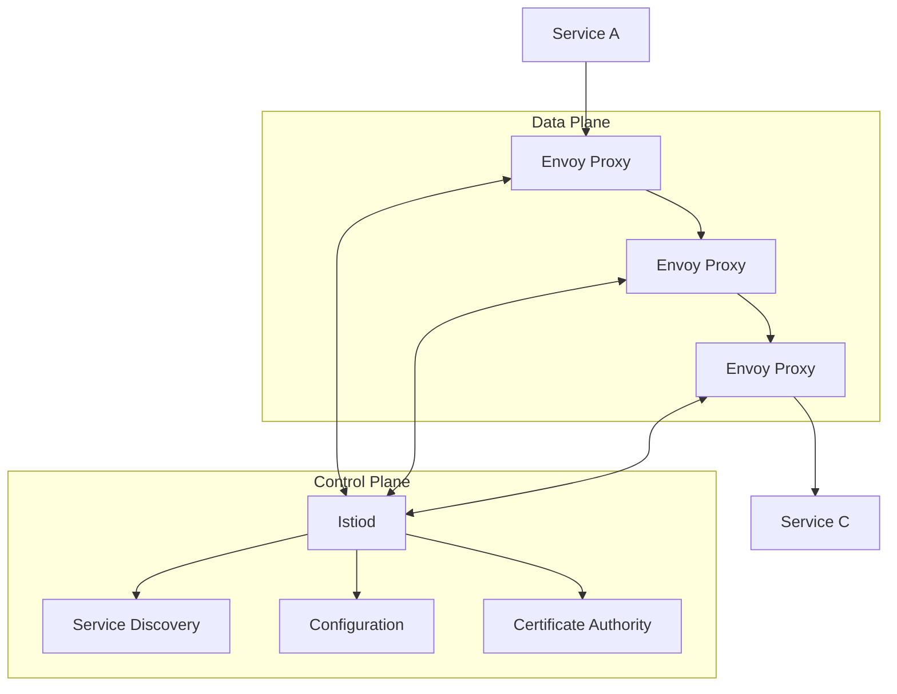

# Cloud Service Mesh

Cloud Service Mesh (part of Anthos Service Mesh) is Google Cloud's fully managed service mesh that provides a platform for managing, observing, and securing microservices. It's based on Istio, an open-source service mesh, and provides enhanced capabilities for Google Cloud environments.

## Key Features

- **Traffic Management**: Advanced traffic control
- **Service Discovery**: Automatic service discovery
- **Security**: mTLS encryption and authentication
- **Observability**: Monitoring, logging, and tracing
- **Policy Enforcement**: Consistent policy application
- **Load Balancing**: Intelligent traffic distribution
- **Circuit Breaking**: Prevent cascading failures
- **Fault Injection**: Test service resilience
- **Managed Control Plane**: Google-managed Istio
- **Multi-cluster Support**: Span multiple clusters
- **Hybrid/Multi-cloud**: Support for diverse environments
- **Integration with GCP**: Native Google Cloud integration

## Service Mesh Architecture

## Components

Cloud Service Mesh consists of several key components:

- **Control Plane**: Manages configuration and policies
  - **Istiod**: Combined Istio components
  - **Service Discovery**: Tracks available services
  - **Configuration API**: Manages mesh configuration
  - **Certificate Authority**: Manages certificates

- **Data Plane**: Handles traffic between services
  - **Envoy Proxies**: Sidecar proxies with services
  - **Ingress Gateway**: Entry point for external traffic
  - **Egress Gateway**: Exit point for external services

## Traffic Management Capabilities

Cloud Service Mesh provides advanced traffic management:

- **Request Routing**: Route based on various criteria
- **Traffic Splitting**: Percentage-based traffic distribution
- **Circuit Breaking**: Prevent cascading failures
- **Fault Injection**: Test service resilience
- **Retry Policies**: Automatic request retries
- **Timeout Policies**: Control request timeouts
- **Outlier Detection**: Identify problematic instances
- **Virtual Services**: Abstract service routing
- **Destination Rules**: Define service subsets
- **Service Entries**: Add external services to mesh
- **Gateways**: Control ingress/egress traffic

## Security Features

Cloud Service Mesh includes several security features:

- **mTLS Encryption**: Encrypt service-to-service traffic
- **Identity Management**: Service identity
- **Authentication**: Verify service identity
- **Authorization**: Control access between services
- **Certificate Management**: Automatic certificate rotation
- **Policy Enforcement**: Consistent security policies
- **RBAC Integration**: Role-based access control
- **Secret Management**: Secure credential handling

## Observability

Cloud Service Mesh provides comprehensive observability:

- **Metrics Collection**: Performance metrics
- **Distributed Tracing**: End-to-end request tracing
- **Access Logging**: Detailed access logs
- **Service Dashboard**: Visual service monitoring
- **Service Topology**: Visual service relationships
- **SLO Monitoring**: Service level objective tracking
- **Anomaly Detection**: Identify unusual behavior
- **Integration with Cloud Monitoring**: Performance monitoring
- **Integration with Cloud Logging**: Activity logging
- **Integration with Cloud Trace**: Request tracing

## Deployment Models

Cloud Service Mesh supports several deployment models:

1. **Single Cluster**
   - Service mesh within one cluster
   - Simplest deployment model
   - Ideal for getting started

2. **Multi-cluster**
   - Span multiple clusters
   - Unified service mesh
   - Cross-cluster communication

3. **Hybrid/Multi-cloud**
   - Extend to on-premises and other clouds
   - Consistent management across environments
   - Unified service mesh across diverse infrastructure

## Management Options

Cloud Service Mesh offers two management options:

1. **Managed Control Plane**
   - Google-managed Istio control plane
   - Reduced operational overhead
   - Automatic updates and maintenance
   - Simplified operations

2. **In-cluster Control Plane**
   - Self-managed control plane
   - More control and customization
   - Higher operational overhead
   - Manual updates and maintenance

## Integration with Google Cloud

Cloud Service Mesh integrates with several Google Cloud services:

- **GKE**: Native Kubernetes integration
- **Anthos**: Multi-cluster management
- **Cloud Monitoring**: Performance monitoring
- **Cloud Logging**: Activity logging
- **Cloud Trace**: Request tracing
- **Cloud Armor**: Security protection
- **IAM**: Access control
- **Secret Manager**: Secure credential storage

## Use Cases

- **Microservices Architecture**: Manage microservices communication
- **Zero-trust Security**: Implement zero-trust model
- **Observability**: Gain visibility into service interactions
- **Canary Deployments**: Gradual rollout of new versions
- **A/B Testing**: Test different service versions
- **Traffic Shifting**: Control traffic between service versions
- **Service Resilience**: Improve fault tolerance
- **Policy Enforcement**: Consistent policy application
- **Multi-environment Consistency**: Uniform behavior across environments

## Comparison with Other Service Meshes

| Feature | Cloud Service Mesh | Istio | Linkerd |
|---------|-------------------|-------|---------|
| Management | Fully managed option | Self-managed | Self-managed |
| Complexity | Moderate | High | Lower |
| Feature Set | Comprehensive | Comprehensive | Focused |
| Performance Impact | Moderate | Moderate | Lower |
| GCP Integration | Native | Limited | Limited |
| Multi-cluster | Supported | Supported | Limited |
| Proxy | Envoy | Envoy | Linkerd Proxy |
| Control Plane | Istiod | Istiod | Linkerd Control Plane |

## Best Practices

1. **Start Small**: Begin with key services
2. **Incremental Adoption**: Gradually expand mesh
3. **Define Service Boundaries**: Clear service responsibilities
4. **Implement Circuit Breaking**: Prevent cascading failures
5. **Use Canary Deployments**: Gradual rollouts
6. **Monitor Performance**: Track proxy overhead
7. **Implement mTLS**: Secure service communication
8. **Document Mesh Configuration**: Maintain documentation
9. **Regular Updates**: Keep mesh components updated
10. **Train Team Members**: Build service mesh expertise

## Challenges and Considerations

- **Complexity**: Service mesh adds complexity
- **Performance Overhead**: Proxy impacts performance
- **Learning Curve**: Understanding service mesh concepts
- **Debugging Challenges**: Distributed system complexity
- **Resource Requirements**: Additional compute resources
- **Operational Overhead**: Managing mesh configuration
- **Migration Challenges**: Moving existing services to mesh
- **Feature Compatibility**: Not all features work in all environments

## Related Topics
- [[GCP Networking]]
- [[Traffic Director]]
- [[Microservices Architecture]]
- [[Zero-trust Security]]
- [[Kubernetes]]
