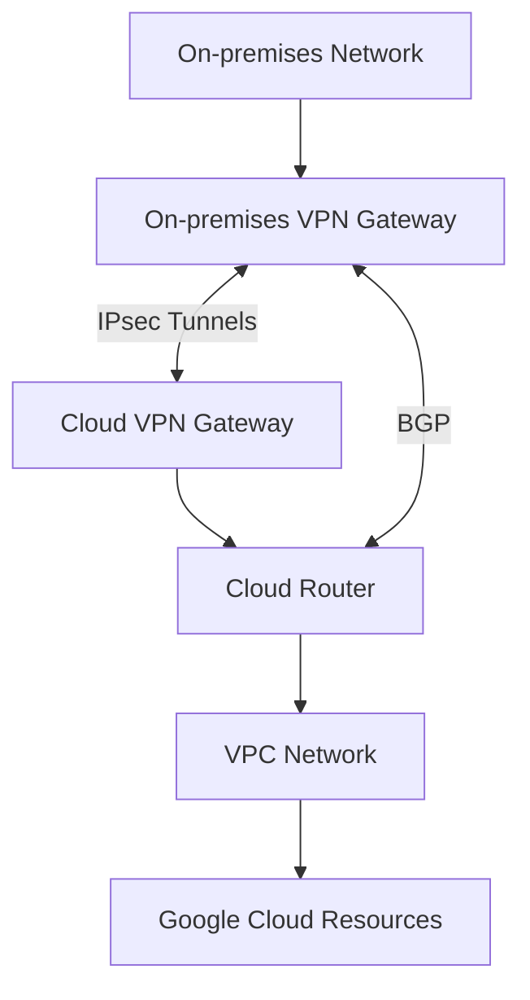

# Cloud VPN

Cloud VPN securely connects your on-premises network to your Google Cloud Virtual Private Cloud (VPC) network through an IPsec VPN connection. It encrypts data traveling between your on-premises network and Google Cloud, providing a secure way to extend your network into the cloud.

## Types of Cloud VPN

Google Cloud offers two types of Cloud VPN:

1. **HA VPN (High Availability VPN)**
   - 99.99% SLA
   - Two external IP addresses
   - Multiple tunnels for redundancy
   - BGP routing
   - Automatic failover
   - Recommended for production workloads

2. **Classic VPN**
   - 99.9% SLA
   - Single external IP address
   - Static or dynamic routing
   - Legacy option
   - Not recommended for new deployments

## Cloud VPN Architecture

## Key Components

Cloud VPN consists of several key components:

- **VPN Gateway**: Manages the VPN connection
- **External IP Address**: Public IP for the VPN gateway
- **VPN Tunnels**: Encrypted connections between gateways
- **Cloud Router**: Manages BGP routing (for dynamic routing)
- **BGP Sessions**: Exchange routes between networks
- **Routing**: Static or dynamic (BGP)
- **Firewall Rules**: Control traffic flow

## HA VPN Configuration

HA VPN provides high availability through redundant components:

- **Two Interfaces**: Each with its own external IP
- **Multiple Tunnels**: Connect to peer VPN gateway
- **BGP Routing**: Dynamic route exchange
- **Automatic Failover**: Detect and recover from failures
- **Equal Cost Multipath (ECMP)**: Load balance across tunnels
- **99.99% SLA**: When configured properly

## VPN Topologies

Cloud VPN supports several network topologies:

1. **Site-to-Site VPN**
   - Connect on-premises to Google Cloud
   - Most common topology

2. **VPN Between VPC Networks**
   - Connect multiple VPC networks
   - Alternative to VPC Network Peering

3. **Multi-site VPN**
   - Connect multiple on-premises locations
   - Hub-and-spoke topology

4. **Multicloud VPN**
   - Connect to other cloud providers
   - Hybrid cloud architecture

## Routing Options

Cloud VPN offers two routing options:

1. **Dynamic Routing (BGP)**
   - Automatic route exchange
   - Faster failover
   - Supports ECMP
   - Required for HA VPN
   - Preferred for production

2. **Static Routing**
   - Manually configured routes
   - Simpler configuration
   - No automatic failover
   - Only available for Classic VPN
   - Not recommended for production

## Security Features

Cloud VPN includes several security features:

- **IPsec Encryption**: Secure tunnel
- **IKE Protocols**: IKEv1 and IKEv2
- **Strong Ciphers**: AES-128, AES-256
- **Perfect Forward Secrecy**: Ephemeral keys
- **Pre-shared Keys**: Authentication
- **IAM Integration**: Role-based access control
- **VPC Service Controls**: Create security perimeters
- **Firewall Rules**: Control traffic flow

## Performance Considerations

Cloud VPN has several performance characteristics:

- **Bandwidth**: Up to 3 Gbps per tunnel
- **ECMP**: Load balance across multiple tunnels
- **MTU**: 1460 bytes (with overhead)
- **Latency**: Depends on internet conditions
- **Packet Loss**: Depends on internet conditions
- **Throughput**: Affected by distance and internet quality

## Use Cases

- **Secure Access to Cloud Resources**: Connect securely to GCP
- **Site-to-Site Connectivity**: Connect offices to cloud
- **Hybrid Cloud**: Integrate on-premises and cloud resources
- **Disaster Recovery**: Replicate data between environments
- **Remote Access**: Connect remote workers (with additional components)
- **Development and Testing**: Secure access to dev/test environments
- **Multicloud Strategy**: Connect to multiple cloud providers
- **Temporary Connectivity**: Quick setup for temporary needs

## Comparison: VPN vs. Interconnect

| Feature | Cloud VPN | Cloud Interconnect |
|---------|-----------|-------------------|
| Connection Type | Encrypted tunnel over internet | Dedicated physical |
| Bandwidth | Up to 3 Gbps | Up to 100 Gbps |
| Latency | Higher | Lower |
| Cost | Lower | Higher |
| Setup Time | Minutes to hours | Days to weeks |
| SLA | Up to 99.99% | Up to 99.999% |
| Security | Encrypted over public internet | Private connection |
| Use Case | Lower bandwidth, cost-sensitive | High bandwidth, low latency |

## Best Practices

1. **Use HA VPN**: For production workloads
2. **Implement BGP Routing**: For automatic failover
3. **Configure Multiple Tunnels**: For redundancy
4. **Monitor VPN Status**: Track connection health
5. **Document VPN Configuration**: Maintain documentation
6. **Use Strong Pre-shared Keys**: Enhance security
7. **Implement Firewall Rules**: Control traffic flow
8. **Test Failover**: Ensure high availability
9. **Consider MTU**: Account for IPsec overhead
10. **Regular Audits**: Review configuration periodically

## Troubleshooting

Common issues and solutions:

- **Tunnel Establishment**: Check IKE/IPsec parameters
- **Route Exchange**: Verify BGP configuration
- **Traffic Flow**: Check firewall rules
- **Performance Issues**: Check MTU, bandwidth
- **Intermittent Connectivity**: Check for packet loss
- **Asymmetric Routing**: Ensure consistent route priorities

## Related Topics
- [[GCP Networking]]
- [[Virtual Private Cloud]]
- [[Cloud Router]]
- [[Cloud Interconnect]]
- [[Hybrid Connectivity]]
