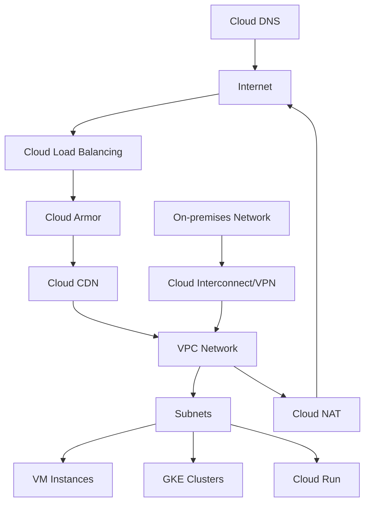

# GCP Networking

Google Cloud Platform offers a comprehensive suite of networking services designed to connect your applications and infrastructure securely and efficiently. These services provide the foundation for building scalable, reliable, and secure applications on Google Cloud.

## Networking Services Overview

GCP provides several networking services, each designed for specific use cases:

1. **Virtual Private Cloud (VPC)**: Software-defined networking
2. **Cloud Load Balancing**: Distribute traffic across instances
3. **Cloud CDN**: Content delivery network
4. **Cloud DNS**: Domain name system service
5. **Cloud Interconnect**: Connect on-premises networks to Google Cloud
6. **Cloud VPN**: Secure connection over the internet
7. **Network Service Tiers**: Choose network performance vs. cost
8. **Cloud NAT**: Network address translation service
9. **Cloud Armor**: DDoS protection and WAF
10. **Network Intelligence Center**: Network monitoring and visualization

## Network Architecture

## VPC Networking

Virtual Private Cloud (VPC) is the fundamental networking service in GCP:

- **Global Resource**: Single VPC spans all regions
- **Subnets**: Regional resources within a VPC
- **IP Addressing**: IPv4 and IPv6 support
- **Routes**: Control traffic flow
- **Firewall Rules**: Control access to instances
- **Shared VPC**: Share networks across projects
- **VPC Peering**: Connect VPCs privately
- **VPC Flow Logs**: Network traffic logging
- **Private Google Access**: Access Google services without public IP

## Connectivity Options

GCP offers several options for connecting to your resources:

### External Connectivity
- **External IP Addresses**: Direct internet connectivity
- **Cloud Load Balancing**: Distribute external traffic
- **Cloud NAT**: Outbound connectivity without external IPs
- **Cloud DNS**: Domain name resolution

### Hybrid Connectivity
- **Cloud VPN**: Secure encrypted tunnels
- **Dedicated Interconnect**: Direct physical connections
- **Partner Interconnect**: Connections through service providers
- **Cross-Cloud Interconnect**: Connect to other clouds

### Internal Connectivity
- **VPC Peering**: Connect VPC networks
- **Private Service Connect**: Access Google services privately
- **Serverless VPC Access**: Connect serverless to VPC
- **Internal Load Balancing**: Distribute internal traffic

## Security Features

GCP networking includes robust security features:

- **Firewall Rules**: Control traffic to and from instances
- **Cloud Armor**: DDoS protection and WAF
- **VPC Service Controls**: Create security perimeters
- **Private Google Access**: Access Google services privately
- **IAM**: Role-based access control
- **SSL Policies**: Control SSL/TLS versions
- **Network Intelligence Center**: Security insights
- **Packet Mirroring**: Capture and inspect traffic

## Performance Optimization

GCP offers several features for optimizing network performance:

- **Premium Tier**: Google's premium backbone
- **Standard Tier**: ISP network at lower cost
- **Cloud CDN**: Cache content close to users
- **Global Load Balancing**: Route to closest region
- **TCP BBR**: Congestion control algorithm
- **Network Service Tiers**: Choose performance vs. cost
- **Performance Dashboard**: Monitor network performance

## Choosing the Right Networking Services

The right networking services depend on your specific requirements:

| Requirement | Recommended Services |
|-------------|---------------------|
| Basic Connectivity | VPC, Subnets, Routes |
| Internet Facing | External IP, Cloud Load Balancing |
| High Availability | Global Load Balancing, Cloud CDN |
| Hybrid Cloud | Cloud Interconnect, Cloud VPN |
| Security | Firewall Rules, Cloud Armor, VPC Service Controls |
| Cost Optimization | Standard Tier, Cloud NAT |
| Performance | Premium Tier, Cloud CDN, Global Load Balancing |

## Related Topics
- [[Virtual Private Cloud]]
- [[Cloud Load Balancing]]
- [[Cloud CDN]]
- [[Cloud Interconnect]]
- [[Cloud VPN]]
- [[Network Service Tiers]]
- [[Cloud Armor]]
