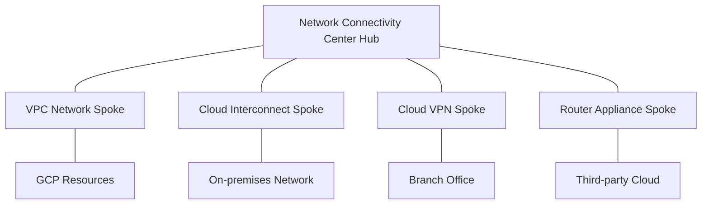

# Network Connectivity Center

Network Connectivity Center is Google Cloud's hub-and-spoke connectivity management platform that simplifies network management by connecting VPC networks and on-premises networks through a central hub. It provides a unified view and management of network connectivity across hybrid and multi-cloud environments.

## Key Features

- **Hub-and-Spoke Model**: Centralized connectivity management
- **Multiple Spoke Types**: Support for various connection types
- **Global Reach**: Connect resources across regions
- **Simplified Management**: Single pane of glass for connectivity
- **Hybrid Connectivity**: Connect on-premises and cloud
- **Multi-Cloud Support**: Connect to other cloud providers
- **Site-to-Site Connectivity**: Connect multiple sites
- **Unified Policy Management**: Consistent policies across connections
- **Scalable Architecture**: Support for growing networks
- **Monitoring and Visibility**: Centralized monitoring
- **IAM Integration**: Role-based access control
- **API Support**: Programmatic management

## Hub-and-Spoke Architecture

## Spoke Types

Network Connectivity Center supports several spoke types:

1. **VPC Network Spokes**
   - Connect VPC networks
   - Enable communication between VPC networks
   - Global connectivity across regions

2. **Cloud Interconnect Spokes**
   - Connect on-premises networks via Dedicated/Partner Interconnect
   - High-bandwidth, low-latency connectivity
   - Enterprise-grade connection

3. **Cloud VPN Spokes**
   - Connect on-premises networks via HA VPN
   - Encrypted connectivity over the internet
   - Cost-effective solution

4. **Router Appliance Spokes**
   - Connect using third-party router appliances
   - Support for SD-WAN and other networking solutions
   - Flexible connectivity options

## Connectivity Patterns

Network Connectivity Center enables several connectivity patterns:

- **VPC-to-VPC**: Connect multiple VPC networks
- **On-premises-to-Cloud**: Connect on-premises to Google Cloud
- **Site-to-Site**: Connect multiple physical locations
- **Multi-Cloud**: Connect to other cloud providers
- **Hybrid Mesh**: Create a mesh network across environments
- **Global Connectivity**: Connect resources across regions

## Implementation Process

The implementation process involves several steps:

1. **Create a Hub**: Central connectivity hub
2. **Create Spokes**: Connect networks to the hub
3. **Configure Routing**: Set up route exchange
4. **Establish Connectivity**: Enable communication
5. **Verify Connectivity**: Test connections
6. **Monitor and Manage**: Ongoing operations

## Use Cases

- **Enterprise Connectivity**: Connect enterprise networks
- **Multi-region Deployments**: Connect resources across regions
- **Hybrid Cloud**: Integrate on-premises and cloud resources
- **Multi-Cloud Strategy**: Connect to multiple cloud providers
- **Branch Office Connectivity**: Connect remote offices
- **Mergers and Acquisitions**: Integrate acquired networks
- **Global Operations**: Support global business operations
- **Disaster Recovery**: Connect primary and backup sites

## Benefits

- **Simplified Management**: Single interface for connectivity
- **Reduced Complexity**: Streamlined network architecture
- **Consistent Policies**: Uniform policy application
- **Improved Visibility**: Centralized monitoring
- **Operational Efficiency**: Reduced management overhead
- **Flexible Connectivity**: Support for various connection types
- **Scalable Architecture**: Adapt to growing networks
- **Cost Optimization**: Efficient use of network resources

## Comparison with Traditional Connectivity

| Feature | Network Connectivity Center | Traditional Point-to-Point |
|---------|-----------------------------|-----------------------------|
| Architecture | Hub-and-spoke | Mesh or point-to-point |
| Management | Centralized | Distributed |
| Scalability | High | Limited |
| Complexity | Lower | Higher |
| Policy Consistency | Uniform | Varies |
| Visibility | Centralized | Fragmented |
| Deployment | Simplified | Complex |
| Cost | Optimized | Potentially higher |

## Integration with Google Cloud

Network Connectivity Center integrates with several Google Cloud services:

- **Cloud Interconnect**: High-bandwidth connectivity
- **Cloud VPN**: Encrypted connectivity
- **Cloud Router**: Dynamic routing
- **VPC Networks**: Internal connectivity
- **Network Intelligence Center**: Monitoring and visibility
- **Cloud Monitoring**: Performance monitoring
- **Cloud Logging**: Activity logging
- **IAM**: Access control

## Best Practices

1. **Plan Hub Deployment**: Strategic hub placement
2. **Choose Appropriate Spoke Types**: Match to requirements
3. **Implement Redundancy**: Multiple connections for critical paths
4. **Document Network Architecture**: Maintain documentation
5. **Monitor Connectivity**: Track performance and health
6. **Implement Security Controls**: Secure all connections
7. **Regular Audits**: Review configuration periodically
8. **Optimize Routing**: Efficient traffic paths
9. **Test Failover**: Ensure high availability
10. **Capacity Planning**: Plan for growth

## Limitations and Considerations

- **Spoke Type Compatibility**: Not all spoke types work together
- **Regional Considerations**: Some features have regional constraints
- **Routing Complexity**: Complex routing scenarios require careful planning
- **Migration Challenges**: Transitioning from existing architecture
- **Operational Readiness**: Team skills and processes
- **Cost Management**: Understanding pricing model
- **Feature Maturity**: Some features may be in preview

## Related Topics
- [[GCP Networking]]
- [[Cloud Interconnect]]
- [[Cloud VPN]]
- [[Cloud Router]]
- [[Hybrid Connectivity]]
