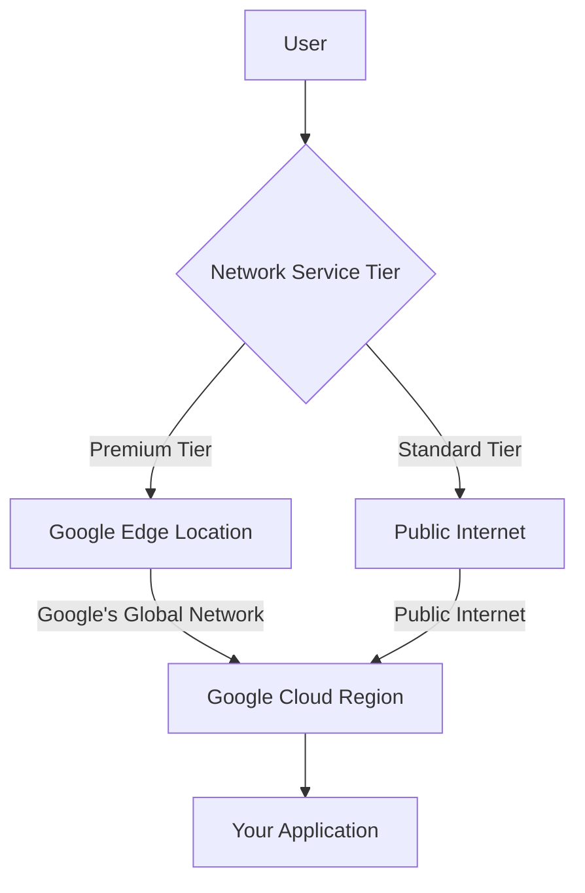

# Network Service Tiers

Network Service Tiers is a Google Cloud feature that allows you to optimize connectivity between your users and Google Cloud resources based on performance and cost requirements. It offers two tiers: Premium Tier and Standard Tier, each with different network paths, performance characteristics, and pricing.

## Tier Options

Google Cloud offers two Network Service Tiers:

1. **Premium Tier**
   - Traffic stays on Google's global network
   - Higher performance and reliability
   - Lower latency
   - Higher cost
   - Default tier

2. **Standard Tier**
   - Traffic uses the public internet
   - Lower performance
   - Higher latency
   - Lower cost
   - Cost-optimized option

## Network Paths

### Premium Tier Path
1. User traffic enters Google's network at the edge location closest to the user
2. Traffic travels on Google's global backbone network
3. Traffic reaches your application in the Google Cloud region

### Standard Tier Path
1. User traffic travels over the public internet
2. Traffic enters Google's network at the region where your application is deployed
3. Traffic reaches your application in the Google Cloud region

## Feature Comparison

| Feature | Premium Tier | Standard Tier |
|---------|-------------|--------------|
| Network Path | Google's global network | Public internet |
| Performance | Higher | Lower |
| Reliability | Higher | Lower |
| Latency | Lower | Higher |
| Cost | Higher | Lower |
| Global Load Balancing | Supported | Limited |
| Cloud CDN | Supported | Supported |
| Static IP Addresses | Global and regional | Regional only |
| SLA | Higher | Lower |

## Services Affected

Network Service Tiers affect several Google Cloud services:

- **External IP Addresses**: Global vs. regional
- **Load Balancing**: Global vs. regional capabilities
- **Cloud CDN**: Different performance characteristics
- **Google Kubernetes Engine**: External services
- **Compute Engine**: VM internet access
- **Cloud Storage**: Public access performance
- **BigQuery**: Data export performance
- **Cloud SQL**: External access performance

## Use Cases

### Premium Tier
- **Global Applications**: Applications with users worldwide
- **Low-Latency Requirements**: Gaming, financial trading, real-time applications
- **High-Reliability Needs**: Mission-critical applications
- **Rich Media Delivery**: Video streaming, large file downloads
- **Enterprise Applications**: Business-critical workloads

### Standard Tier
- **Cost-Sensitive Applications**: Budget-constrained projects
- **Regional Applications**: Applications serving specific regions
- **Non-Critical Workloads**: Development, testing environments
- **Bulk Data Transfer**: Where timing is not critical
- **Internal Applications**: Limited external access

## Performance Considerations

### Premium Tier Performance
- **Global Reach**: 100+ edge locations worldwide
- **Low Latency**: Traffic stays on Google's optimized network
- **Consistent Performance**: Less variability
- **Higher Throughput**: Optimized routing and congestion control
- **Better Packet Loss**: Lower packet loss rates
- **TCP Optimization**: Google's optimized TCP stack

### Standard Tier Performance
- **Regional Reach**: Limited to region entry points
- **Higher Latency**: Traffic traverses public internet
- **Variable Performance**: Depends on internet conditions
- **Lower Throughput**: Subject to internet congestion
- **Higher Packet Loss**: Typical internet packet loss rates
- **Standard TCP**: No special optimizations

## Cost Considerations

Network Service Tiers have different pricing models:

- **Premium Tier**: Higher cost per GB
- **Standard Tier**: Lower cost per GB (20-30% savings)
- **Ingress Traffic**: Free in both tiers
- **Egress Traffic**: Charged based on volume and destination
- **Inter-Region Traffic**: Different rates by tier
- **Static IP Addresses**: Different rates by tier

## Selection Criteria

Consider these factors when selecting a Network Service Tier:

- **Application Requirements**: Performance vs. cost
- **User Location**: Global vs. regional distribution
- **Budget Constraints**: Available networking budget
- **Performance Sensitivity**: Impact of latency and packet loss
- **Traffic Patterns**: Volume and distribution of traffic
- **Compliance Requirements**: Regulatory considerations
- **Business Criticality**: Impact of performance issues

## Best Practices

1. **Evaluate Application Needs**: Match tier to requirements
2. **Consider Hybrid Approach**: Different tiers for different services
3. **Test Both Tiers**: Measure actual performance difference
4. **Monitor Performance**: Track key metrics
5. **Calculate TCO**: Consider all costs, not just networking
6. **Review Periodically**: Reassess as needs change
7. **Use Premium for Critical Paths**: Prioritize user-facing traffic
8. **Consider Regional Deployment**: For Standard Tier
9. **Optimize Content Delivery**: Use Cloud CDN regardless of tier
10. **Document Tier Selection**: Maintain documentation

## Related Topics
- [[GCP Networking]]
- [[Cloud Load Balancing]]
- [[Cloud CDN]]
- [[Performance Optimization]]
- [[Cost Optimization]]
