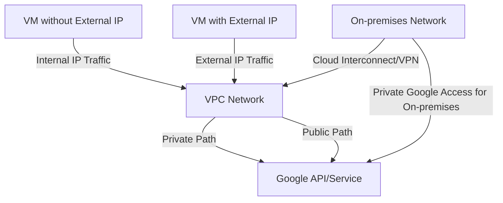

# Private Google Access

Private Google Access is a Google Cloud feature that allows virtual machine (VM) instances without external IP addresses to access Google APIs and services using internal IP addresses. It enables secure, private connectivity to Google services without exposing instances to the public internet.

## Key Features

- **Private API Access**: Access Google APIs without public internet
- **Internal IP Addressing**: Use only internal IP addresses
- **Enhanced Security**: Reduce public internet exposure
- **Cost Optimization**: Eliminate need for external IPs
- **Simplified Architecture**: No need for NAT or proxies
- **Global Access**: Access Google services worldwide
- **VPC Service Controls**: Enhanced security boundaries
- **On-premises Access**: Extend to on-premises networks
- **Hybrid Cloud Support**: Consistent access across environments
- **Granular Control**: Configure access by subnet

## How Private Google Access Works

Private Google Access works by:

1. Enabling the feature on a subnet
2. VM instances in that subnet send requests to Google APIs
3. Traffic is routed through Google's network, not the public internet
4. Google APIs respond through the same private path

## Types of Private Google Access

Google Cloud offers several types of Private Google Access:

1. **Private Google Access for VPC**
   - For VM instances without external IPs
   - Access Google APIs privately
   - Enabled at subnet level

2. **Private Google Access for On-premises**
   - For on-premises hosts
   - Access Google APIs privately
   - Uses Cloud VPN or Cloud Interconnect

3. **Private Google Access for Serverless**
   - For serverless services (Cloud Run, Cloud Functions)
   - Access VPC resources privately
   - Bidirectional connectivity

4. **Private Service Connect**
   - Advanced private connectivity
   - Access Google APIs and services via internal IP
   - More control and customization

## Supported Google Services

Private Google Access supports access to many Google services:

- **Google Cloud APIs**: All GCP APIs
- **Google APIs**: Maps, Drive, Gmail, etc.
- **Google Workspace**: Docs, Sheets, Slides, etc.
- **Google.com Services**: Search, Photos, etc.
- **Cloud Storage**: GCS buckets and objects
- **BigQuery**: Data warehousing
- **Artifact Registry**: Container images
- **Cloud Logging**: Log storage and analysis
- **Cloud Monitoring**: Performance monitoring

## DNS Configuration

Private Google Access requires specific DNS configuration:

- **Default Google API Domain**: `*.googleapis.com`
- **Google API DNS Records**: Point to private IP ranges
- **Cloud DNS**: Automatic configuration
- **Custom DNS**: Manual configuration required
- **Private DNS Zones**: For custom domains
- **Split-horizon DNS**: Different views for internal/external

## Use Cases

- **Secure API Access**: Access APIs without internet exposure
- **Compliance Requirements**: Meet regulatory requirements
- **Cost Optimization**: Eliminate need for external IPs
- **Security Enhancement**: Reduce attack surface
- **Hybrid Cloud**: Consistent access from on-premises
- **Data Processing**: Process data without internet exposure
- **Private Workloads**: Run sensitive workloads privately
- **Serverless Integration**: Connect serverless to VPC

## Security Benefits

Private Google Access provides several security benefits:

- **Reduced Attack Surface**: No public internet exposure
- **Network Isolation**: Traffic stays on Google's network
- **No External IPs**: Instances not reachable from internet
- **VPC Service Controls**: Enhanced security boundaries
- **IAM Integration**: Role-based access control
- **Audit Logging**: Track API access
- **Compliance Support**: Meet regulatory requirements
- **Consistent Security**: Same model across environments

## Implementation Steps

### For VPC Networks
1. **Enable on Subnet**: Set Private Google Access flag
2. **Configure Firewall**: Allow egress to Google API ranges
3. **Verify DNS**: Ensure proper DNS resolution
4. **Test Access**: Verify API connectivity

### For On-premises Networks
1. **Set Up Connectivity**: Cloud VPN or Interconnect
2. **Configure Routes**: Routes to Google API ranges
3. **Configure DNS**: DNS resolution for Google APIs
4. **Enable Private Access**: Configure Cloud Router
5. **Test Access**: Verify API connectivity

## Best Practices

1. **Enable on All Subnets**: Consistent configuration
2. **Document DNS Configuration**: Maintain documentation
3. **Monitor API Access**: Track usage patterns
4. **Implement Least Privilege**: Restrict API access
5. **Use VPC Service Controls**: Enhanced security
6. **Regular Testing**: Verify connectivity
7. **Backup Access Method**: Plan for contingencies
8. **Keep IP Ranges Updated**: Track Google API IP ranges
9. **Combine with IAM**: Comprehensive security
10. **Audit Regularly**: Review configuration periodically

## Limitations and Considerations

- **API Coverage**: Not all Google services supported
- **DNS Configuration**: Critical for proper operation
- **Firewall Rules**: Must allow Google API ranges
- **Service Account Configuration**: Proper setup required
- **Regional Considerations**: Some services have regional constraints
- **Hybrid Networking**: Proper setup for on-premises
- **Troubleshooting Complexity**: Private networking issues

## Comparison with Alternative Approaches

| Feature | Private Google Access | NAT Gateway | Proxy Server |
|---------|----------------------|-------------|--------------|
| Implementation | Simple | Moderate | Complex |
| Cost | Lower | Moderate | Higher |
| Performance | Higher | Moderate | Lower |
| Maintenance | Minimal | Moderate | High |
| Security | Higher | Moderate | Varies |
| Flexibility | Limited to Google services | All destinations | All destinations |
| Scalability | Automatic | Limited by NAT | Limited by proxy |

## Related Topics
- [[GCP Networking]]
- [[Virtual Private Cloud]]
- [[Cloud NAT]]
- [[VPC Service Controls]]
- [[Cloud DNS]]
