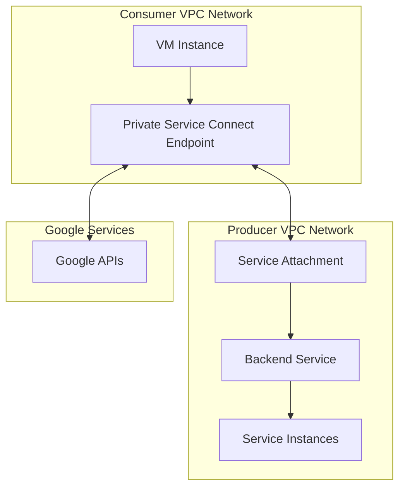

# Private Service Connect

Private Service Connect is a Google Cloud networking feature that provides private connectivity between VPC networks and services. It allows you to access Google APIs, services published by other organizations, and your own services privately, without traversing the public internet.

## Key Features

- **Private Access**: Access services without public internet exposure
- **Service Publishing**: Publish services to other VPC networks
- **Google API Access**: Private access to Google APIs
- **Cross-organization Access**: Access services across organizations
- **Internal IP Addressing**: Use internal IP addresses
- **Endpoint Configuration**: Configure service endpoints
- **Load Balancing Integration**: Work with load balancers
- **VPC Service Controls**: Enhanced security boundaries
- **IAM Integration**: Role-based access control
- **DNS Configuration**: Automatic or manual DNS setup
- **Monitoring and Logging**: Track service access

## Private Service Connect Models

Private Service Connect supports two main connectivity models:

1. **Consumer Model (Endpoints)**
   - Create endpoints to access services
   - Access Google APIs privately
   - Access published services

2. **Producer Model (Service Attachments)**
   - Publish services to other VPC networks
   - Control who can access your services
   - Manage service connections

## Architecture

## Endpoint Types

Private Service Connect supports several endpoint types:

1. **Backend Service Endpoints**
   - Connect to services published by other VPC networks
   - Use internal IP addresses
   - Support for TCP/UDP traffic

2. **Forwarding Rule Endpoints**
   - Connect to Google APIs and services
   - Use internal IP addresses
   - Support for HTTP(S) traffic

3. **Global Access Endpoints**
   - Access from any region
   - Global routing
   - Consistent access pattern

## Service Publishing

To publish services using Private Service Connect:

1. **Create Backend Service**: Define your service
2. **Create Service Attachment**: Publish the service
3. **Configure Access Control**: Control who can connect
4. **Share Service Information**: Provide connection details
5. **Accept Connections**: Approve connection requests

## Google API Access

Private Service Connect provides private access to Google APIs:

- **Private Google Access**: Access Google APIs privately
- **VPC Service Controls**: Enhanced security boundaries
- **DNS Configuration**: Automatic or manual DNS setup
- **Regional Endpoints**: Access in specific regions
- **Global Endpoints**: Access from any region

## Use Cases

- **Secure API Access**: Access APIs without internet exposure
- **SaaS Applications**: Publish software as a service
- **Multi-tenant Services**: Serve multiple customers
- **Managed Services**: Offer managed services to customers
- **Partner Connectivity**: Connect with partners securely
- **Regulatory Compliance**: Meet data sovereignty requirements
- **Microservices Architecture**: Connect microservices privately
- **Hybrid Cloud**: Connect on-premises and cloud services

## Security Benefits

Private Service Connect provides several security benefits:

- **No Public Internet Exposure**: Services remain private
- **Network Isolation**: Separate producer and consumer networks
- **Access Controls**: Control who can connect
- **VPC Service Controls**: Enhanced security boundaries
- **IAM Integration**: Role-based access control
- **Private IP Addressing**: No public IP addresses
- **Reduced Attack Surface**: Minimize exposure
- **Compliance Support**: Meet regulatory requirements

## Comparison with Other Connectivity Options

| Feature | Private Service Connect | VPC Peering | Cloud VPN |
|---------|------------------------|-------------|-----------|
| Network Isolation | High | Limited | High |
| Service Granularity | Service-level | Network-level | Network-level |
| Setup Complexity | Moderate | Low | High |
| Cross-organization | Yes | Limited | Yes |
| Google API Access | Native | Via Private Google Access | Via Private Google Access |
| IP Range Overlap | Supported | Not supported | Supported with NAT |
| Service Publishing | Native | Manual | Manual |

## Implementation Steps

### For Consumers
1. **Create Endpoint**: Define the endpoint in your VPC
2. **Configure DNS**: Set up DNS resolution
3. **Configure Access**: Set up access controls
4. **Connect to Service**: Use the internal IP address

### For Producers
1. **Create Backend Service**: Define your service
2. **Create Service Attachment**: Publish the service
3. **Configure Access Control**: Control who can connect
4. **Share Connection Details**: Provide information to consumers
5. **Monitor Connections**: Track service usage

## Best Practices

1. **Plan IP Addressing**: Avoid IP conflicts
2. **Implement DNS Strategy**: Consistent name resolution
3. **Document Service Connections**: Maintain documentation
4. **Monitor Service Health**: Track performance
5. **Implement Access Controls**: Restrict who can connect
6. **Regular Audits**: Review configuration periodically
7. **Test Connectivity**: Verify service access
8. **Capacity Planning**: Plan for growth
9. **Implement Redundancy**: High availability for critical services
10. **Security Monitoring**: Track access patterns

## Limitations and Considerations

- **Regional Scope**: Some features have regional constraints
- **Service Type Support**: Not all service types supported
- **Protocol Support**: Limited to supported protocols
- **DNS Configuration**: May require custom setup
- **Connection Quotas**: Limits on number of connections
- **Billing Considerations**: Understand pricing model
- **Feature Maturity**: Some features may be in preview

## Related Topics
- [[GCP Networking]]
- [[Virtual Private Cloud]]
- [[VPC Service Controls]]
- [[Cloud Load Balancing]]
- [[Private Google Access]]
