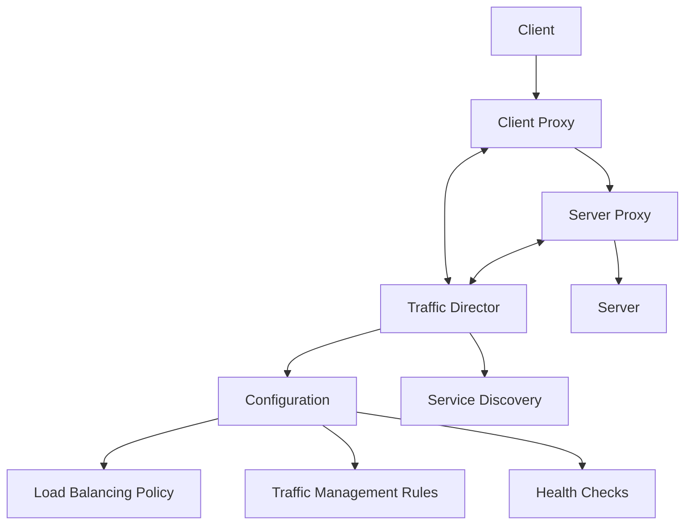

# Traffic Director

Traffic Director is Google Cloud's fully managed traffic control plane for service mesh that provides global load balancing, traffic management, and service discovery for open service mesh. It enables sophisticated traffic control capabilities for your applications, regardless of where they run.

## Key Features

- **Global Load Balancing**: Distribute traffic globally
- **Service Mesh Integration**: Works with open service mesh
- **Traffic Management**: Advanced traffic control
- **Service Discovery**: Automatic service discovery
- **Health Checking**: Monitor service health
- **Circuit Breaking**: Prevent cascading failures
- **Fault Injection**: Test service resilience
- **Traffic Splitting**: A/B testing and canary deployments
- **Retry Policies**: Automatic request retries
- **Timeout Policies**: Control request timeouts
- **Outlier Detection**: Identify problematic instances
- **Weighted Load Balancing**: Control traffic distribution
- **Proxyless gRPC**: Native gRPC support
- **Multi-environment Support**: Works across environments

## Architecture

## Components

Traffic Director consists of several key components:

- **Control Plane**: Manages configuration and service discovery
- **Data Plane**: Proxies that handle traffic (e.g., Envoy)
- **Configuration**: Traffic rules and policies
- **Service Registry**: Service discovery information
- **Health Checking**: Service health monitoring
- **Monitoring**: Performance and health metrics

## Deployment Models

Traffic Director supports several deployment models:

1. **Sidecar Proxy Model**
   - Proxy deployed alongside each service
   - Fine-grained traffic control
   - Envoy proxy integration

2. **Gateway Model**
   - Proxy deployed as a gateway
   - Entry/exit point for traffic
   - Simplified deployment

3. **Proxyless gRPC**
   - Native gRPC integration
   - No proxy required
   - Reduced overhead

## Traffic Management Capabilities

Traffic Director provides advanced traffic management:

- **Request Routing**: Route based on various criteria
- **Traffic Splitting**: Percentage-based traffic distribution
- **Circuit Breaking**: Prevent cascading failures
- **Fault Injection**: Test service resilience
- **Retry Policies**: Automatic request retries
- **Timeout Policies**: Control request timeouts
- **Outlier Detection**: Identify problematic instances
- **Header Manipulation**: Modify request/response headers
- **Weighted Load Balancing**: Control traffic distribution

## Load Balancing Modes

Traffic Director supports several load balancing modes:

- **Round Robin**: Distribute traffic evenly
- **Weighted Round Robin**: Distribute traffic based on weights
- **Least Request**: Send to least busy instance
- **Ring Hash**: Consistent hashing for session affinity
- **Maglev**: Consistent hashing with minimal disruption
- **Locality-weighted**: Prefer local instances

## Service Discovery

Traffic Director provides service discovery through:

- **GCP Service Directory**: Centralized service registry
- **Instance Groups**: Compute Engine instance groups
- **GKE Services**: Kubernetes services
- **NEGs (Network Endpoint Groups)**: Fine-grained endpoints
- **Custom Service Registration**: Register your own services

## Health Checking

Traffic Director monitors service health through:

- **HTTP Health Checks**: Check HTTP endpoints
- **TCP Health Checks**: Check TCP connectivity
- **gRPC Health Checks**: Check gRPC health service
- **Custom Health Checks**: Define custom health criteria
- **Outlier Detection**: Identify problematic instances

## Integration with Google Cloud

Traffic Director integrates with several Google Cloud services:

- **Compute Engine**: Manage VM traffic
- **GKE**: Kubernetes integration
- **Cloud Run**: Serverless integration
- **Anthos Service Mesh**: Enhanced service mesh
- **Cloud Monitoring**: Performance monitoring
- **Cloud Logging**: Activity logging
- **Cloud Trace**: Request tracing

## Use Cases

- **Microservices Architecture**: Manage microservices traffic
- **Multi-region Deployments**: Global traffic management
- **Hybrid Cloud**: Consistent traffic control across environments
- **Canary Deployments**: Gradual rollout of new versions
- **A/B Testing**: Test different service versions
- **Blue/Green Deployments**: Zero-downtime deployments
- **Service Migration**: Migrate services with minimal disruption
- **API Gateway**: Manage API traffic
- **Service Mesh**: Build a service mesh architecture

## Comparison with Other Solutions

| Feature | Traffic Director | Istio | AWS App Mesh |
|---------|-----------------|-------|--------------|
| Management | Fully managed | Self-managed | Managed control plane |
| Global Reach | Global | Cluster-scoped | Regional |
| Proxyless gRPC | Supported | Not supported | Not supported |
| Multi-environment | Supported | Limited | AWS-focused |
| Integration | GCP services | Kubernetes-focused | AWS services |
| Complexity | Moderate | High | Moderate |
| Proxy | Envoy | Envoy | Envoy |
| Pricing Model | Pay-as-you-go | Open source | Pay-as-you-go |

## Best Practices

1. **Start Simple**: Begin with basic traffic management
2. **Implement Gradual Rollouts**: Use traffic splitting
3. **Monitor Service Health**: Track performance metrics
4. **Implement Circuit Breaking**: Prevent cascading failures
5. **Test Resilience**: Use fault injection
6. **Document Traffic Policies**: Maintain documentation
7. **Use Consistent Naming**: Clear service naming conventions
8. **Plan for Scale**: Design for growth
9. **Implement Redundancy**: High availability for critical services
10. **Regular Audits**: Review configuration periodically

## Limitations and Considerations

- **Proxy Overhead**: Performance impact of proxies
- **Complexity**: Advanced features increase complexity
- **Learning Curve**: Understanding traffic management concepts
- **Operational Overhead**: Managing traffic policies
- **Compatibility**: Not all services support all features
- **Debugging Challenges**: Distributed system complexity
- **Feature Maturity**: Some features may be in preview

## Related Topics
- [[GCP Networking]]
- [[Cloud Load Balancing]]
- [[Service Mesh]]
- [[Microservices Architecture]]
- [[gRPC]]
