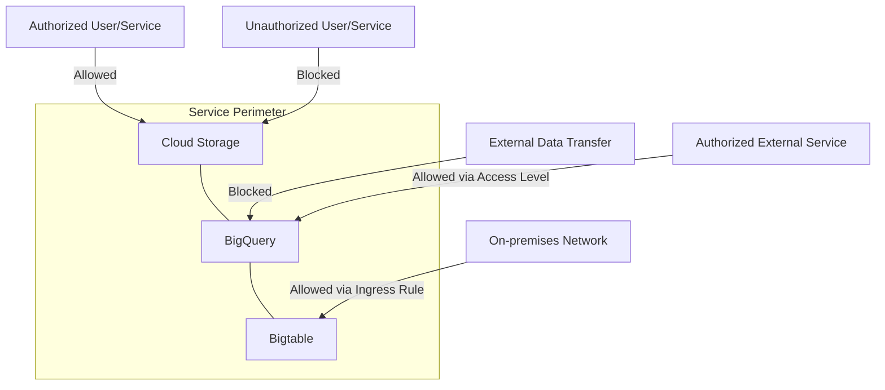

# VPC Service Controls

VPC Service Controls is a Google Cloud security feature that creates security perimeters around Google Cloud resources to help mitigate data exfiltration risks. It provides additional layers of security for sensitive data stored in Google Cloud services by controlling the flow of data across service boundaries.

## Key Features

- **Service Perimeters**: Isolate Google Cloud resources
- **Data Exfiltration Prevention**: Control data movement
- **Access Levels**: Context-aware access control
- **Perimeter Bridges**: Controlled communication between perimeters
- **Ingress Rules**: Control inbound access
- **Egress Rules**: Control outbound access
- **Dry Run Mode**: Test policies before enforcement
- **Monitoring**: Track perimeter violations
- **VPC Accessible Services**: Control service access
- **Private IP Access**: Access services via private IP
- **Organization Policy Integration**: Comprehensive security
- **IAM Integration**: Role-based access control

## How VPC Service Controls Works

VPC Service Controls works by:

1. Creating a service perimeter around Google Cloud resources
2. Defining access levels based on context (IP, device, user)
3. Controlling data movement in and out of the perimeter
4. Enforcing policies at the service level, not just the network level

## Service Perimeter Types

VPC Service Controls supports two types of perimeters:

1. **Regular Perimeters**
   - Enforced protection
   - Active restrictions
   - Production use

2. **Dry Run Perimeters**
   - Test mode
   - Logs violations without blocking
   - Policy validation

## Protected Services

VPC Service Controls protects many Google Cloud services, including:

- **Cloud Storage**: Object storage
- **BigQuery**: Data warehousing
- **Bigtable**: NoSQL database
- **Spanner**: Global relational database
- **Pub/Sub**: Messaging service
- **Dataflow**: Stream/batch processing
- **Dataproc**: Managed Hadoop/Spark
- **Cloud Logging**: Log management
- **Cloud Monitoring**: Performance monitoring
- **Artifact Registry**: Container registry
- **Vertex AI**: Machine learning platform
- **Many others**: Expanding coverage

## Access Control Mechanisms

VPC Service Controls provides several access control mechanisms:

- **Service Perimeters**: Define security boundaries
- **Access Levels**: Context-aware access control
- **Perimeter Bridges**: Controlled communication between perimeters
- **Ingress Rules**: Control inbound access
- **Egress Rules**: Control outbound access
- **VPC Accessible Services**: Control service access
- **Attribute Conditions**: Fine-grained access control

## Access Levels

Access levels define conditions for accessing resources:

- **IP-based Access**: Restrict by IP address/range
- **Device-based Access**: Restrict by device attributes
- **User/Service Account**: Restrict by identity
- **Geo-location**: Restrict by location
- **Time-based**: Restrict by time of day
- **Multi-factor Authentication**: Require MFA
- **Corporate Device**: Require managed device
- **Combination Rules**: Combine multiple conditions

## Use Cases

- **Data Exfiltration Prevention**: Prevent unauthorized data movement
- **Regulatory Compliance**: Meet data sovereignty requirements
- **Multi-tenant Isolation**: Separate customer environments
- **Sensitive Data Protection**: Protect PII, PHI, financial data
- **Zero Trust Security**: Implement zero trust model
- **Defense in Depth**: Add security layers
- **Insider Threat Mitigation**: Protect against privileged users
- **Third-party Risk Management**: Control vendor access

## Implementation Process

The implementation process involves several steps:

1. **Identify Resources**: Determine resources to protect
2. **Define Perimeters**: Create service perimeters
3. **Create Access Levels**: Define access conditions
4. **Configure Rules**: Set ingress/egress rules
5. **Test in Dry Run**: Validate without enforcement
6. **Monitor Violations**: Track policy violations
7. **Enforce Perimeters**: Switch to enforcement mode
8. **Continuous Improvement**: Refine policies

## Best Practices

1. **Start with Dry Run**: Test before enforcement
2. **Implement Gradually**: Phased approach
3. **Document Perimeter Design**: Maintain documentation
4. **Monitor Violations**: Track policy violations
5. **Use Least Privilege**: Minimal access levels
6. **Plan for Emergency Access**: Break-glass procedures
7. **Regular Audits**: Review configuration periodically
8. **Combine with IAM**: Comprehensive security
9. **Test Regularly**: Verify perimeter effectiveness
10. **Train Team Members**: Build security awareness

## Limitations and Considerations

- **Service Coverage**: Not all services supported
- **API Compatibility**: Some APIs may have limitations
- **Performance Impact**: Potential slight latency increase
- **Operational Complexity**: Additional security layer
- **Troubleshooting Challenges**: Complex security issues
- **Integration Considerations**: Third-party services
- **Cost Implications**: Additional security features
- **Learning Curve**: Understanding perimeter concepts

## Comparison with Other Security Controls

| Feature | VPC Service Controls | Firewall Rules | IAM |
|---------|---------------------|---------------|-----|
| Protection Level | Service-level | Network-level | Resource-level |
| Data Exfiltration Prevention | Strong | Limited | Limited |
| Context-aware Access | Yes | Limited | Limited |
| Implementation Complexity | Higher | Moderate | Lower |
| Scope | Google Cloud services | Network traffic | Resource access |
| Integration with Zero Trust | Strong | Partial | Partial |
| Granularity | Service boundaries | Network rules | Resource permissions |

## Related Topics
- [[GCP Networking]]
- [[Virtual Private Cloud]]
- [[IAM]]
- [[Security Best Practices]]
- [[Zero Trust Security]]
