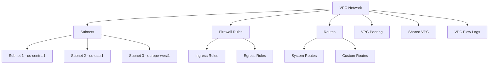

# Virtual Private Cloud (VPC)

Virtual Private Cloud (VPC) is Google Cloud's networking service that provides a software-defined networking layer for your Google Cloud resources. It enables you to create isolated private networks, control IP addressing, define routes and firewall rules, and connect to other networks securely.

## Key Features

- **Global Resource**: A single VPC spans all Google Cloud regions
- **Custom IP Addressing**: Define your own IP address ranges
- **Subnets**: Create regional subnets within your VPC
- **IPv4 and IPv6 Support**: Dual-stack networking
- **Firewall Rules**: Control traffic to and from instances
- **Routes**: Define custom routes for traffic
- **VPC Peering**: Connect VPCs privately
- **Shared VPC**: Share networks across projects
- **VPC Flow Logs**: Log network traffic
- **Private Google Access**: Access Google services without public IP
- **Private Service Connect**: Access Google services privately
- **Packet Mirroring**: Capture and inspect traffic
- **Network Tags**: Group instances for firewall rules
- **Service Directory**: Discover services in your VPC

## VPC Architecture

## VPC Types

Google Cloud offers two types of VPC networks:

1. **Auto Mode VPC**
   - Automatically creates subnets in each region
   - Uses predefined IP ranges
   - Simple to set up
   - Limited customization
   - Not recommended for production

2. **Custom Mode VPC**
   - You create subnets manually
   - Full control over IP ranges
   - More flexible
   - Recommended for production

## Subnets

Subnets are regional resources within a VPC:

- **Regional Scope**: Each subnet exists in a specific region
- **IP Range**: Defined by a primary CIDR block
- **Secondary Ranges**: Optional additional IP ranges
- **Private Google Access**: Access to Google APIs without public IP
- **Flow Logs**: Per-subnet flow log configuration
- **Private Service Connect**: Access to Google services

## Firewall Rules

Firewall rules control traffic to and from instances:

- **Direction**: Ingress (incoming) or egress (outgoing)
- **Priority**: Determines rule precedence
- **Action**: Allow or deny traffic
- **Targets**: Instances the rule applies to
- **Source/Destination**: IP ranges, tags, service accounts
- **Protocol and Ports**: Specific protocols and ports
- **Enforcement Status**: Enabled or disabled

## Routes

Routes determine how traffic is directed within your VPC:

- **System Routes**: Automatically created routes
- **Custom Routes**: User-defined routes
- **Static Routes**: Manually configured
- **Dynamic Routes**: Created by Cloud Router
- **Next Hop**: Where to send traffic (instance, VPN, interconnect)

## VPC Peering

VPC Peering connects two VPC networks privately:

- **Private Communication**: Direct private connectivity
- **No Public IP**: Traffic doesn't traverse the internet
- **No Gateway**: No single point of failure
- **No Transitive Peering**: Peering is not transitive

## Shared VPC

Shared VPC allows an organization to connect resources from multiple projects to a common VPC network:

- **Host Project**: Contains the shared VPC network
- **Service Projects**: Use the shared VPC network
- **Centralized Control**: Network administration in one project
- **Decentralized Usage**: Resources in multiple projects

## Use Cases

- **Application Deployment**: Deploy applications in isolated environments
- **Multi-tier Architecture**: Separate tiers with subnets and firewall rules
- **Hybrid Cloud**: Connect on-premises and cloud resources
- **Multi-project Infrastructure**: Share networks across projects
- **Microservices**: Connect microservices securely
- **Security Isolation**: Isolate sensitive workloads

## Best Practices

1. **Use Custom Mode VPC**: More control and flexibility
2. **Plan IP Addressing**: Design for future growth
3. **Implement Least Privilege**: Restrict firewall rules
4. **Use Network Tags**: Group instances logically
5. **Enable Flow Logs**: For security and troubleshooting
6. **Use Private Google Access**: Avoid public IP exposure
7. **Implement Shared VPC**: For multi-project deployments
8. **Document Network Design**: Maintain documentation
9. **Use Hierarchical Firewall Policies**: For organization-wide rules
10. **Monitor Network Usage**: Track usage and performance

## Related Topics
- [[GCP Networking]]
- [[Cloud Load Balancing]]
- [[Cloud Interconnect]]
- [[Cloud VPN]]
- [[VPC Service Controls]]
