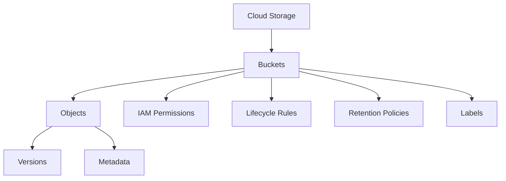

# Cloud Storage

Cloud Storage is Google Cloud's object storage service for storing and accessing unstructured data at scale. It provides durable and highly available storage with strong consistency.

## Key Features

- **Global Availability**: Store data in locations around the world
- **Unlimited Storage**: No limit on how much data you can store
- **Objects up to 5TB**: Store large individual files
- **Strong Consistency**: Read-after-write and list consistency
- **Versioning**: Track and restore previous versions of objects
- **Lifecycle Management**: Automatically transition or delete objects
- **Object Lock**: Prevent object deletion or modification
- **Retention Policies**: Enforce data retention requirements
- **Event Notifications**: Trigger actions when objects change
- **Customer-Managed Encryption Keys**: Control your own encryption keys

## Storage Classes

Cloud Storage offers four storage classes to optimize for cost and availability:

1. **Standard Storage**
   - Highest availability
   - No minimum storage duration
   - Best for frequently accessed data
   - Use cases: Website content, streaming videos, mobile apps

2. **Nearline Storage**
   - Lower cost than Standard
   - 30-day minimum storage duration
   - Best for data accessed less than once a month
   - Use cases: Backups, long-tail multimedia content

3. **Coldline Storage**
   - Lower cost than Nearline
   - 90-day minimum storage duration
   - Best for data accessed less than once a quarter
   - Use cases: Disaster recovery, archival data

4. **Archive Storage**
   - Lowest cost option
   - 365-day minimum storage duration
   - Best for data accessed less than once a year
   - Use cases: Long-term archives, regulatory data

## Bucket Organization

## Access Control

Cloud Storage provides multiple ways to control access:

- **IAM**: Role-based access control at the bucket and project level
- **ACLs**: Fine-grained control at the bucket and object level
- **Signed URLs**: Time-limited access to objects
- **Signed Policy Documents**: Control what can be uploaded
- **Firebase Authentication**: For mobile and web apps
- **VPC Service Controls**: Create security perimeters

## Data Transfer Options

- **gsutil**: Command-line tool for Cloud Storage
- **Cloud Console**: Web-based interface
- **Client Libraries**: Programmatic access in various languages
- **Storage Transfer Service**: Scheduled and managed transfers
- **Transfer Appliance**: Physical device for offline transfers

## Pricing Components

Cloud Storage pricing is based on several factors:

- **Storage**: Amount of data stored per month
- **Data Transfer**: Egress to the internet or between regions
- **Operations**: Number and type of operations performed
- **Retrieval Fees**: For Nearline, Coldline, and Archive classes
- **Early Deletion**: For objects deleted before minimum duration

## Use Cases

- **Static Website Hosting**: Host static websites
- **Content Delivery**: Store and serve media content
- **Backup and Archive**: Store backups and archives
- **Data Lakes**: Store data for analytics
- **App Data**: Store user-generated content
- **Disaster Recovery**: Store recovery data

## Best Practices

1. **Choose the Right Storage Class**: Match storage class to access patterns
2. **Use Lifecycle Management**: Automatically transition objects
3. **Implement Object Versioning**: Protect against accidental deletion
4. **Set Up Appropriate IAM Roles**: Least privilege access
5. **Use Signed URLs for Temporary Access**: Control access without IAM changes
6. **Enable Object Retention**: For compliance requirements
7. **Use Batch Operations**: For large-scale changes
8. **Monitor Usage**: Track storage and access patterns

## Related Topics
- [[GCP Storage Services]]
- [[Cloud Storage Transfer Service]]
- [[Cloud CDN]]
- [[Storage Best Practices]]
