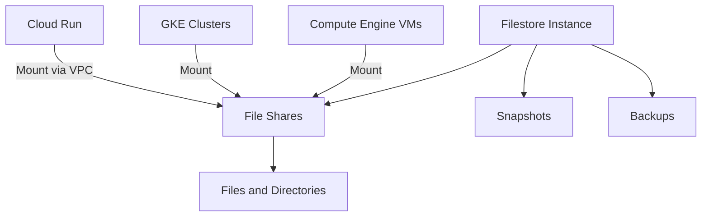

# Filestore

Filestore is Google Cloud's fully managed file storage service that provides NFS-based shared file systems for applications running on Compute Engine VMs or Google Kubernetes Engine clusters.

## Service Tiers

Filestore offers several service tiers to meet different performance and capacity requirements:

1. **Basic**
   - Entry-level file storage
   - Capacity: 1 TB to 63.9 TB
   - Performance: Up to 180 MB/s read, 120 MB/s write
   - Best for: General file sharing, development environments

2. **Enterprise**
   - High-performance file storage
   - Capacity: 1 TB to 10 TB per instance
   - Performance: Up to 1,200 MB/s read, 1,000 MB/s write
   - Best for: High-performance workloads, databases

3. **High Scale**
   - Highest capacity and performance
   - Capacity: 10 TB to 100 TB
   - Performance: Up to 25 GB/s read, 4.5 GB/s write
   - Best for: HPC, media rendering, financial modeling

## Deployment Options

Filestore instances can be deployed in two configurations:

1. **Zonal**
   - Data stored in a single zone
   - Lower cost
   - Best for non-critical workloads

2. **Regional**
   - Data replicated across multiple zones in a region
   - Higher availability (99.99%)
   - Synchronous replication
   - Best for critical workloads

## Key Features

- **NFS v3/v4.1**: Industry-standard file sharing protocol
- **Fully Managed**: No need to provision or manage file servers
- **High Performance**: Low latency and high throughput
- **Automatic Backup**: Scheduled backups of file shares
- **Snapshot Support**: Point-in-time snapshots for data protection
- **VPC Integration**: Secure access within your VPC
- **IAM Integration**: Role-based access control
- **Encryption at Rest**: Automatic encryption of data
- **Monitoring Integration**: Monitor performance with Cloud Monitoring

## Architecture

## Use Cases

- **Lift and Shift**: Migrate applications that require file systems
- **Content Management Systems**: Store and serve website content
- **Media Workflows**: Store and process media files
- **EDA Workloads**: Electronic Design Automation
- **Financial Services**: Store and analyze financial data
- **Shared Application Data**: Share data between applications
- **GKE Persistent Volumes**: Provide persistent storage for containers

## Performance Optimization

- **Choose the Right Tier**: Match tier to performance requirements
- **Optimize File Access Patterns**: Minimize small, random I/O
- **Use Appropriate File Sizes**: Larger files for better throughput
- **Configure NFS Mount Options**: Tune for your workload
- **Monitor Performance**: Track latency and throughput

## Comparison with Other Storage Options

| Feature | Filestore | Cloud Storage | Persistent Disk |
|---------|-----------|---------------|-----------------|
| Access Protocol | NFS | HTTP/REST | Block |
| Access Model | Shared | Object | Attached to VM |
| File System | Yes | No | Requires formatting |
| Use Case | Shared files | Unstructured data | VM storage |
| Max Capacity | 100 TB | Unlimited | 64 TB |
| Performance | Up to 25 GB/s | Varies | Up to 4.8 GB/s |

## Best Practices

1. **Size Appropriately**: Choose the right capacity for performance
2. **Use Snapshots**: Create regular snapshots for data protection
3. **Implement Backup Strategy**: Schedule regular backups
4. **Monitor Usage**: Track capacity and performance
5. **Secure Access**: Use VPC and IAM controls
6. **Choose Regional for Critical Workloads**: Ensure high availability
7. **Optimize Mount Options**: Tune NFS mount options for your workload

## Related Topics
- [[GCP Storage Services]]
- [[Compute Engine]]
- [[Google Kubernetes Engine]]
- [[Storage Best Practices]]
