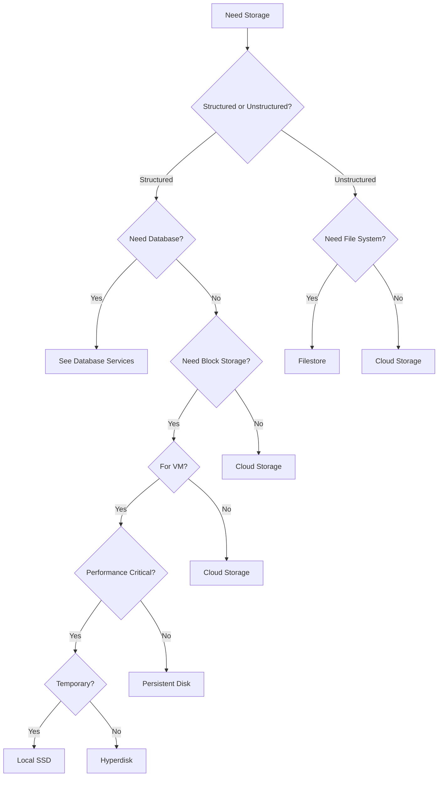

# GCP Storage Services

Google Cloud Platform offers a variety of storage services designed to meet different needs, from object storage to block storage and file systems.

## Storage Services Overview

GCP provides several storage options, each optimized for specific use cases:

1. **Cloud Storage**: Object storage for unstructured data
2. **Persistent Disk**: Block storage for Compute Engine VMs
3. **Filestore**: Managed file storage for applications
4. **Cloud Storage for Firebase**: Storage for mobile and web apps
5. **Transfer Service**: Bulk data transfer to GCP
6. **Storage Transfer Service**: Online data transfer between sources
7. **Transfer Appliance**: Physical device for offline data transfer

## Choosing the Right Storage Service

The right storage service depends on your specific requirements:

| Storage Service | Best For | Access Method | Consistency | Durability |
|-----------------|----------|---------------|-------------|------------|
| Cloud Storage | Unstructured data, backups, static content | Object-based (REST API) | Strong | 99.999999999% |
| Persistent Disk | VM attached storage, databases | Block-based | Strong | 99.999% |
| Hyperdisk | High-performance workloads | Block-based | Strong | 99.999% |
| Filestore | File sharing, lift-and-shift applications | File-based (NFS) | Strong | 99.99% |
| Local SSD | High-performance temporary storage | Block-based | Strong | None (ephemeral) |

## Storage Decision Tree

## Storage Tiers and Classes

GCP storage services offer different tiers and classes to optimize for cost and performance:

### Cloud Storage Classes
- **Standard**: Frequently accessed data
- **Nearline**: Data accessed less than once a month
- **Coldline**: Data accessed less than once a quarter
- **Archive**: Data accessed less than once a year

### Persistent Disk Types
- **Standard (HDD)**: Cost-effective, for non-critical workloads
- **Balanced (SSD)**: Balance of performance and cost
- **SSD**: High-performance for critical workloads
- **Extreme**: Highest performance for demanding workloads

### Filestore Tiers
- **Basic**: For general purpose workloads
- **Enterprise**: For performance-sensitive workloads
- **Zonal**: Single-zone storage
- **Regional**: Multi-zone redundancy

## Data Transfer Options

GCP provides several options for transferring data to its storage services:

- **Online Transfer**: Direct upload via APIs or tools
- **Storage Transfer Service**: Managed service for online transfers
- **Transfer Appliance**: Physical device for offline transfers
- **BigQuery Data Transfer Service**: For analytics data
- **Database Migration Service**: For database transfers

## Security Features

GCP storage services include robust security features:

- **Encryption at Rest**: All data automatically encrypted
- **Encryption in Transit**: Data encrypted during transfer
- **Customer-Managed Encryption Keys (CMEK)**: Control your own keys
- **IAM**: Fine-grained access control
- **VPC Service Controls**: Create security perimeters
- **Access Control Lists**: Object-level permissions for Cloud Storage
- **Signed URLs**: Time-limited access to objects

## Related Topics
- [[Cloud Storage]]
- [[Persistent Disk]]
- [[Filestore]]
- [[Storage Transfer Service]]
- [[Storage Best Practices]]
