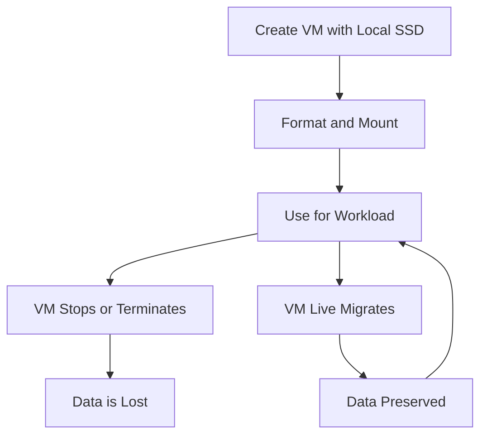

# Local SSD

Local SSD is a high-performance, physically attached block storage option for Compute Engine virtual machines. It provides extremely low latency and high IOPS for workloads that require high-performance temporary storage.

## Key Characteristics

- **Physically Attached**: Directly attached to the server hosting your VM
- **Ephemeral Storage**: Data persists only for the life of the instance
- **High Performance**: Extremely low latency and high IOPS
- **Fixed Size**: 375 GB per disk, with up to 24 disks per VM (9 TB total)
- **No Snapshots**: Cannot create snapshots of Local SSD disks
- **No Resize**: Cannot resize Local SSD disks
- **No Reattach**: Cannot detach and reattach to other VMs
- **Encryption**: Automatically encrypted at rest

## Performance Specifications

Local SSD offers exceptional performance characteristics:

- **IOPS**: Up to 2,400,000 read IOPS and 1,200,000 write IOPS per VM
- **Throughput**: Up to 9 GB/s read and 4.5 GB/s write per VM
- **Latency**: Sub-millisecond latency

## Interface Options

Local SSD disks are available with two interface options:

1. **NVMe Interface**
   - Higher performance
   - Requires OS support for NVMe
   - Available on most machine types
   - Recommended for new deployments

2. **SCSI Interface**
   - Legacy interface
   - Broader OS compatibility
   - Slightly lower performance
   - Available on most machine types

## Local SSD Lifecycle

## Use Cases

- **High-Performance Databases**: Temporary database storage
- **Caching Layer**: High-speed cache for applications
- **Scratch Space**: Temporary processing space
- **Data Processing**: High-performance data processing
- **Gaming Servers**: Low-latency game state storage
- **Financial Trading**: Ultra-low latency storage for trading applications
- **Media Processing**: Temporary storage for media processing

## Data Persistence Strategies

Since Local SSD is ephemeral, several strategies can be used to manage data persistence:

1. **Replication**: Replicate data across multiple VMs
2. **Periodic Backup**: Regularly back up data to persistent storage
3. **Write-Through Cache**: Use as a cache with writes going to persistent storage
4. **Rebuild on Boot**: Rebuild data from source on VM startup
5. **Managed Services**: Use managed services that handle persistence

## Performance Optimization

- **RAID Configuration**: Create RAID arrays for better performance or reliability
- **File System Selection**: Choose appropriate file systems (XFS, ext4)
- **I/O Scheduler**: Configure the I/O scheduler for optimal performance
- **Partition Alignment**: Ensure proper partition alignment
- **Workload Distribution**: Distribute workload across multiple disks

## Comparison with Other Storage Options

| Feature | Local SSD | Persistent Disk | Hyperdisk |
|---------|-----------|-----------------|-----------|
| Persistence | Ephemeral | Persistent | Persistent |
| Max IOPS | 2.4M read / 1.2M write | 100K read / 100K write | 350K read / 240K write |
| Max Throughput | 9 GB/s read / 4.5 GB/s write | 1.2 GB/s read / 800 MB/s write | 4.8 GB/s read / 2.4 GB/s write |
| Latency | Sub-millisecond | Single-digit millisecond | Single-digit millisecond |
| Snapshots | No | Yes | Yes |
| Resize | No | Yes | Yes |
| Reattach | No | Yes | Yes |
| Max Size | 9 TB per VM | 64 TB per disk | 64 TB per disk |

## Best Practices

1. **Plan for Data Loss**: Always assume data could be lost
2. **Implement Backup Strategy**: Regularly back up critical data
3. **Use for Appropriate Workloads**: Only use for workloads that can handle data loss
4. **Monitor Performance**: Track IOPS and throughput
5. **Consider RAID Configurations**: Use RAID for performance or reliability
6. **Format with Appropriate File System**: Choose the right file system for your workload
7. **Understand VM Maintenance Events**: Know how maintenance affects Local SSD

## Related Topics
- [[GCP Storage Services]]
- [[Compute Engine]]
- [[Persistent Disk]]
- [[Storage Best Practices]]
