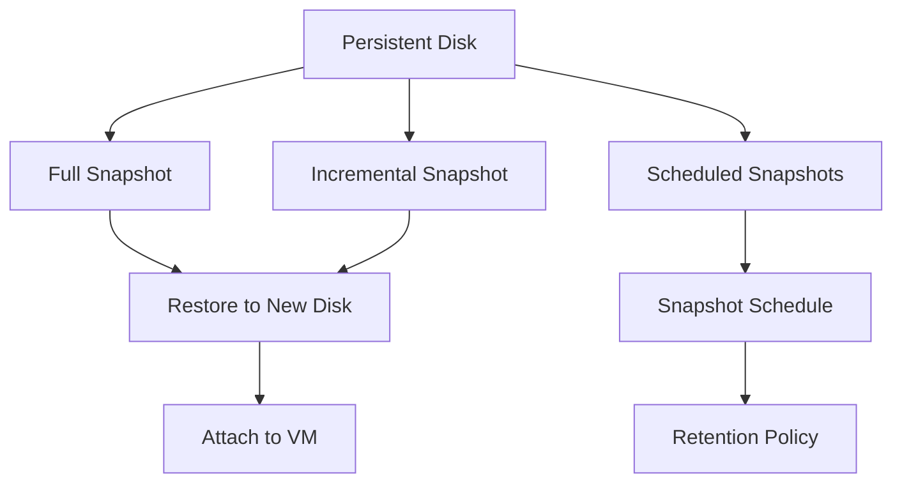

# Persistent Disk

Persistent Disk is Google Cloud's block storage service that provides durable network storage for Compute Engine virtual machine instances. It offers high-performance block storage that can be attached to VMs.

## Types of Persistent Disks

Google Cloud offers several types of persistent disks:

1. **Standard Persistent Disk (pd-standard)**
   - HDD-based storage
   - Cost-effective option
   - Good for sequential read/write operations
   - Best for batch processing and data warehousing

2. **Balanced Persistent Disk (pd-balanced)**
   - SSD-based storage
   - Balance of performance and cost
   - Good for most general-purpose applications
   - Best for development environments, low-medium traffic web servers

3. **SSD Persistent Disk (pd-ssd)**
   - High-performance SSD storage
   - Higher IOPS and throughput than Balanced
   - Best for production databases and applications

4. **Extreme Persistent Disk (pd-extreme)**
   - Highest performance SSD storage
   - Provisioned IOPS
   - Best for high-performance databases like SAP HANA

5. **Hyperdisk Balanced (hyperdisk-balanced)**
   - Next-generation block storage
   - Independent provisioning of capacity and IOPS/throughput
   - Best for databases and applications with specific performance requirements

6. **Hyperdisk Extreme (hyperdisk-extreme)**
   - Highest performance block storage
   - Customizable IOPS and throughput
   - Best for mission-critical workloads

## Key Features

- **Resizable**: Increase disk size without downtime
- **Snapshots**: Point-in-time backups of disks
- **Encryption**: Automatic encryption at rest
- **Multi-writer**: Attach a single disk to multiple VMs in read-only mode
- **Regional Persistent Disks**: Replicate data across zones
- **Performance Scaling**: Performance scales with disk size
- **Independent Lifecycle**: Disks exist independently of VMs

## Performance Characteristics

| Disk Type | Max Size | Max IOPS (Read/Write) | Max Throughput (Read/Write) |
|-----------|----------|------------------------|------------------------------|
| Standard | 64 TB | 7,500 / 15,000 | 1,200 MB/s / 180 MB/s |
| Balanced | 64 TB | 80,000 / 60,000 | 1,200 MB/s / 660 MB/s |
| SSD | 64 TB | 100,000 / 60,000 | 1,200 MB/s / 800 MB/s |
| Extreme | 64 TB | 120,000 / 60,000 | 1,200 MB/s / 800 MB/s |
| Hyperdisk Balanced | 64 TB | 160,000 / 96,000 | 2,400 MB/s / 1,200 MB/s |
| Hyperdisk Extreme | 64 TB | 350,000 / 240,000 | 4,800 MB/s / 2,400 MB/s |

## Disk Snapshots

## Zonal vs Regional Persistent Disks

Google Cloud offers two deployment options for persistent disks:

1. **Zonal Persistent Disks**
   - Data stored in a single zone
   - Lower cost
   - Best for non-critical workloads

2. **Regional Persistent Disks**
   - Data replicated across two zones in the same region
   - Higher availability (99.999%)
   - Synchronous replication
   - Best for critical workloads

## Use Cases

- **Boot Disks**: Operating system disks for VMs
- **Database Storage**: Storage for database workloads
- **Application Data**: Storage for application data
- **Shared Read-Only Data**: Data shared across multiple VMs
- **High-Performance Computing**: Storage for HPC workloads
- **SAP Workloads**: Storage for SAP applications

## Best Practices

1. **Right-size Your Disks**: Choose the appropriate size for performance
2. **Use Snapshots for Backups**: Regularly back up your disks
3. **Use Regional Disks for Critical Workloads**: Ensure high availability
4. **Monitor Disk Performance**: Track IOPS and throughput
5. **Use Disk Cloning for Quick Provisioning**: Create new disks from existing ones
6. **Implement Snapshot Schedules**: Automate backups
7. **Choose the Right Disk Type**: Match disk type to workload requirements

## Related Topics
- [[GCP Storage Services]]
- [[Compute Engine]]
- [[Local SSD]]
- [[Disk Snapshots]]
