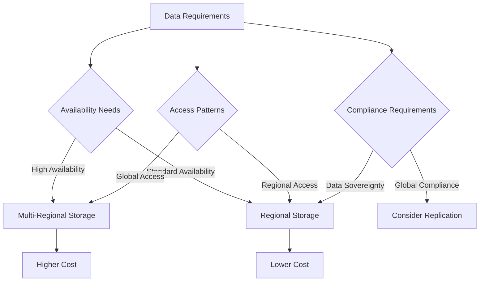

# GCP Storage Best Practices

This document outlines best practices for using Google Cloud storage services effectively, efficiently, and securely.

## General Storage Best Practices

### 1. Storage Selection

- **Match Storage to Workload**: Choose the right storage service based on access patterns, performance requirements, and cost constraints
- **Consider Data Lifecycle**: Plan for the entire lifecycle of your data
- **Evaluate Total Cost of Ownership**: Consider all costs, including storage, operations, and data transfer

### 2. Data Organization

- **Use Consistent Naming Conventions**: Implement clear naming conventions for buckets, objects, and disks
- **Implement Logical Hierarchies**: Organize data in logical hierarchies
- **Use Metadata and Labels**: Tag resources with metadata and labels for better organization
- **Separate Production and Non-Production Data**: Keep production and non-production data separate

### 3. Performance Optimization

- **Optimize Object Sizes**: For Cloud Storage, use larger objects when possible
- **Choose Appropriate Disk Types**: Match disk type to performance requirements
- **Monitor Performance Metrics**: Regularly review performance metrics
- **Implement Caching**: Use caching where appropriate
- **Consider Geographic Location**: Store data close to where it's used

### 4. Cost Optimization

- **Use Lifecycle Management**: Automatically transition or delete data based on age
- **Right-size Resources**: Choose appropriate sizes for disks and instances
- **Monitor Usage**: Regularly review usage and costs
- **Use Compression**: Compress data where appropriate
- **Consider Storage Classes**: Use lower-cost storage classes for infrequently accessed data

## Cloud Storage Best Practices

### 1. Bucket Configuration

- **Choose Regional vs Multi-regional**: Based on access patterns and availability requirements
- **Set Up Lifecycle Policies**: Automatically transition objects between storage classes
- **Configure Versioning**: Enable versioning for critical data
- **Set Up Retention Policies**: Implement retention policies for compliance

### 2. Performance

- **Use Parallel Uploads**: For large objects, use parallel composite uploads
- **Consider Cache-Control Headers**: Set appropriate cache-control headers
- **Use Appropriate Client Libraries**: Use the latest client libraries
- **Batch Small Operations**: Combine small operations into batch requests

### 3. Security

- **Implement Least Privilege**: Use IAM to grant minimal necessary permissions
- **Use Signed URLs**: For temporary access to objects
- **Enable Object Versioning**: Protect against accidental deletion
- **Consider VPC Service Controls**: Create security perimeters
- **Use Customer-Managed Encryption Keys**: For sensitive data

## Persistent Disk Best Practices

### 1. Disk Selection

- **Choose the Right Disk Type**: Match disk type to workload requirements
- **Size for Performance**: Disk performance scales with size
- **Consider Regional Disks**: For high-availability workloads
- **Use SSD for Performance-Critical Workloads**: Choose SSD or Hyperdisk for high-performance needs

### 2. Data Protection

- **Implement Snapshot Schedules**: Regularly back up disks
- **Test Restore Procedures**: Ensure you can restore from snapshots
- **Consider Multi-Zone Redundancy**: Use regional persistent disks for critical workloads

### 3. Performance

- **Monitor IOPS and Throughput**: Track disk performance metrics
- **Optimize I/O Patterns**: Align I/O patterns with disk capabilities
- **Consider Striping**: Use multiple disks in a stripe for higher performance
- **Choose Appropriate File Systems**: Select file systems based on workload

## Filestore Best Practices

### 1. Instance Selection

- **Choose Appropriate Service Tier**: Match tier to performance requirements
- **Size for Performance**: Instance performance scales with capacity
- **Consider Regional Instances**: For high-availability workloads

### 2. Performance

- **Optimize NFS Mount Options**: Configure appropriate mount options
- **Minimize Small, Random I/O**: Filestore performs better with sequential access
- **Use Appropriate File Sizes**: Larger files generally perform better

### 3. Security

- **Control Network Access**: Restrict access using VPC firewall rules
- **Implement IAM**: Use IAM for access control
- **Consider VPC Service Controls**: Create security perimeters

## Data Transfer Best Practices

### 1. Transfer Method Selection

- **Evaluate Network Capacity**: Understand available bandwidth
- **Consider Transfer Volume**: Choose appropriate transfer method based on data volume
- **Evaluate Time Constraints**: Consider time available for transfer

### 2. Online Transfers

- **Use Storage Transfer Service**: For cloud-to-cloud transfers
- **Implement Parallelism**: Transfer multiple files in parallel
- **Schedule During Off-peak Hours**: Minimize impact on production systems
- **Use Incremental Transfers**: Only transfer new or changed files

### 3. Offline Transfers

- **Plan Logistics**: Coordinate shipping and handling
- **Prepare Environment**: Ensure adequate power and network connectivity
- **Validate Data**: Verify data integrity during and after transfer

## Multi-Region Strategy

## Related Topics
- [[GCP Storage Services]]
- [[Cloud Storage]]
- [[Persistent Disk]]
- [[Filestore]]
- [[Storage Transfer Service]]
