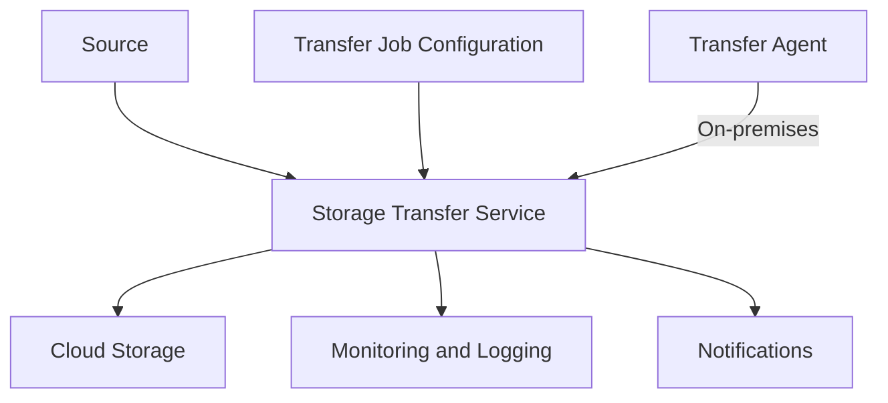

# Storage Transfer Service

Storage Transfer Service is a fully managed service that enables you to transfer data between cloud storage services, on-premises storage, and other cloud providers. It simplifies large-scale data transfers and migrations.

## Key Features

- **Managed Transfers**: Fully managed service with no infrastructure to provision
- **Scheduled Transfers**: One-time or recurring transfer jobs
- **Multiple Sources**: Transfer from various sources to Google Cloud
- **Incremental Transfers**: Only transfer new or changed files
- **Metadata Preservation**: Preserve metadata during transfers
- **Event-driven Transfers**: Trigger transfers based on events
- **Transfer Monitoring**: Monitor transfer progress and status
- **Retry Logic**: Automatic retries for failed transfers
- **Filtering**: Transfer only specific files based on filters
- **Deletion**: Optionally delete source files after transfer

## Supported Sources and Destinations

### Sources
- Amazon S3
- Azure Blob Storage
- Cloud Storage
- On-premises storage (via Transfer Service for On-premises Data)
- HDFS (Hadoop Distributed File System)
- File system via POSIX interface

### Destinations
- Cloud Storage

## Transfer Architecture

## Transfer Methods

1. **Cloud-to-Cloud Transfers**
   - Direct transfers between cloud storage providers
   - No data transfer agents required
   - Efficient and secure transfers

2. **On-premises to Cloud Transfers**
   - Requires Transfer Service for On-premises Data
   - Deploys transfer agents in your environment
   - Secure and efficient transfers over the internet

## Transfer Job Configuration

Storage Transfer Service allows you to configure various aspects of your transfer jobs:

- **Schedule**: One-time or recurring transfers
- **Source and Destination**: Define source and destination locations
- **File Filters**: Include or exclude files based on patterns
- **Metadata Options**: Preserve or transform metadata
- **Deletion Options**: Delete source files after transfer
- **Overwrite Options**: Control how existing files are handled
- **Transfer Options**: Control transfer behavior

## Use Cases

- **Cloud Migration**: Migrate data from on-premises to Google Cloud
- **Cloud-to-Cloud Migration**: Move data between cloud providers
- **Backup and Archive**: Back up data to Cloud Storage
- **Data Consolidation**: Consolidate data from multiple sources
- **Disaster Recovery**: Set up disaster recovery solutions
- **Data Processing Pipelines**: Feed data into processing pipelines

## Best Practices

1. **Plan Your Transfer**: Understand data volume and network capacity
2. **Test Small Transfers First**: Validate configuration with small transfers
3. **Monitor Transfer Performance**: Track transfer rates and failures
4. **Use Incremental Transfers**: Minimize data transfer volume
5. **Consider Network Limitations**: Understand bandwidth constraints
6. **Implement Appropriate IAM Roles**: Secure access to transfer jobs
7. **Schedule During Off-peak Hours**: Minimize impact on production systems
8. **Use Event-driven Transfers**: Trigger transfers based on events

## Comparison with Other Transfer Options

| Feature | Storage Transfer Service | Transfer Appliance | Manual Transfer (gsutil) |
|---------|-------------------------|-------------------|------------------------|
| Data Volume | Any size | Very large (TB/PB) | Small to medium |
| Transfer Speed | Network-dependent | Physical shipping | Network-dependent |
| Setup Complexity | Low | Medium | Low |
| Cost | Usage-based | Fixed + shipping | Free tool, network costs |
| Best For | Regular transfers | One-time large transfers | Ad-hoc transfers |

## Related Topics
- [[GCP Storage Services]]
- [[Cloud Storage]]
- [[Transfer Appliance]]
- [[BigQuery Data Transfer Service]]
