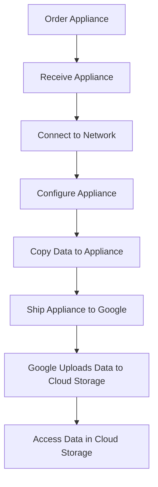

# Transfer Appliance

Transfer Appliance is a hardware appliance provided by Google Cloud that allows you to securely transfer large volumes of data to Google Cloud without using the internet. It's designed for offline data transfer when network transfer is impractical due to size or bandwidth constraints.

## Available Appliance Types

Google Cloud offers several Transfer Appliance configurations:

1. **TA40**
   - Capacity: 40 TB
   - Form Factor: Rackmount (1U)
   - Interface: 10 Gbps Ethernet
   - Best for: Moderate data transfers

2. **TA300**
   - Capacity: 300 TB
   - Form Factor: Rackmount (2U)
   - Interface: 10/25/40 Gbps Ethernet
   - Best for: Large data transfers

3. **TA300 Cluster**
   - Capacity: Up to 1 PB (multiple TA300 appliances)
   - Form Factor: Multiple rackmount units
   - Interface: 10/25/40 Gbps Ethernet
   - Best for: Very large data transfers

## Transfer Process

## Key Features

- **High Capacity**: Transfer up to petabytes of data
- **Secure Transfer**: Data encrypted at rest and in transit
- **Capture System**: Efficient data capture from various sources
- **Multiple Interfaces**: Support for various network interfaces
- **Data Validation**: Checksums to ensure data integrity
- **Chain of Custody**: Secure handling throughout the process
- **Status Tracking**: Track the status of your transfer
- **Managed Service**: Google handles the upload to Cloud Storage

## Use Cases

- **Data Center Migration**: Move large datasets during data center migration
- **Backup and Archive**: Transfer backup and archive data to Cloud Storage
- **Media and Entertainment**: Transfer large media files
- **Scientific Research**: Transfer research data and datasets
- **Genomics**: Transfer genomic sequencing data
- **IoT Data Collection**: Transfer data collected from IoT devices
- **Disaster Recovery**: Set up disaster recovery solutions

## Security Features

Transfer Appliance includes several security features:

- **AES-256 Encryption**: Data encrypted at rest
- **Secure Boot**: Ensures only authorized software runs
- **Tamper-evident Packaging**: Detect physical tampering
- **Secure Erase**: Data securely erased after upload
- **Controlled Access**: Only authorized personnel can access the appliance
- **Secure Transport**: Tracked shipping with chain of custody

## Comparison with Online Transfer Methods

| Feature | Transfer Appliance | Storage Transfer Service | Manual Transfer (gsutil) |
|---------|-------------------|-------------------------|------------------------|
| Data Volume | Very large (TB/PB) | Any size | Small to medium |
| Transfer Speed | Physical shipping | Network-dependent | Network-dependent |
| Network Usage | None | High | High |
| Setup Complexity | Medium | Low | Low |
| Cost | Fixed + shipping | Usage-based | Free tool, network costs |
| Best For | One-time large transfers | Regular transfers | Ad-hoc transfers |

## Best Practices

1. **Plan Your Transfer**: Understand data volume and organization
2. **Prepare Your Environment**: Ensure adequate power and network connectivity
3. **Organize Your Data**: Structure data for efficient transfer
4. **Monitor Transfer Progress**: Track data copy progress
5. **Validate Data**: Verify data integrity during copy
6. **Follow Security Procedures**: Adhere to security guidelines
7. **Track Shipping**: Monitor appliance shipment
8. **Plan for Destination**: Prepare Cloud Storage buckets

## Cost Considerations

Transfer Appliance pricing includes several components:

- **Appliance Rental**: Fee for renting the appliance
- **Shipping**: Cost of shipping to and from your location
- **Data Transfer**: No data transfer charges
- **Cloud Storage**: Standard storage charges apply once data is uploaded

## Related Topics
- [[GCP Storage Services]]
- [[Cloud Storage]]
- [[Storage Transfer Service]]
- [[Data Migration Planning]]
